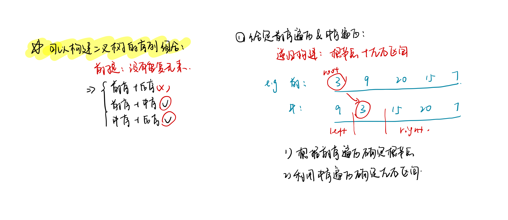

<!--
 * @Description: 
 * @Versions: 
 * @Author: Vernon Cui
 * @Github: https://github.com/vernon97
 * @Date: 2020-12-14 17:25:24
 * @LastEditors: Vernon Cui
 * @LastEditTime: 2020-12-15 15:12:24
 * @FilePath: /.leetcode/Users/vernon/Leetcode-notes/week11.md
-->
# Week 11 - Leetcode 101 - 110 

#### 101 - 对称二叉树

和100 相同的树类似，都是递归搜索左右子树；

这里对称的搜索方法是指 左节点的左子树和右节点的右子树一致，左节点的右子树和右节点的左子树一致；

```cpp
class Solution {
public:
    vector<int> left, right;
public:
    bool isSymmetric(TreeNode* root) {
        if(!root) return true;
        return dfs(root->left, root->right);
    }
    bool dfs(TreeNode* left, TreeNode* right)
    {
        if(!left && !right) return true;
        if(!left || !right || left->val != right->val) return false;
        return dfs(left->left, right->right) && dfs(left->right, right->left);
    }
};
```

#### 102 - 二叉树的层序遍历

BFS按层搜索就好

```cpp
class Solution {
public:
    vector<vector<int>> res;
public:
    vector<vector<int>> levelOrder(TreeNode* root) {
        if(root == nullptr) return res;
        queue<TreeNode*> q;
        q.push(root);
        while(q.size())
        {
            vector<int> level;
            int len = q.size();

            while(len--)
            {
                auto t = q.front();
                q.pop();
                level.push_back(t->val);
                if(t->left)  q.push(t->left);
                if(t->right) q.push(t->right);
            }
            res.push_back(move(level));
        }
        return res;
    }
};
```

#### 103 - 二叉树的锯齿形层次遍历

上一个题的基础上加上一个奇偶判断是否翻转即可

```cpp
class Solution {
public:
    vector<vector<int>> zigzagLevelOrder(TreeNode* root) {
        vector<vector<int>> res;
        bool direct = false;
        if(root == nullptr) return res;
        queue<TreeNode*> q;
        q.push(root);
        while(q.size())
        {
            vector<int> level;
            int len = q.size();

            while(len--)
            {
                auto t = q.front();
                q.pop();
                level.push_back(t->val);
                if(t->left)  q.push(t->left);
                if(t->right) q.push(t->right);
            }
            if(direct) reverse(level.begin(), level.end());
            direct = !direct;
            res.push_back(move(level));
        }
        return res;
    }
};
```

#### 104 - 二叉树的最大深度

搜索题 BFS和DFS都可以解决

**1. BFS**

```cpp
class Solution {
public:
    int maxDepth(TreeNode* root) {
        int depth = 0;
        queue<TreeNode*> q;
        if(root == nullptr) return depth;
        q.push(root);
        while(q.size())
        {
            int len = q.size();
            while(len--)
            {
                auto t = q.front();
                q.pop();
                if(t->left)  q.push(t->left);
                if(t->right) q.push(t->right);
            }
            depth++;
        }
        return depth;
    }
};
```

**2. DFS**

```cpp
class Solution {
public:
    int depth;
public:
    int maxDepth(TreeNode* root) {
        if(root == nullptr) return depth;
        dfs(root, 0);
        return depth;
    }
    void dfs(TreeNode* root, int u)
    {
        if(!root->left && !root->right) 
            depth = max(depth, u + 1);
        else {
            if(root->left)  dfs(root->left,  u + 1);
            if(root->right) dfs(root->right, u + 1);
        }
    }
};
```

嗯 很基础

#### 105 - 从前序和中序遍历序列构造二叉树



查找根节点位置 -> 哈希表
重点就在这几个区间的index怎么算上

首先，中序遍历中确定根节点的index为`k`, 那么两个子区间分别为`[il, k - 1]` 和`[k + 1, ir]`

这样也确定了左子树子区间的长度为`k - 1 - il + 1 = k - il`, 右子树子区间的长度为`ir - (k + 1) + 1 = ir - k`

根据这个长度我们可以得到在前序遍历里面两个区间的位置，根节点为 `pl` 

左子树子区间`r - (pl + 1) + 1 = k - il` -> `r = k + pl - il`

右子树子区间`pr - l + 1 = ir - k` -> `l = k + pr - ir + 1`

```cpp
class Solution {
public:
    unordered_map<int, int> hash;
public:
    TreeNode* buildTree(vector<int>& preorder, vector<int>& inorder) {
        for(int i = 0; i < inorder.size(); i++)
            hash[inorder[i]] = i;
        return build(preorder, inorder, 0, preorder.size() - 1, 0, preorder.size() - 1);
    }
    // @brief: 构建二叉树
    // @pram: preorder, inorder: 前序遍历与中序遍历
    //        pl, pr : 当前前序遍历的区间
    //        il, ir : 当前中序遍历的区间
    // @ret: 构建的根节点
    TreeNode* build(vector<int>& preorder, vector<int>& inorder, int pl, int pr, int il, int ir)
    {
        if (pl > pr) return nullptr;
        TreeNode* root = new TreeNode(preorder[pl]);
        int k = hash[root->val]; // 根节点在中序遍历的位置
        root->left  = build(preorder, inorder,pl + 1,k + pl - il ,il, k - 1);
        root->right = build(preorder, inorder, k + pr - ir + 1,pr,k + 1, ir);
        return root;
    }
};
```

#### 106 - 从中序和后序遍历序列构造二叉树

和上一题基本一致，无非是前序序列的根左右变成后序序列的左右根, 然后区间端点再重推一下

```cpp
class Solution {
public:
    unordered_map<int, int> hash;
public:
    TreeNode* buildTree(vector<int>& inorder, vector<int>& postorder) {
        for(int i = 0; i < inorder.size(); i++)
            hash[inorder[i]] = i;
        return build(inorder, postorder, 0, postorder.size() - 1, 0, postorder.size() - 1);
    }
    TreeNode* build(vector<int>& inorder, vector<int>& postorder, int il, int ir, int pl, int pr)
    {
        if(pl > pr) return nullptr;
        int k = hash[postorder[pr]];
        TreeNode* root = new TreeNode(postorder[pr]);
        root->left  = build(inorder, postorder, il, k - 1, pl, pl + k - il - 1);
        root->right = build(inorder, postorder, k + 1, ir, pr + k - ir, pr - 1);
        return root;
    }
};
```

#### 107 - 二叉树的层次遍历ii

正常层序遍历在反序就好了

```cpp
class Solution {
public:
    vector<vector<int>> levelOrderBottom(TreeNode* root) {
        vector<vector<int>> res;
        queue<TreeNode*> q;
        if(root == nullptr) return res;
        q.push(root);
        while(q.size())
        {
            vector<int> level;
            int len = q.size();
            while(len--)
            {
                auto t = q.front();
                q.pop();
                level.push_back(t->val);
                if(t->left)  q.push(t->left);
                if(t->right) q.push(t->right);
            }
            res.push_back(move(level));
        }
        reverse(res.begin(), res.end());
        return res;
    }
};
```

#### 108 - 将有序数组转换为二叉搜索树

中序遍历有序 等价于 是二叉搜索树

将一个按照升序排列的有序数组，转换为一棵高度平衡二叉搜索树;

考察的是线段树或者平衡树的初始化方式, 即如何从数组初始化为平衡树 -> 从中间对半分开

```cpp
class Solution {
public:
    TreeNode* sortedArrayToBST(vector<int>& nums) {
        return build(nums, 0, nums.size() - 1);
    }
    TreeNode* build(vector<int>& nums, int l, int r)
    {
        if(l > r) return nullptr;
        int mid = l + r >> 1;
        TreeNode* root = new TreeNode(nums[mid]);
        root->left  = build(nums, l, mid - 1);
        root->right = build(nums, mid + 1, r);
        return root;
    }
};
```

#### 109 - 有序链表转换为二叉搜索树

和上面的题类似， 将链表从中点分开，然后分别递归构建左右子树即可；
这里找中点利用的是快慢指针，只用遍历一次子链表即可找到中点；

然后边界问题需要新建一个`dummy`指针指向头结点来实现，如果链表只剩下一个头结点要特判返回；

将一个链表分成两段 就是将指向`mid`的指针置为`nullptr` 就可以实现；

```cpp
class Solution {
public:
    ListNode* dummy;
public:
    TreeNode* sortedListToBST(ListNode* head) {
        dummy = new ListNode(0);
        dummy->next = head;
        return build(head);
    }
    TreeNode* build(ListNode* head)
    {
        if(!head) return nullptr;
        ListNode* fast = head, *slow = head, *prev = dummy;
        // 快慢指针找中点
        while(fast && fast->next)
        {
            prev = slow;
            slow = slow->next;
            fast = fast->next->next;
        }
        // 找到中点 新建root
        TreeNode* root  = new TreeNode(slow->val);
        // 如果中点是head 可以直接返回了
        if(prev == dummy) return root;
        // 链表分成两段
        ListNode* right = slow->next;
        prev->next = nullptr;
        // 递归建树
        root->left  = sortedListToBST(head);
        root->right = sortedListToBST(right);
        return root;
    }
};
```

#### 110 - 平衡二叉树

递归搜索深度加判断即可

```cpp
class Solution {
public:
    bool ans = true;
public:
    bool isBalanced(TreeNode* root) {
        dfs(root);
        return ans;
    }
    int dfs(TreeNode* root)
    {
        if(!root) return 0;
        int l = dfs(root->left);
        int r = dfs(root->right);
        if(abs(l - r) > 1) ans = false;
        return max(l, r) + 1;
    }
};
```

