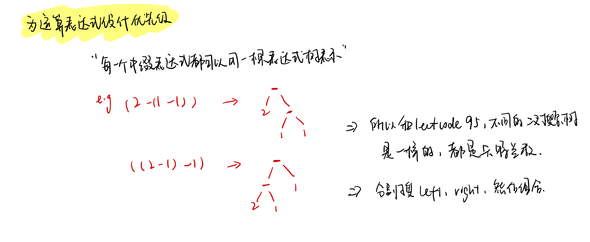

<!--
 * @Description: 
 * @Versions: 
 * @Author: Vernon Cui
 * @Github: https://github.com/vernon97
 * @Date: 2021-01-18 17:59:36
 * @LastEditors: Vernon Cui
 * @LastEditTime: 2021-01-18 19:31:26
 * @FilePath: /.leetcode/Users/vernon/Leetcode-notes/week25.md
-->

# Week 25 - Leetcode 241 - 250

```diff
+ 本周就两道题？！
```

#### 241 - 为运算表达式设计优先级

所有的中缀表达式都可以对应到一棵表达式树, 所以这题实际上和Leetcode.95 不同的二叉搜索树ii 是一样的（很神奇）


代码也和95题很像

```cpp
class Solution {
public:
    vector<char> ops;
    vector<int> nums;
public:
    vector<int> diffWaysToCompute(string input) {
        for(int i = 0; i < input.size(); i ++)
        {
            if(isdigit(input[i]))
            {
                int j = i, x = 0;
                while(j < input.size() && isdigit(input[j]))
                {
                    x = x * 10 + input[j] - '0';
                    j++;
                }
                nums.push_back(x);
                i = j - 1;
            }
            else
                ops.push_back(input[i]);
        }
        // dfs搜索 这里搜索的是 每个数字
        return dfs(0, nums.size() - 1);
    }
    int calculate(int x, int y, char op)
    {
        int res = 0;
        switch(op)
        {
            case '+':
                res = x + y;
                break;
            case '-':
                res = x - y;
                break;
            case '*':
                res = x * y;
                break;
        }
        return res;
    }
    vector<int> dfs(int l, int r)
    {
        if(l == r) return {nums[l]};
        vector<int> res;
        for(int i = l; i < r; i++)
        {
            vector<int> left  = dfs(l, i);
            vector<int> right = dfs(i + 1, r);
            for(int x : left)
                for(int y : right)
                    res.push_back(calculate(x, y, ops[i]));
        }
        return res;
    }
};
```

#### 242 - 有效的字母异位词

老感觉这种题出了好几次了 就是hash统计次数

```cpp
class Solution {
public:
    bool isAnagram(string s, string t) {
        if(s.size() != t.size()) return false;
        unordered_map<char, int> hash;
        for(char x : s)
            hash[x]++;
        for(char x : t)
            if(!hash.count(x) || --hash[x] < 0) return false;
        return true;
    }
};
```