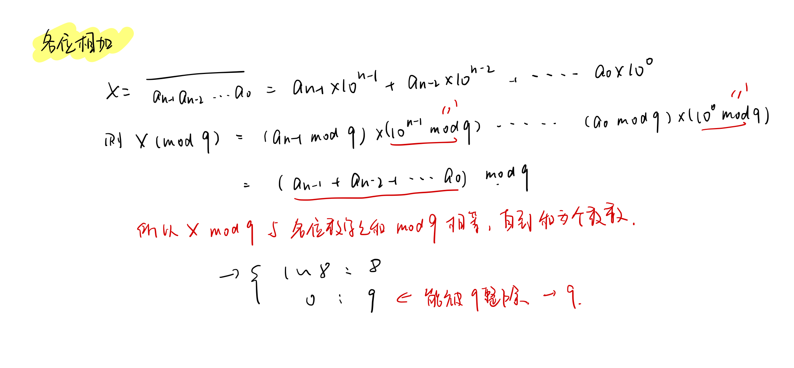
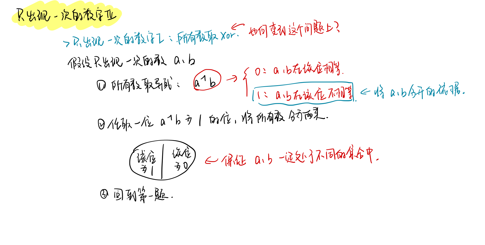

<!--
 * @Description: 
 * @Versions: 
 * @Author: Vernon Cui
 * @Github: https://github.com/vernon97
 * @Date: 2021-01-18 19:31:42
 * @LastEditors: Vernon Cui
 * @LastEditTime: 2021-01-18 20:43:25
 * @FilePath: /.leetcode/Users/vernon/Leetcode-notes/week26.md
-->
# Week 26 - Leetcode 251 - 260

#### 257 - 二叉树的所有路径

基础dfs题

```cpp
class Solution {
public:
    vector<string> res;
public:
    vector<string> binaryTreePaths(TreeNode* root) {
        if(root == nullptr) return res;
        vector<int> path;
        dfs(root, path);
        return res;
    }
    void dfs(TreeNode* root, vector<int>& path)
    {
        if(root->left == nullptr && root->right == nullptr)
        {
            stringstream ss;
            for(int x : path)
                ss << to_string(x) << "->";
            ss << to_string(root->val);
            res.push_back(ss.str());
            return;
        }
        // * left 和 right
        path.push_back(root->val);
        if(root->left)  dfs(root->left,  path);
        if(root->right) dfs(root->right, path);
        path.pop_back();
    }
};
```

#### 258 - 各位相加
```diff
+ 数论
```

> 你可以不使用循环或者递归，且在 O(1) 时间复杂度内解决这个问题吗？

o(1)是不是有公式呀..

**同余** 数论真的好难...


```cpp
class Solution {
public:
    int addDigits(int num) {
        if(num == 0) return 0;
        int x = num % 9;
        if(x == 0) return 9;
        else return x;
    }
};
```

#### 260 - 只出现一次的数字III

复习一下前两题是怎么做的

```diff
+ 只出现一次的数字：异或
+ 只出现一次的数字II：每一位用两个数字one 和 two 统计出现次数 状态转移 位运算
```

> 你的算法应该具有线性时间复杂度。你能否仅使用常数空间复杂度来实现？



```cpp
class Solution {
public:
    vector<int> singleNumber(vector<int>& nums) {
        long long aXorB = 0;
        // * 1. 求得 a xor b
        for(int x : nums)
            aXorB = aXorB ^ x;
        // * 2. 找到 a xor b 中最低位1的位
        aXorB = aXorB & (-aXorB);
        int a = 0, b = 0;
        for(int x : nums)
        {
        // * 3. 按照该位是否为1 将所有数分成两类 这样保证a b 一定在不同的集合中
            if(x & aXorB)
                a = a ^ x;
            else
                b = b ^ x;
        }
        return {a, b};
    }
};
```
