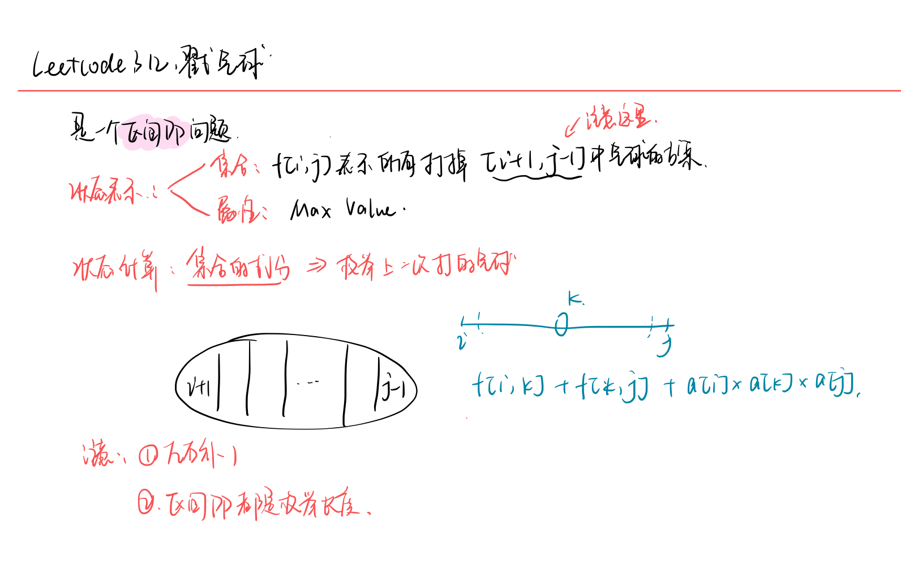
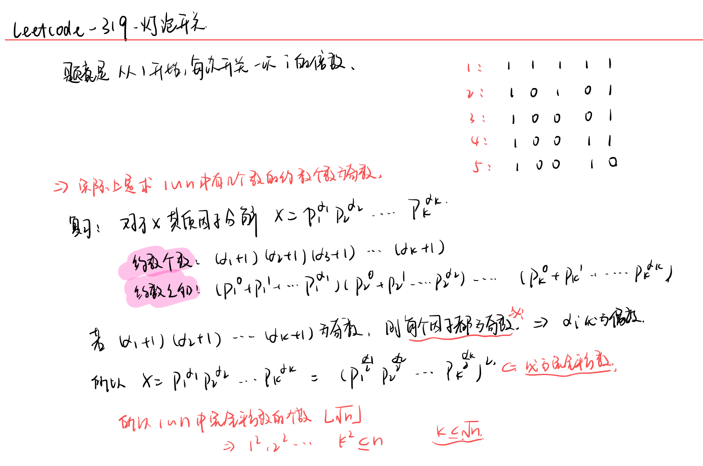

<!--
 * @Description: 
 * @Versions: 
 * @Author: Vernon Cui
 * @Github: https://github.com/vernon97
 * @Date: 2021-04-16 19:41:05
 * @LastEditors: Vernon Cui
 * @LastEditTime: 2021-05-06 20:50:38
 * @FilePath: /.leetcode/Users/vernon/Leetcode-notes/notes/week32.md
-->
# Week 32 - Leetcode 311 - 320

### 312 - 戳气球

经典的区间dp问题了，**记住记住区间dp是先枚举长度 再枚举左端点**

他这个状态设计注意一下 `l` 和 `r` 都是没有打掉的 因为计算分数需要


还有一个优化： 每次计算`nums[l] * nums[k] * nums[r]` 可以先把`nums[l] * nums[r]` 存下来

```cpp
class Solution {
public:
    int maxCoins(vector<int>& nums) {
        int n = nums.size();
        nums.insert(nums.begin(), 1);
        nums.push_back(1);
        vector<vector<int>> f(n + 2, vector<int>(n + 2));
        // 区间DP模板
        for(int len = 3; len <= n + 2; len++)
            for(int l = 0; len + l - 1 <= n + 1; l++)
            {
                int r = l + len - 1;
                int reslr = nums[l] * nums[r];
                for(int k = l + 1; k < r; k++)
                    f[l][r] = max(f[l][r], f[l][k] + f[k][r] + reslr * nums[k]);
            }
        return f[0][n + 1];
    }
};
```

### 313 - 超级丑数

复习一下丑数系列：

#### 263 - 丑数

只包含质因子2, 3, 5 的话 就把质因子2，3， 5 除干净 看看余数是不是1就可以了

```cpp
class Solution {
public:
    bool isUgly(int num) {
        if(num < 1) return false;
        while(num % 2 == 0) num /= 2;
        while(num % 3 == 0) num /= 3;
        while(num % 5 == 0) num /= 5;
        return num == 1;
    }
};
```

#### 264 - 丑数II

丑数的定义是一样的 请找出第`n`个丑数

有点三路归并的意思, 用 `i j k`来表示丑数序列中因子`2 3 5`对应的指针 避免一个丑数同时有多个因子

每次更新 `2 * ugs[i], 3 * ugs[j], 5 * ugs[k]` 中最小的一个追加在序列内

然后判断更新的数是不是2 3 5 的因子 是的话 对应指针++

```cpp
class Solution {
public:
    int nthUglyNumber(int n) {
        vector<int> ugs;
        ugs.push_back(1);
        int i = 0, j = 0, k = 0;
        while(--n) // 注意这里是--n 第一个丑数是1
        {
            int cur_ug = min(min(ugs[i] * 2, ugs[j] * 3), ugs[k] * 5);
            ugs.push_back(cur_ug);
            if(cur_ug % 2 == 0) i++;
            if(cur_ug % 3 == 0) j++;
            if(cur_ug % 5 == 0) k++; 
        }
        return ugs.back();
    }
};
```

对于本题无非是`丑数II`这个题的扩展，把`2 3 5`的质数列表扩展即可

但是**这里找最小值可以换成堆** 

1. o(nk)
   
```cpp
class Solution {
public:
    int nthSuperUglyNumber(int n, vector<int>& primes) {
        int m = primes.size();
        vector<int> pointers(m, 0);
        vector<int> ugs(1, 1);
        while(--n)
        {
            // 1. 查找最小的质数和
            int cur_ug = INT_MAX;
            for(int i = 0; i < m; i++)
                cur_ug = min(cur_ug, primes[i] * ugs[pointers[i]]);
            // 2. 更新pointers
            for(int i = 0; i < m; i++)
                if(cur_ug % primes[i] == 0) pointers[i]++;
            ugs.push_back(cur_ug);
        }
        return ugs.back();
    }
};
```

2. o(nlogk)
   
```cpp
class Solution {
public:
    using PII = pair<int, int>;
    int nthSuperUglyNumber(int n, vector<int>& primes) {
        priority_queue<PII, vector<PII>, greater<PII>> heap;
        for(int x : primes) heap.emplace(x, 0);
        vector<int> q(n);
        q[0] = 1;
        for(int i = 1; i < n;)
        {
            auto t = heap.top(); heap.pop();
            if(q[i - 1] < t.first) q[i++] = t.first; // 判断丑数序列是否要更新 
            int idx = t.second, p = t.first / q[idx];
            heap.emplace(p * q[idx + 1], idx + 1); // 把下一个可能的丑数加入heap
        }
        return q.back();
    }
};
```

### 315 - 计算右侧小于当前元素的数量

保序离散化 + 树状数组 经典了吧 拿离散后的元素当下标 这样可以区间查询到比x大/小的元素个数了

保序离散化

```cpp
sort(nums.begin(), nums.end());
nums.erase(unique(nums.begin(), nums.end()), nums.end());

int find(int x)
{
    return lower_bound(nums.begin(), nums.end(), x) - nums.begin() + 1; // 注意要映射到1开始
}
```

树状数组

```cpp
int tree[N];

int lowbit(int x)
{
    return x & (-x);
}

int add(int i, int x)
{
    while(i <= n)
    {
        tree[i] += x;
        i += lowbit(i);
    }
}

int query(int i)
{
    int sum = 0;
    while(i > 0)
    {
        sum += tree[i];
        i -= lowbit(i);
    }
    return sum;
}
```

代码如下：

```cpp
class Solution {
public:
    static const int N = 100010;
    int n;
    int tree[N];
    vector<int> q;
public:
    int lowbit(int x)
    {
        return x & -x;
    }
    void add(int i, int x)
    {
        while(i <= n)
        {
            tree[i] += x;
            i += lowbit(i); 
        }
    }
    int query(int i)
    {
        int sum = 0;
        while(i > 0)
        {
            sum += tree[i];
            i -= lowbit(i);
        }
        return sum;
    }
    int find(int x)
    {
        return lower_bound(q.begin(), q.end(), x) - q.begin() + 1;
    }
    vector<int> countSmaller(vector<int>& nums) {
        n = nums.size();
        q = nums;
        sort(q.begin(), q.end());
        q.erase(unique(q.begin(), q.end()), q.end());
        vector<int> res(n);
        // 1. 插入树状数组
        for(int i = n - 1; i >= 0; i--)
        {
            int idx = find(nums[i]);
            res[i] = query(idx - 1);
            add(idx, 1);
        }
        return res;
    }
};
```

### 316 - 去除重复字母

给你一个字符串 s ，请你去除字符串中重复的字母，使得每个字母只出现一次。需保证 返回结果的字典序最小（要求不能打乱其他字符的相对位置)

去掉重复字母还不算 还要字典序最小 -> 肯定是贪心删除 

**做法：**

每次判断答案字符串的最后一个字母`T[j]` 大于 `S[i]` 且 `T[j]`可删除 -> 删除 直到不行
维持这样的偏序关系 最终得到字典序最优的解

- 使用栈来贪心的构造最终的字符串，栈的更新规则如下。
- 前提是当前字符没有在栈中出现。如果当前字符比栈顶字符的值小，且栈顶字符不是最后一次出现，则栈顶出栈。
- 重复 2 直到栈空或栈顶不满足出栈条件。此时，将当前字符压入栈中，且标记当前字符出现过。
- 最后将栈中元素从栈底到栈顶的顺序输出。

```cpp
class Solution {
public:
    string removeDuplicateLetters(string s) {
        string stk;
        unordered_map<char, int> last;
        unordered_set<char> instack;
        for(int i = 0; i < s.size(); i++) last[s[i]] = i;
        for(int i = 0; i < s.size(); i++)
        {
            char c = s[i];
            if(instack.count(c)) continue;
            while(stk.size() && stk.back() > c && last[stk.back()] > i)
            {
                instack.erase(stk.back());
                stk.pop_back();
            }
            stk.push_back(c);
            instack.insert(c);
        }
        return stk;
    }
};
```

### 318 - 最大单词长度乘积

```diff
+ 注意位运算的优先级不如 == 哇！ 那个括号可不能省略
```

两次枚举肯定是跑不掉的，但是如何快速判断两个字符串是否有相同字母？

**二进制枚举的思想**

用一个二进制数来表示每个字母是否出现过，这样用与运算就可判断是否有相同字母同时出现。

```cpp
class Solution {
public:
    int maxProduct(vector<string>& words) {
        int n = words.size();
        vector<int> states(n, 0);
        for(int i = 0; i < n; i++)
        {
            string& word = words[i];
            for(int j = 0; j < word.size(); j++)
                states[i] = states[i] | (1 << word[j] - 'a');
        }
        int res = 0;
        for(int i = 0; i < n; i++)
            for(int j = i + 1; j < n; j++)
                if((states[i] & states[j]) == 0) // 注意这个括号
                    res = max(res, static_cast<int>(words[i].size() * words[j].size()));
        return res;
    }
};
```

### 319 - 灯泡开关

数论题真的不会 记一下推导吧~



所以最终返回`sqrt(n)`的下取整就好

```cpp
class Solution {
public:
    int bulbSwitch(int n) {
        return static_cast<int>(sqrt(n));
    }
};
```