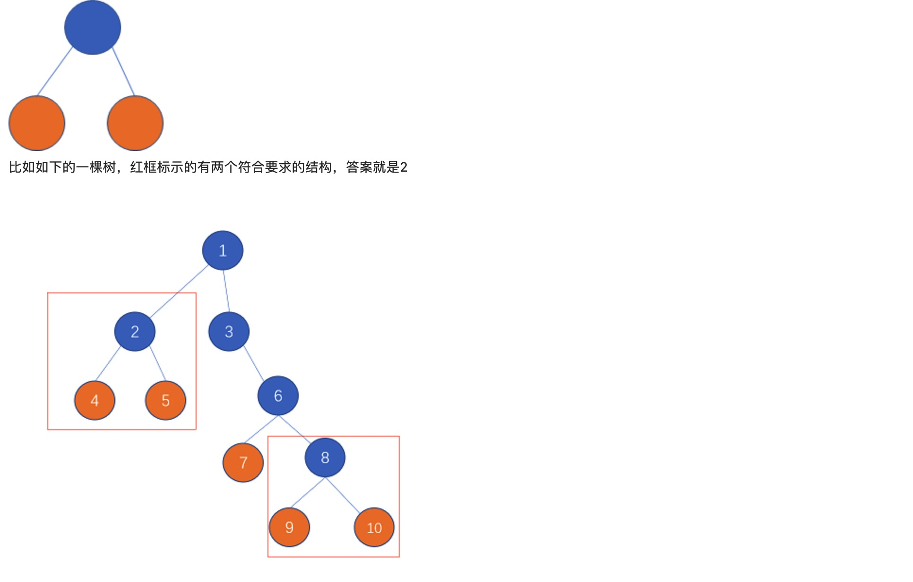

<!--
 * @Description: 
 * @Versions: 
 * @Author: Vernon Cui
 * @Github: https://github.com/vernon97
 * @Date: 2021-01-20 22:31:46
 * @LastEditors: Vernon Cui
 * @LastEditTime: 2021-01-21 16:20:44
 * @FilePath: /.leetcode/Users/vernon/Leetcode-notes/网易2021算法02.md
-->
# 网易2021校招笔试-算法工程师（正式第一批）

### 问答题
《猜你喜欢的商品》请为网易严选的“猜你喜欢”推荐模块设计一个算法方案，可以从召回模型、排序模型、数据和特征、离线在线等方面描述。

### 01 - [编程题] 树上摘樱桃
有一棵二叉树，树上的叶子节点定义为“樱桃”。现在需要找出树上有多少个满足如下子结构的“樱桃”串，即一串上刚好有两颗“樱桃”。


**输入描述:**

第一行两个正整数m, n，空格分开，分别代表总共有树上有多少个节点，和树上有多少条边，2<=m<=100,  1<=n<=100

下面有n行，每行为3个部分，用空格分割，第一个数字为某非叶子节点的id, 第二个为该边为left还是right，第三个为子节点的id

注意：节点id彼此不会重复，id 1为根节点 

**输出描述:**

一个整数，标示符合要求的子结构的数量

**输入例子1:**
```
10 9
1 left 2
1 right 3
2 left 4
2 right 5
3 right 6
6 left 7
6 right 8
8 left 9
8 right 10
```
**输出例子1:**
```
2
```
**例子说明1:**

> 如题目说明的第一个样例图，可以看到，2-4-5子串，8-9-10子串，两个子串符合条件，所以答案为2

---
输入输出比题可恶心多了

```cpp
#include <iostream>
#include <cstring>
#include <algorithm>
#include <string>
#include <sstream>
#include <unordered_map>
using namespace std;
const int N = 110;

struct Node{
    int val;
    Node* left;
    Node* right;
    Node() : val(0), left(nullptr), right(nullptr) {} 
    Node(int _val) : val(_val), left(nullptr), right(nullptr) {} 
};
int n, m;
int h[N], e[N], ne[N], idx;
int res;
unordered_map<int, Node*> ha;

bool dfs(Node* root)
{
    // 是叶子节点
    if(root->left == nullptr && root->right == nullptr) return true;
    int cnt = 0;
    // 左右都是叶子节点
    if(root->left && dfs(root->left)) cnt++;
    if(root->right && dfs(root->right)) cnt++;
    if(cnt == 2) res++;
    return false;
}
int main()
{
    cin >> n >> m;
    char tmp = cin.get();
    while(m--)
    {
        int a, b;
        string line, direction;
        getline(cin, line);
        stringstream ss(line);
        ss >> a >> direction >> b;
        if(!ha.count(a)) ha[a] = new Node(a);
        if(!ha.count(b)) ha[b] = new Node(b);
        if(direction == "left")
            ha[a]->left = ha[b];
        else if(direction == "right")
            ha[a]->right = ha[b];
    }
    Node* root = ha[1];
    dfs(root);
    cout << res << endl;
    return 0;
}
```

### 02 -  [编程题]成双成对

给定一个字符串，请返回满足以下条件的最长字符串的长度：“a”、"b"、“c”、“x”、"y"、“z”在字符串中都恰好出现了偶数次（0也是偶数）

**输入描述:**

字符串s, s长度>=1

**输出描述:**

一个整数，满足条件的的最长字符串的长度

**输入例子1:**
```
amabc
```
**输出例子1:**
```
3
```
**例子说明1:**

> ama，长度为3

---

hin经典了 🆘 写不出来 这里我们从几个类似的题开始

**Leetcode 962. 最大宽度坡**

维护一个前缀最小值数组 `minl`，和一个后缀最大值数组 `maxr`。例如，`[6,0,8,2,1,5]` 的两个数组分别为 `[6,0,0,0,0,0]`, `[8,8,8,5,5,5]`。
定义两个指针，初始时分别指向两个数组的开头，如果 `minl[i] <= maxr[j]`，则更新答案后 `j++`；否则 `i++`；

解释：如果 `minl[i] <= maxr[j]`，则说明在 i之前（包括 i）必定有一个数字小于等于 j之后（包括 j）的某个数字。且左端的数字就是 `A[i]`，因为 i 是从最小的开始往后走的，故此时只需要向后移动 j，去尝试 j之后的数字某个是否也可行。

如果 `minl[i] > maxr[j]`，则说明 i之前（包括 i）的所有数字都比 j 之后（包括 j）的所有数字要大，所以 i需要向后移动寻找一个小一些的数字。

```cpp
class Solution {
public:
    int maxWidthRamp(vector<int>& A) {
        int n = A.size();
        vector<int> minl(n + 2, 1e9), maxr(n + 2, -1e9);
        for(int i = 1; i <= n; i++)
            minl[i] = min(minl[i - 1], A[i - 1]);
        for(int i = n; i >= 1; i--)
            maxr[i] = max(maxr[i + 1], A[i - 1]);
        int l = 1, r = 1, res = 0;
        while(l <= n && r <= n)
        {
            if(minl[l] <= maxr[r])
            {
                res = max(res, r - l);
                r++;
            }
            else l++;
        }
        return res;
    }
};
```

**Leetcode 1124. 表现良好的最长时间段**

前缀和 + 斜坡

这里把每个大于8h的工作日记作1分 小于8h的工作日记作-1分

相当于在前缀和数组中 找到最长的i, j 使得`s[i] <= s[j]`; 直接回到上一题


```cpp
class Solution {
public:
    int longestWPI(vector<int>& hours) {
        // 预处理前缀和
        int n = hours.size();
        vector<int> s(n + 1, 0);
        for(int i = 1; i <= n; i++)
            if(hours[i - 1] > 8)
                s[i] = s[i - 1] + 1;
            else
                s[i] = s[i - 1] - 1;
        // 找到前缀和中 最大的斜坡
        vector<int> minl(n + 3, 1e9), maxr(n + 3, -1e9);
        for(int i = 1; i <= n + 1; i++)
            minl[i] = min(minl[i - 1], s[i - 1]);
        for(int i = n + 1; i >= 1; i--)
            maxr[i] = max(maxr[i + 1], s[i - 1]);
        int ans = 0;
        int i = 1, j = 1;
        while (i <= n + 1 && j <= n + 1) {
            if (minl[i] < maxr[j]) {
                ans = max(ans, j - i);
                j++;
            }
            else
                i++;
        }
        return ans;
    }
};
```
**Leetcode 560. 和为K的子数组**
对原数组求前缀和后，一个和为 k 的子数组即为一对前缀和的差值为 k 的位置。
遍历前缀和数组，用 unordered_map 哈希表记录每个前缀和出现的次数。特别地，初始时前缀和为 0 需要被额外记录一次。
遍历过程中，对于当前前缀和 tot，累加之前 tot - k 前缀和出现的次数。

注意 这种和为K的子数组问题 用到的都是哈希表去记录一些信息 这里是记录的出现次数， 还有第一次出现的位置/最后一次出现的位置这种 

注意 hash[0] = 1; // 初始化

```cpp
class Solution {
public:
    int subarraySum(vector<int>& nums, int k) {
        unordered_map<int, int> hash;
        int tot = 0, ans = 0;
        hash[0] = 1;
        for(int x : nums)
        {
            tot += x;
            ans += hash[tot - k];
            hash[tot]++;
        }
        return ans;
    }
};
```

**Leetcode 1248. 统计优美子数组**

上一个题同样的模型

```cpp
class Solution {
public:
    int numberOfSubarrays(vector<int>& nums, int k) {
        // 恰好有 k 个奇数数字
        unordered_map<int, int> hash;
        int tot = 0, ans = 0;
        hash[0] = 1;
        for(int x : nums)
        {
            tot += (x & 1);
            ans += hash[tot - k];
            hash[tot]++;
        }
        return ans;
    }
};
```
**Leetcode 1371. 每个元音包含偶数次的最长子字符串**

状态压缩＋哈希表。类似的题出现好几次了。 如1124。 状态压缩后，哈希表的用处是求最长的连续子串，满足子数组的和为k。 

**遇到奇偶个数校验，想到XOR**

**遇到有限的参数（小于20个）表状态， 想到状态压缩 （bitmask）**

**遇到求最长的连续子串使得和为k（maximum continuous subarray(substring) with sum equal to k）想到 前缀和 加哈希表记录第一次出现某一状态的位置。**

```cpp
class Solution {
public:
    int findTheLongestSubstring(string s) {
        string vowels = "aeiou";
        unordered_map<int, int> hash;
        int ans = 0;
        hash[0] = -1;
        int state = 0;
        for(int i = 0; i < s.size(); i++)
        {
            for(int j = 0; j < 5; j++)
                if(s[i] == vowels[j])
                    state = state ^ (1 << j);
            // 这里用哈希表 找到第一次出现这个状态的位置
            // 状态异或为0 表示出现次数为偶数次
            if(hash.count(state)) ans = max(ans, i - hash[state]);
            else hash[state] = i;
        }
        return ans;
    }
};

```

所以本题就和上一题一样啦 学到了学到了

```cpp
#include <iostream>
#include <algorithm>
#include <cstring>
#include <string>
#include <unordered_map>
using namespace std;
string abcxyz = "abcxyz";
int main()
{
    string line;
    getline(cin, line);
    int state = 0, ans = 0;
    unordered_map<int, int> ha;
    ha[state] = -1;
    for(int i = 0; i < line.size(); i++)
    {
        for(int j = 0; j < 6; j++)
        {
            if(line[i] == abcxyz[j])
            state = state ^ (1 << j);
        }
        if(ha.count(state)) ans = max(ans, i - ha[state]);
        else ha[state] = i;
    }
    cout << ans << endl;
    return 0;
}
```

### 03 - [编程题]最多的回文

给定一个字符串s，问该字符串里有多少个长度大于1的连续子串都是回文？
回文：正序的文本内容与倒序的文本内容相同，比如 aa，aba

**输入描述:**

字符串s，1<=length(s)<=100000

**输出描述:**

一个整数，该字符串内部有多少个连续子串都是回文

**输入例子1:**

a

**输出例子1:**

0

**例子说明1:**

没有长度大于1的回文

**输入例子2:**

abbcbb

**输出例子2:**

4

**例子说明2:**

解释：bb，bbcbb,  bcb, bb

---
看来是经典dp问题了； 

```cpp
#include <iostream>
#include <algorithm>
#include <string>
#include <vector>

using namespace std;
int main()
{
    string s;
    getline(cin, s);
    int n = s.size();
    vector<vector<bool>> f(n + 1, vector<bool>(n + 1));
    int ans = 0;
    // 长度从1开始枚举
    for(int j = 0; j < n; j++)
        for(int i = 0; i <= j; i++)
        {
            if(i == j) f[i][j] = true;
            else if(s[i] == s[j] && (i + 1 > j - 1 || f[i + 1][j - 1]))
            {
                f[i][j] = true;
                ans++;
            }
        }
    cout << ans << endl;
    return 0;
}
```

### 04 - [编程题]约会匹配

网易公司在七夕节前后内部都会组织相亲活动，但是由于人数众多，为了提高效率，主办方设计了一个系统。所有男生先登录系统，观看女生资料，然后在系统中登记他们自己有初步意向的女生，可以登记多个。反之女生也可以在系统中登记多个有初步意向的男生。如果某个女生和某个男生同时互相都有意向，则认定为匹配。

最终系统会取出所有系统互相都初步匹配成功的男生女生，尽量地促成他们的真实约会，约会形式是互相匹配的一男与一女单独约会，但是被选中的男生女生最多只能约会一次。问该系统最多能够促成多少次约会，让尽可能多的男生女生得到约会机会。

**输入描述:**

第一行输入为所有男生的id序列， 0< id数量 < 10000，用空格切分
第二行输入为所有女生的id序列， 0< id数量 < 10000，用空格切分
第三行为有已经有多少个匹配数n
下面有n行，每一行为一个已经初步互相匹配的男生女生id对，为两个数字，第一个为男生id，第二个为女生id，用空格区分

**输出描述:**

一个整数，最多能够促成多少次约会

**输入例子1:**
```
0 1 2
3 4 5
6
0 4
0 3
1 3
1 4
2 5
2 4
```
**输出例子1:**
```
3
```
**例子说明1:**

该case存在有多个互相匹配的情况，但是经过分析，0-3, 1-4, 2-5这种约会安排方法，保证尽量多的约会，同时每人只约会最多一次。

---
我发现网易真的很喜欢考二分图 

本题是二分图的最大匹配 还是匈牙利算法一把梭了

```cpp
#include <iostream>
#include <algorithm>
#include <cstring>
#include <string>
#include <sstream>
#include <vector>

using namespace std;

const int N = 20010, M = 20010;

int n1, n2, m;
int h[N], e[M], ne[M], idx;
int match[N];
bool st[N];

void add(int a, int b)
{
    e[idx] = b, ne[idx] = h[a], h[a] = idx++;
}

bool find(int u)
{
    for(int i = h[u]; ~i; i = ne[i])
    {
        int j = e[i];
        if(!st[j])
        {
            st[j] = true;
            if(match[j] == 0 || find(match[j]))
            {
                match[j] = u;
                return true;
            }
        }
    }
    return false;
}

int main()
{
    memset(h, -1, sizeof h);
    int x;
    vector<int> nums1;
    string line;
    getline(cin, line);
    stringstream ss;
    ss << line;
    while(ss >> x)
        nums1.push_back(x + 1);
    getline(cin, line);
    cin >> m;
    while(m--)
    {
        int a, b;
        cin >> a >> b;
        add(a + 1, b + 1);
    }
    int res = 0;
    for(auto x : nums1)
    {
        memset(st, false, sizeof st);
        if(find(x)) res++;
    }
    cout << res << endl;
    return 0;
}
```
