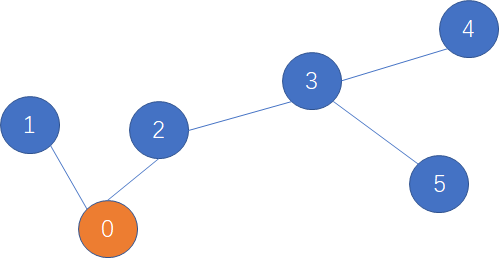

<!--
 * @Description: 
 * @Versions: 
 * @Author: Vernon Cui
 * @Github: https://github.com/vernon97
 * @Date: 2021-01-21 02:46:03
 * @LastEditors: Vernon Cui
 * @LastEditTime: 2021-01-21 23:20:53
 * @FilePath: /.leetcode/Users/vernon/Leetcode-notes/网易2021计算机视觉02.md
-->
# 网易2021校招笔试-计算机视觉算法工程师（正式第一批）

### 01 - [问答题]

请选择一个你最熟悉的计算机视觉算法领域，例如通用目标检测、图像特征检索、短视频分类、文本检测或文本识别、人脸检测或人脸识别等
1、简明扼要地谈谈近几年该领域算法的主要发展脉络； 
2、选择该领域中一到两个目前应用最广泛的算法，简要介绍一下该算法的核心思想。 以上问题建议根据自己的个人理解来阐述。

### 02 - [问答题]

数据增强是深度学习模型训练的重要技巧，随着深度学习在视觉领域的应用不断发展，数据增强方面也涌现了很多新方法新思路，请介绍一下几种近期流行数据增强策略及其特点，如果有相关实践经验，请分享通过数据增强提升项目效果的案例。

### 03 - [编程题]树上摘樱桃

和算法的那一套题一样

### 04 - [编程题]特殊的编辑距离

在自然语言处理的过程中，经常需要判断一个字符串和另外一个字符串之间的一个相似程度，其中常见的一个指标就是编辑距离，即一个字符串最少经过多少次“增删改”某个字符，可以变为另一个字符串。

如“abc”与“ac”的编辑距离为1，是因为在a和c中间“增加”一个b即可。如“abcd”与“axc”的编辑距离为2，是因为把“abcd”的b修改为x，然后再删除d即可，共2次操作。

但是在某种场景中，编辑距离定义为词粒度的。比如句子A “I am a coder”与句子B “hello ,  I am a singer”之间，对于句子A可以通过添加"hello"和符号",",  并替换"coder"为"singer"，共3个操作得到句子B。所以可得其基本的编辑距离为3。

在本题中，特别地，对于部分词，比如标点符号“, ”、"hello"对于句子语义的影响并不重要，这部分称之为停用词，这部分可以在匹配的过程中被跳过。比如对于句子A “I am a coder”与句子B “hello ,  I am a singer”，如果加入了停用词的影响，那编辑距离从3降到1。

所以目标是可以有选择性地跳过停用词的情况下，问最小的编辑距离是多少。

**输入描述:**

共3行
第一行为停用词列表，用空格区分
第二行为句子A，所有词可以用空格区分，词数不超过10000
第三行为句子B，所有词可以用空格区分，词数不超过10000

**输出描述:**

一个整数，可跳过停用词情况下的最短编辑距离

**输入例子1:**
```
hello ,
I am a coder
hello ,  I am a singer
```
**输出例子1:**
```
1
```
**例子说明1:**

见题意

**输入例子2:**
```
hello , ?
I am a boy
are you a girl ?
```
**输出例子2:**
```
3
```
**例子说明2:**

> I am boy 需要进行编辑

---

编辑距离这个题很经典了

> f[i][j] 表示 a[1..i] 到 b[1..j] 按顺序操作的最短编辑距离

不会有多余操作
操作顺序不会影响答案
删除 `f[i - 1, j] + 1` 添加 `f[i, j - 1] + 1` 替换 `f[i - 1, j - 1] + 0 / 1` （取决于`a[i] `和 `b[j]`是否相等）

这题在编辑距离的基础上加上了 额外的预处理 把每个词用哈希表映射到一个值就可以了 跳过的单词直接忽略

```cpp
#include <iostream>
#include <string>
#include <sstream>
#include <vector>
#include <unordered_map>
#include <unordered_set>
using namespace std;

int n, m, cnt;
unordered_map<string, int> ha;
unordered_set<string> skips;
vector<int> a(1, 0), b(1, 0);
int main()
{
    string line, word;
    getline(cin, line);
    stringstream ss;
    ss << line;
    while(ss >> word)
        skips.insert(word);
    ss.clear();
    getline(cin, line);
    ss << line;
    while(ss >> word)
    {
        if(skips.count(word)) continue;
        if(!ha.count(word)) ha[word] = ++cnt;
        a.push_back(ha[word]);
    }
    ss.clear();
    getline(cin, line);
    ss << line;
    while(ss >> word)
    {
        if(skips.count(word)) continue;
        if(!ha.count(word)) ha[word] = ++cnt;
        b.push_back(ha[word]);
    }
    // 编辑距离 -> 动态规划；
    // 编号从1开始
    n = a.size(), m = b.size();
    vector<vector<int>> f(n + 1, vector<int>(m + 1));
    // 初始化
    for(int i = 1; i < n; i++)
        f[i][0] = i;
    for(int j = 1; j < m; j++)
        f[0][j] = j;
    for(int i = 1; i < n; i++)
            for(int j = 1; j < m; j++)
            {
                // f[i][j] = f[i - 1][j] + 1, f[i][j - 1] + 1, f[i - 1][j - 1] + "a[i] b[j] 是否相等"
                f[i][j] = min(f[i - 1][j] + 1, f[i][j - 1] + 1);
                f[i][j] = min(f[i][j], f[i - 1][j - 1] + (a[i] != b[j]));
            }
    cout << f[n - 1][m - 1] << endl;
    return 0;
}
```

### 03 - [编程题]送快递

严选的快递员每天需要送很多个包裹，在货物装车后，需要开着电动车先到0号用户家。送完货后从0号出发，再送到1号用户。然后快递员可以从1号直接到2号用户家，完成送货。但有时候由于路不通的原因，需要先折返回0号，再去2号，如此循环，完成送货。



由于路况复杂，每个用户家只有一条路通往附近的其他一户邻居家，假设每条通路都是1公里。另外快递员的电动车的电是有限的，最多只能开有限的k公里。现在快递员已经在0号用户家送完快递，问快递员最多可以送多少个不重复的用户

**输入描述:**

输入包括两行,第一行包括两个正整数n(2 ≤ n ≤ 1000)和k(1 ≤ k ≤ 3000),表示用户家个数和快递员电动车剩余还能够行使的路程。
第二行包括n-1个整数，定义该数组为S，对于每个数组下标 i (0 ≤ i ≤ n - 2)，第i+1号用户跟S[i]号用户有一条道路连接。（参见下方样例和上图）

**输出描述:**

输出一个整数，表示快递员该次累计最多可以送几个用户

**输入例子1:**

6 3
0 0 2 3 3

**输出例子1:**

4

**例子说明1:**

通路情况如上图所示，走 0->2->3->4 的路线，或者走0->2->3->5的路线，电动车刚好再送3次快递，加一开始的0号用户累计是送了4个快递。

**输入例子2:**

5 2
0 1 2 3

**输出例子2:**

3
---
居然是省选题 而且是贪心...

**贪心策略：**
从最长链走（希望每一凑一步都夺走一个点）
- 如果走不完最长链：步数 + 1；
- 走完还剩下体力值 剩下的体力值保证每两步可以多访问一个节点

对于没有全访问的情况（如果这种方法求出来的值大于总数，则输出总数），最长链上肯定存在一条边连着一个没有访问的节点 ，当走到这里的时候，可以花两步去访问再回来。

贪不出来 见识一下吧

```cpp
#include <iostream>
#include <algorithm>
#include <cstring>
#include <cstdio>
using namespace std;

const int N = 10010, M = 20020;

int n, m;
int h[N], e[M], ne[M], idx;

void add(int a, int b)
{
    e[idx] = b, ne[idx] = h[a], h[a] = idx++;
}

int dfs(int u, int p)
{
    int res = 0;
    for(int i = h[u]; ~i; i = ne[i])
    {
        int j = e[i];
        if(j == p) continue;
        res = max(res, dfs(j, u) + 1);
    }
    return res;
}

int main()
{
    memset(h, -1, sizeof h);
    cin >> n >> m;
    for(int i = 1; i < n; i++)
    {
        int b;
        cin >> b;
        add(i, b);
        add(b, i);
    }
    // 找到最长链
    int maxl = dfs(0, -1);
    int ans = 0;
    if(m <= maxl) ans = m + 1;
    else ans = min(n, (m - maxl) /2 + maxl + 1);
    cout << ans << endl;
    return 0;
}
```


### 04 - [编程题]最多的水果

网易内部开了一家水果店，最近推出了一个水果礼盒的产品。礼盒总的目标重量是固定的，水果店的工人需要从N个不同重量的水果中，挑选出合适的一些水果，使尽量装满这个礼盒。但是礼盒比较脆弱，所以水果的重量总和不能超过礼盒的目标重量。

问每一次工人装水果的时候，这个礼盒最多能装多少。

输入描述:

第一行为水果礼盒的目标重量C，为一个正整数，0<C<=100000
第二行为所有可选水果的重量数组W，都为整数，用空格分隔，每个值不大于1000，0<length(W)<=10000

输出描述:

一个整数，礼盒最多能够装多少重量的水果

输入例子1:

100
47 59 42

输出例子1:

89

---
基础的0-1背包了

```cpp
#include <iostream>
#include <cstring>
#include <algorithm>
#include <string>
#include <sstream>
#include <vector>

using namespace std;
int M;
vector<int> w(1, 0);
int main()
{
    cin >> M;
    char  tmp = cin.get();
    string line;
    getline(cin, line);
    stringstream ss(line);
    int x;
    while(ss >> x)
       w.push_back(x);
    int n = w.size() - 1;
    vector<int> f(M + 1, 0);
    for(int i = 1; i <= n; i++)
    {
        for(int j = M; j >= w[i]; j--)
            f[j] = max(f[j], f[j - w[i]] + w[i]);
    }
    cout << f[M] << endl;
    return 0;
}
```