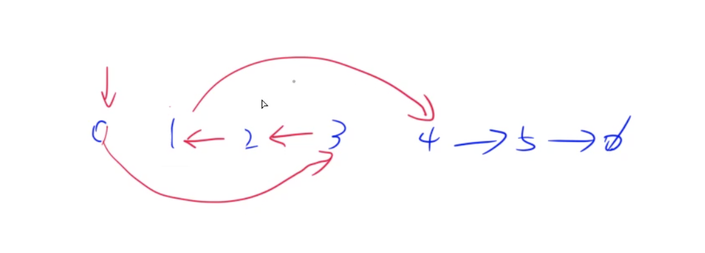
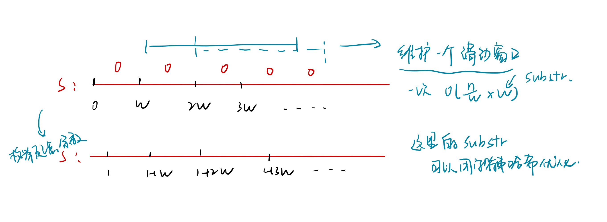

# Week 03 - Leetcode 21 - 30

**21 - 合并两个有序链表**

二路归并

```cpp
class Solution {
public:
    ListNode* mergeTwoLists(ListNode* l1, ListNode* l2) {
        // 双指针 
        ListNode* dummy = new ListNode(0), *cur = dummy;

        while(l1 && l2)
        {
            if(l1->val < l2->val)
                cur->next = l1, l1 = l1->next;
            else
                cur->next = l2, l2 = l2->next;
            cur = cur->next;
        }

        ListNode* l = l1 ? l1 : l2;
        while(l)
        {
            cur = cur->next = l;
            l = l->next;
        }
        return dummy->next;
    }
};
```

**22 - 括号生成**

括号序合法的充分必要条件是左括号数量大于等于右括号的数量 （卡特兰数）

```cpp
class Solution {
public:
    int n;
    vector<string> res;
public:
    void dfs(int l_num, int r_num, string path)
    {
        if(l_num == n && r_num == n)
        {
            res.push_back(path);
            return;
        }
        if(l_num < n)   dfs(l_num + 1, r_num, path + '(');
        if(l_num > r_num) dfs(l_num, r_num + 1, path + ')');
    }
    vector<string> generateParenthesis(int n) {
        this->n = n;
        dfs(0, 0, "");
        return res;
    }
};
```

**23 - 合并K个升序链表**

K路归并， 用堆找最小值；

> **Note:** 在C++中, 优先队列传入自定义的比较函数是传入一个自定义的Struct 重载括号

```cpp
class Solution {
public:
    // 容器的比较 传入结构体 重构括号
    struct Cmp{
        bool operator() (ListNode* a, ListNode* b)
        {
            return a->val > b->val;
        }
    };
    ListNode* mergeKLists(vector<ListNode*>& lists) {
        priority_queue<ListNode*, vector<ListNode*>, Cmp> heap;
        ListNode* dummy = new ListNode(-1), *tail = dummy;
        for(auto l : lists) if(l) heap.push(l);

        while(heap.size())
        {
            auto t = heap.top();
            heap.pop();
            tail = tail->next = t;
            if(t->next) heap.push(t->next);
        }   
        return dummy->next;
    }
};
```

**24 - 两两交换链表中的节点**

这种链表题在纸上画一画指针是怎么倒腾的；

```cpp
class Solution {
public:
    ListNode* swapPairs(ListNode* head) {
        ListNode* dummy = new ListNode(0), *cur = dummy;
        dummy->next = head;
        while(cur->next && cur->next->next)
        {
            ListNode* a = cur->next, *b = a->next;
            a->next = b->next;
            cur->next = b;
            b->next = a;
            cur = a;
        }
        return dummy->next;
    }
};
```

**25 - K个一组反转链表**



1. 是否剩余k个
2. 内部指向反转
3. 头尾指向调整

```cpp
class Solution {
public:
    ListNode* reverseKGroup(ListNode* head, int k) {
        ListNode* dummy = new ListNode(0), *cur = dummy;
        dummy->next = head;
        while(check(cur, k))
        {

            ListNode* a = cur->next, *b = a->next;
            // 1. 内部指向反转
            for(int i = 0; i < k - 1; i++)
            {  
                ListNode* c = b->next; // 先存下来 避免找不着了
                b->next = a;
                a = b, b = c;
            }
            // 2. 首尾处理
            ListNode* c = cur->next;
            cur->next = a;
            c->next = b;
            cur = c; 
        }
        return dummy->next;
    }
    bool check(ListNode* p, int k)
    {
        for(int i = 0; i <= k; i++, p = p->next)
            if(!p) return false;
        return true;
    }
};
```

**26 - 删除排序数组中的重复项**

C++ 中 unique函数的实现 遇到和前一个元素不一样的，就记录到k指的位置；

```cpp
class Solution {
public:
    int removeDuplicates(vector<int>& nums) {
        int k = 0;
        for(int i = 0; i < nums.size(); i++)
            if(!i || nums[i] != nums[i - 1])
                nums[k++] = nums[i];
        return k;
    }
};
```

**27 - 移除元素**

和上一题一样

```cpp
class Solution {
public:
    int removeElement(vector<int>& nums, int val) {
        int k = 0;
        for(int i = 0; i < nums.size(); i++)
            if(nums[i] != val)
                nums[k++] = nums[i];
        return k;
    }
};
```

**28 - 实现strStr()**

复习一下KMP (永远记不住KMP)🆘 KMP的数组下标从1开始 定义 ne\[1] = 0， ne\[i] 表示p\[1...i]前后缀中最长重叠的长度（不算自己）...; 背一下下面的这个 **1. 求ne数组**

```cpp
for(int i = 2, j = 0; i <= m; i++)
{
    while(j && p[i] != p[j + 1]) j = ne[j]; // 尝试匹配p[j+1]与i
    if(p[i] == p[j + 1]) j++; // 避免跳出j == 0
    ne[i] = j; // 记录 p[1..i] 能匹配上的j
}
```

**2. KMP匹配**

```cpp
for(int i = 1, j = 0; i <= n; i++)
{
    while(j && s[i] != p[j + 1]) j = ne[j]; // 匹配不上就往前倒p 直到完全匹配不上 
    if(s[i] == p[j + 1]) j++;
    // 匹配成功了
    if(j == m)
    {
        j = ne[j]; // 如果继续往下匹配的话
    }
}
```

```cpp
class Solution {
public:
    int strStr(string s, string p) {
        if(p.empty()) return 0;
        int n = s.size(), m = p.size();
        s = ' ' + s, p = ' ' + p;
        int ne[m + 1];
        memset(ne, 0, sizeof ne);
        for(int i = 2, j = 0; i <= m; i++)
        {
            while(j && p[i] != p[j + 1]) j = ne[j];
            if(p[i] == p[j + 1]) j++;
            ne[i] = j;
        }
        // kmp匹配
        for(int i = 1, j = 0; i <= n; i++)
        {
            while(j && s[i] != p[j + 1]) j = ne[j];
            if(s[i] == p[j + 1]) j++;
            if(j == m)
                return i - m;
        }
        return -1;
    }
};
```

**29 - 两数相除**

只能用加减法.. 快速幂的思想 复习一下快速幂

```cpp
int qmi(int m, int k, int p)
{
    int res = 1 % p, t = m;
    while(k)
    {
        if(k & 1) res = (LL) res * t % p;
        t = (LL) t * t % p;
        k >>= 1;
     }
}
```

这里快速幂是乘法-从小到大，除法反过来从大到小枚举 这里边界情况还很多的 尤其要注意的是溢出问题 比如 int -2^31取模就会溢出 所以abs的时候要强转 1 << i 这里是先按int左移 如果超>= 32位就会溢出 实际会按照 i% 32 进行位移

```cpp
typedef long long LL;
class Solution {
public:
    int divide(int x, int y) {
        // 不用乘除法
        vector<LL> exp;
        bool is_minus = false;
        if(x < 0 && y > 0 || x > 0 && y < 0) is_minus = true;
        LL a = abs((LL)x), b = abs((LL)y);
        for(LL i = b; i <= a; i = i + i)
            exp.push_back(i);
        LL res = 0, i = b;
        for(int i = exp.size() - 1; i >= 0; i--)
        {
            if(a >= exp[i])
            {
                a -= exp[i];
                res += 1ll << i;
            }
        }
        if(is_minus) res = -res;
        if(res > INT_MAX || res < INT_MIN)  return INT_MAX;
        else return res;
    }
};
```

**30 - 串联所有单词的字串**



这里的额外复杂度是substr操作所带来的, C++17中引入的`std::string_view`可以一定程度上解决这个问题； `string_view sv = s` **1. substr版 o(w\*n)**

```cpp
class Solution {
public:
    vector<int> findSubstring(string s, vector<string>& words) {
        vector<int> res;
        if(words.empty()) return res;
        int n = s.size(), m = words.size(), w = words[0].size();
        unordered_map<string, int> tot;
        for(string& word: words)
            tot[word]++;
        // 枚举余数？
        for(int i = 0; i < w; i++)
        {
            int suc = 0;
            unordered_map<string, int> window;
            for(int j = i; j + w <= n; j += w)
            {
                if(j >= i + m * w)
                {
                    string cur = s.substr(j - m * w, w);
                    window[cur]--;
                    if(window[cur] < tot[cur]) 
                        suc--;
                }
                string cur = s.substr(j, w);
                window[cur] ++;
                if(window[cur] <= tot[cur])
                    suc++;
                if(suc == m)
                    res.push_back(j - (m - 1) * w);
            }
        }
        return res;
    }
};
```

**2. 字符串哈希版 o(n)**

```cpp
typedef unsigned long long ULL;
class Solution {
public:
    static const int base = 131;
public:
    ULL get(ULL h[], ULL p[], int l, int r)
    {
        return h[r] - h[l - 1] * p[r - l + 1];
    }
    vector<int> findSubstring(string s, vector<string>& words) {
        vector<int> res;
        if(words.empty()) return res;
        int n = s.size(), m = words.size(), w = words[0].size();
        s = ' ' + s;
        ULL h[n + 1], p[n + 1];
        memset(h, 0, sizeof h);
        // 1. 字符串哈希 -> s
        p[0] = 1;
        for(int i = 1; i <= n; i++)
        {
            h[i] = h[i - 1] * base + s[i] - 'a' + 1;
            p[i] = p[i - 1] * base;
        }
        // 2. 字符串哈希 -> words
        unordered_map<ULL, int> tot;
        for(string& word: words)
        {
            ULL hash = 0;
            for(auto c: word)
                hash = hash * base + c - 'a' + 1;
            tot[hash]++;
        }
        // // 枚举余数？
        for(int i = 1; i <= w; i++)
        {
            int suc = 0;
            unordered_map<ULL, int> window;
            for(int j = i; j + w <= n + 1; j += w)
            {
                if(j >= i + m * w)
                {
                    ULL cur = get(h, p, j - m * w, j - (m - 1) * w - 1);
                    window[cur]--;
                    if(window[cur] < tot[cur]) 
                        suc--;
                }
                ULL cur = get(h, p, j, j + w - 1);
                window[cur] ++;
                if(window[cur] <= tot[cur])
                    suc++;
                if(suc == m)
                    res.push_back(j - (m - 1) * w - 1);
            }
        }
        return res;
    }
};
```
