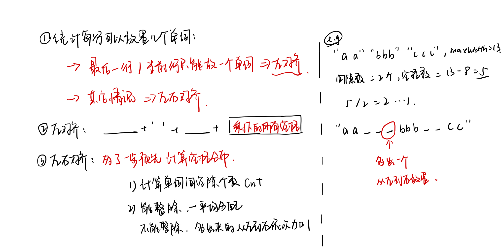

# Week 07 - Leetcode 61 - 70


**61 - 旋转链表**


```cpp
class Solution {
public:
    ListNode* rotateRight(ListNode* head, int k) {
        if(!head) return head;
        int n = 1;
        ListNode* tail = head, *cur = head, *res = head;
        while(tail->next)
            tail = tail->next, n++;
        tail->next = head;
        k = n - 1 - (k % n);
        while(k--)
            cur = cur->next;
        res = cur->next;
        cur->next = nullptr;
        return res;
    }
};
```

**62 - 不同路径**

```diff
+ DP
```


基础的dp，初始化第一行第一列都为1 然后状态转移方程 `f[i][j] = f[i - 1][j] + f[i][j - 1]`

仅用到上一行 可以用滚动数组优化空间；

实际上答案就是一个组合数问题， 从 `(n - 1 + m - 1)` 个操作中选出 `(n - 1)` 个向下；

```cpp
class Solution {
public:
    int uniquePaths(int n, int m) {
        vector<vector<int>> f(2, vector<int>(m, 1));
        int k = 0;
        for(int i = 1; i < n; i++, k = 1 - k)
            for(int j = 1; j < m; j++)
                f[k][j] = f[1 - k][j] + f[k][j - 1];
        return f[1 - k][m - 1];
    }
};
```

**63 - 不同路径II**

在上一题的基础上增加了一些不能走的点， 不能走就设成0，能走和上题一样； 为了避免边界问题， 可以多加一行和一列，值为0；

```cpp
class Solution {
public:
    int uniquePathsWithObstacles(vector<vector<int>>& obstacleGrid) {
        if(obstacleGrid[0][0]) return 0;
        int n = obstacleGrid.size(), m = obstacleGrid[0].size();
        vector<vector<int>> f(n + 1, vector<int>(m + 1));
        for(int i = 1; i <= n; i++)
            for(int j = 1; j <= m; j++)
                if(i == 1 && j == 1) f[i][j] = 1 - obstacleGrid[i - 1][j - 1];
                else    f[i][j] = (1 - obstacleGrid[i - 1][j - 1]) * (f[i - 1][j] + f[i][j - 1]);
        return f[n][m]; 
    }
};
```

**64 - 最小路径和**

同样是动态规划，枚举从起点走到每个点的最小权值；

同样也是多加一行避免边界情况；

```cpp
class Solution {
public:
    int minPathSum(vector<vector<int>>& grid) {
        int n = grid.size(), m = grid[0].size();
        // 依旧是动态规划；
        vector<vector<int>> f(n + 1, vector<int>(m + 1, 2e9));
        f[0][1] = f[1][0] = 0;
        for(int i = 1; i <= n; i++)
            for(int j = 1; j <= m; j++)
                f[i][j] = min(f[i - 1][j], f[i][j - 1]) + grid[i - 1][j - 1];
        return f[n][m];
    }
};
```

**65 - 有效数字**

这题没什么意义.. 面向测试用例编程罢了 不做也行 (😁

**66 - 加一**

```diff
+ 高精度加法
```

前面做过一个类似的

```cpp
class Solution {
public:
    vector<int> plusOne(vector<int>& digits) {
        // 高精度加法
        if(digits.empty()) return {1};
        int n = digits.size(), f = 1;
        for(int i = n - 1; i >= 0; i--)
        {
            f += digits[i];
            digits[i] = f % 10;
            f /= 10;
            if(!f) break;
        }
        if(f) digits.insert(digits.begin(), f);
        return digits;
    }
};
```

**67 - 二进制求和**

```diff
+ 高精度加法
```

可以说和上面的题基本一样了

```cpp
class Solution {
public:
    string addBinary(string a, string b) {
        stringstream ss;
        int i = a.size() - 1, j = b.size() - 1, f = 0;
        while(i >= 0 || j >= 0)
        {
            if(i >= 0) f += a[i] - '0';
            if(j >= 0) f += b[j] - '0';
            ss << f % 2;
            f /= 2;
            i--, j--;
        }
        if(f) ss << f;
        string res = ss.str();
        reverse(res.begin(), res.end());
        return res;
    }
};
```

**68 - 文本左右对齐**

这是一道模拟题;



```cpp
class Solution {
public:
    vector<string> fullJustify(vector<string>& words, int maxWidth) {
        vector<string> res;
        for(int i = 0; i < words.size(); i++)
        {
            int j = i + 1;
            int len = words[i].size(), cur_len = 0;
            while(j < words.size() && len + 1 + words[j].size() <= maxWidth)
                len += words[j++].size() + 1;
            
            stringstream line;
            // 最后一行或一行只有一个单词 -> 左对齐
            if(j == words.size() || j == i + 1)
            {
                line << words[i];
                cur_len += words[i].size();
                for(int k = i + 1; k < j; k ++)
                    line << ' ' << words[k], cur_len += 1 + words[k].size();
                if(maxWidth > cur_len) line << string(maxWidth - cur_len, ' ');
            }
            // 剩下的情况 -> 左右对齐
            else
            {
                int cnt = j - i - 1, r = maxWidth - len + cnt; // r 是剩下的空格数；
                line << words[i];
                int k = 0;
                while(k < r % cnt) line << string(r / cnt + 1, ' ') << words[i + k + 1], k++;
                while(k < cnt) line << string(r / cnt, ' ') << words[i + k + 1], k++;
            }
            res.push_back(line.str());
            i = j - 1;
        }
        return res;
    }
};
```

**69 - x 的平方根**

```diff
+ 二分
```

这里的二分是下取整，相当于找到一个最大的y 使得`y * y <= x`

用乘法会有溢出问题 -> 转成除法

INT\_MAX + 1 会溢出 -> 转成 long long

```cpp
class Solution {
public:
    int mySqrt(int x) {
        if(!x) return x;
        // 二分
        int l = 0, r = x;
        while(l < r)
        {
            int mid = (long long) l + r + 1 >> 1;
            if(mid <= x / mid) l = mid;
            else r = mid - 1;
        }
        return l;
    }
};
```

**70 - 爬楼梯**

```diff
+ DP
```

`f[i] = f[i - 1] + f[i - 2];` // 斐波那契数列 从走一步or 走两步转移过来

```cpp
class Solution {
public:
    int climbStairs(int n) {
        // 排列组合
        int f0 = 0, f1 = 1, f= 1;
        for(int i = 0; i < n; i++)
        {
            f = f0 + f1;
            f0 = f1;
            f1 = f;
        }
        return f;
    }
};
```
