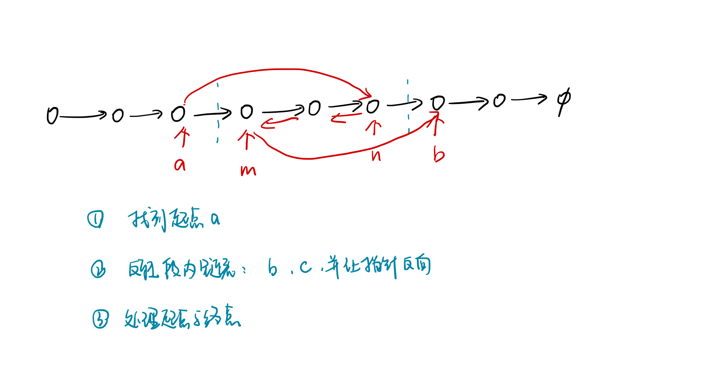

# Week 10 - Leetcode 91 - 100

**91 - 解码方法**

就是斐波那契数列：`f[i] = f[i - 1] + f[i - 2]`;

但是多一些限制 `s[i] != '0'` 才能从`f[i - 1]`转移过来； 同样的， `s[i - 1] * 10 + s[i]` 在 1 到 26之间才能从`f[i - 2]`转移过来；

```cpp
class Solution {
public:
    int numDecodings(string s) {
        // 感觉是斐波那契数列
        // f[i] = f[i - 1] + f[i - 2]; 
        // 肯定有一些额外的条件了 看s[i] 和 s[i] * 10 + s[i - 1] 在不在1 - 26 里
        int n = s.size();
        s = ' ' + s;
        vector<int> f(n + 1);
        f[0] = 1;
        for(int i = 1; i <= n; i++)
        {
            if(s[i] > '0') f[i] += f[i - 1];
            if(i >= 2 && (s[i - 1] == '1' || (s[i - 1] == '2'&& (s[i] <= '6')))) f[i] += f[i - 2]; 
        }
        return f[n];
    }
};
```

**92 - 反转链表II**



这里指针反向是用记录两个指针`b`和`c`实现的 让`c->next=b`实现反转

接下来还要让`b`和`c`格子向下移动一位，因为`c->next`已经覆盖 所以要提前记录

```cpp
class Solution {
public:
    ListNode* reverseBetween(ListNode* head, int m, int n) {
        ListNode* dummy = new ListNode(0), *a, *b, *c;
        dummy->next = head, a = dummy;
        for(int i = 0; i < m - 1; i++)
            a = a->next;
        b = a->next, c = b->next;
        for(int i = 0; i < n - m;i++)
        {
            ListNode* t = c->next;
            c->next = b;
            b = c, c = t;
        }
        a->next->next = c;
        a->next = b;
        return dummy->next;

    }
};
```

**93 - 复原IP地址**

做法差不多 都是`dfs+剪枝` 枚举三个`.`应该插在哪里 细节上有点区别；

**做法1**

```cpp
class Solution {
public:
    vector<string> res;
    int n;
public:
    vector<string> restoreIpAddresses(string s) {
        n = s.size();
        if(!n) return res;
        vector<int> dots;
        dfs(0, 4, dots, s);
        return res;
    }
    void dfs(int u, int cnt, vector<int>& dots, string& s)
    {
        // 剪枝条件：剩下的元素不够分了
        if(n - u < cnt || n - u > 3 * cnt) return;
        if(cnt == 0) 
        {
            stringstream ss;
            for(int i = 0; i < 3; i++)
            {
                ss << s.substr(dots[i], dots[i + 1] - dots[i]);
                ss << '.';
            }
            ss << s.substr(dots.back());
            res.push_back(ss.str());
            return;
        }
        // 枚举场景
        // 一个元素
        dots.push_back(u);
        dfs(u + 1, cnt - 1, dots, s);
        // 两个元素
        if(u + 1 < n && s[u] != '0')
        {
            dfs(u + 2, cnt - 1, dots, s);
        }
        // 三个元素
        if(u + 2 < n)
        {
            int val = stoi(s.substr(u, 3));
            if(val >= 100 && val <= 255)
                dfs(u + 3, cnt - 1, dots, s);
        }
        dots.pop_back();
    }
};
```

**做法2**

```cpp
class Solution {
public:
    vector<string> res;
    int n;
public:
    vector<string> restoreIpAddresses(string s) {
        n = s.size();
        if(!n) return res;
        dfs(s, 0, 0, "");
        return res;
    }
    void dfs(string& s, int u, int k, string path)
    {
        if(u == n)
        {
            if(k == 4)
            {
                path.pop_back();
                res.push_back(path);
            }
            return;
        }
        if(k == 4) return;
        for(int i = u, t = 0; i < n; i++)
        {
            if(i > u && s[u] == '0') break;
            t = t * 10 + s[i] - '0';
            if(t <= 255) 
                dfs(s, i + 1, k + 1, path + to_string(t) + '.');
            else break;
        }
    }
};
```

**94 - 二叉树的中序遍历**


主要记一下迭代怎么写；

遍历是，我们需要将所有左子树链上的所有点放入栈中，该过程即为递,然后取出栈顶，加入遍历数组，之后再放入右子树，同时注意这里的右子树指的是整个右子树的左子树链。直到遍历完所有结点。

```cpp
class Solution {
public:
    vector<int> res;
public:
    vector<int> inorderTraversal(TreeNode* root) {
        vector<int> res;
        stack<TreeNode*> stk;

        while(root || stk.size())
        {
            while(root)
            {
                stk.push(root);
                root = root->left;
            }
            root = stk.top();
            stk.pop();
            res.push_back(root->val);
            // 处理right
            root = root->right;
        }
        return res;
    }
};
```

**95 - 不同的二叉搜索树ii**

**BST**

二叉搜索树-> 中序遍历是有序的

由`1~n`所有数形成的二叉搜索树的种类数是**卡特兰数** 

这里的搜索还是很巧妙的，因为二叉搜索树的中序遍历是有序的 枚举任一有序区间内的点，左边的一定构成BST的左子树，右边一定构成BST的右子树，所以可以按照这个原则去枚举区间，并生成最终的答案；

```cpp
class Solution {
public:
    vector<TreeNode*> generateTrees(int n) {
        if(n == 0) return {};
        return dfs(1, n);
    }
    vector<TreeNode*> dfs(int l, int r)
    {
        if(l > r) return {nullptr};
        vector<TreeNode*> res;
        for(int i = l; i <= r; i++)
        {
            vector<TreeNode*> left  = dfs(l, i - 1);
            vector<TreeNode*> right = dfs(i + 1, r);
            for(auto l : left)
                for(auto r : right)
                {
                    TreeNode* root = new TreeNode(i);
                    root->left = l;
                    root->right = r;
                    res.push_back(root);
                }
        }
        return res;
    }
};
```

有这样几个需要注意的地方： 1. root 每次都要新建 不要一直用一个 会有读写冲突； 2. 不同子树的某些节点可能是共用的

**96 - 不同的二叉搜索树**


这里用到的就是递推形式， 实际上这里的二叉搜索树的个数就是由上面的递推式而来的；

枚举根节点root, 然后遍历左右两边的可能性：这里的方案数量仅和区间的长度有关

`f[n]`表示 n个节点的二叉搜索树共有多少种。 状态转移：左子树可以有 `0,1,…n−1`个节点，对应的右子树有 `n−1,n−2,…,0`个节点，`f[n]` 是所有这些情况的加和，所以 `f[n] = f[k] * f[n - 1 - k] (k = 0 .. n - 1]` (共有n - 1个节点分配给左右两边)

1. **组合数**

```cpp
typedef unsigned long long ULL;
class Solution {
public:
    int numTrees(int n) {
        vector<vector<ULL>> f(2 * n + 1, vector<ULL>(2 * n + 1, 0));
        for(int i = 0; i <= 2 * n; i++)
            for(int j = 0; j <= min(i, n); j++)
                if(!j) f[i][j] = 1;
                else f[i][j] = f[i - 1][j] + f[i - 1][j - 1];
        return static_cast<int>(f[2 * n][n] / (n + 1));
        }
};
```

1. **递推**

```cpp
class Solution {
public:
    int numTrees(int n) {
            vector<int> f(n + 1);
            f[0] = 1;
            for(int i = 1; i <= n; i++)
                for(int j = 1; j <= i; j++)
                    f[i] += f[j - 1] * f[i - j];
            return f[n];
        }
};
```

**97 - 交错字符串**

```diff
+ 动态规划
```

`f[i, j]` 表示s1的前i个字符和s2的前j个字符可以构成s3的前`i+j`个字符

`f[i, j] == (s1[i] == s3[i + j] && f[i - 1][j]) || (s2[j] == s3[i + j] && f[i][j - 1])` 表示从s1构建或者从s2构建

```cpp
class Solution {
public:
    bool isInterleave(string s1, string s2, string s3) {
        int n1 = s1.size(), n2 = s2.size(), n3 = s3.size();
        s1 = ' ' + s1, s2 = ' ' + s2, s3 = ' ' + s3;
        if(n1 + n2 != n3) return false;
        vector<vector<bool>> f(n1 + 1, vector<bool>(n2 + 1));
        f[0][0] = true; // 初始状态
        for(int i = 0; i <= n1; i++)
            for(int j = 0; j <= n2; j++)
                if(i != 0 || j != 0)
                    f[i][j] = (i && s1[i] == s3[i + j] && f[i - 1][j]) || 
                        (j && s2[j] == s3[i + j] && f[i][j - 1]);
        return f[n1][n2];
    }
};
```

**98 - 验证二叉搜索树**

二叉搜索树的性质：中序遍历的结果一定是有序的，因此保存中序遍历的结果判断是否有序即可；

这里复习一下迭代法求中序遍历

```cpp
class Solution {
public:
    vector<int> nums;
public:
    bool isValidBST(TreeNode* root) {
        // 中序遍历判断有序
        dfs(root);
        for(int i = 0; i < nums.size(); i++)
        {
            if(i && nums[i] <= nums[i - 1])
                return false;
        }
        return true;
    }
    void dfs(TreeNode* root)
    {
        stack<TreeNode*> stk;
        while(root || stk.size())
        {
            while(root)
            {
                stk.push(root);
                root = root->left;
            }
            root = stk.top();
            stk.pop();
            nums.push_back(root->val);
            root = root->right;
        }
    }
};
```

**99 - 恢复二叉搜索树**

**Morris遍历**

二叉搜索树被错误的交换节点的时候，中序遍历会出现逆序对；

也就是说找到逆序对就可以发现被错误交换的节点，在这里可能有两种情况： 只有一个逆序对 就说明相邻两个元素被交换 有两个逆序对，则说明第一个逆序对的第一个元素和第二个逆序对的第二个元素被交换；

这里我们不用额外的空间去保存中序遍历的结果，而是直接在递归中记录上一个处理的节点prev； 在中序遍历中每一个处理的节点

```diff
- dfs(root->left);
+ 在这处理节点
+ 也就是在这里被处理的顺序就是中序遍历的结果
+ 在这里记录prev即可
- dfs(root->right);
```

**1. 空间复杂度o(n)**

```cpp
class Solution {
public:
    TreeNode* prev = new TreeNode(INT_MIN);
    TreeNode* t1 = nullptr, *t2 = nullptr;
public:
    void recoverTree(TreeNode* root) {
        dfs(root);
        int tmp = t1->val;
        t1->val = t2->val;
        t2->val = tmp;
    }
    void dfs(TreeNode* root)
    {
        if(root == nullptr) return;
        dfs(root->left);
        if(prev->val > root->val && t1 == nullptr)
            t1 = prev;
        if(prev->val > root->val && t1 != nullptr)
            t2 = root;
        prev = root;
        dfs(root->right);
    }
};
```

这样做的话实际是用递归栈存储了中序遍历的结果，空间复杂度还是`o(n)`的 要想实现`o(1)`的空间复杂度，需要利用Morris遍历；

Morris遍历总的来说是把回溯的过程用额外的指针实现

1. 没有左子树: 则直接遍历当前点，然后走到右儿子
2. 如果当前节点有左儿子，则找当前节点的前驱。 (1) 如果前驱节点的右儿子为空，说明左子树没遍历过，则进入左子树遍历，并将前驱节点的右儿子置成当前节点，方便回溯； (2) 如果前驱节点的右儿子为当前节点，说明左子树已被遍历过，则将前驱节点的右儿子恢复为空，然后打印当前节点的值，然后进入右子树继续遍历；

```cpp
class Solution {
public:
    TreeNode* first = nullptr, *second = nullptr, *last = nullptr;
public:
    void recoverTree(TreeNode* root) {
        while(root)
        {
            if(!root->left)
            {
                // 遍历当前点
                if(last && last->val > root->val)
                {
                    if(!first) first = last, second = root;
                    else second = root;
                }
                last = root;
                root = root->right;
            }
            else 
            {
                auto p = root->left;
                while(p->right && p->right != root) p = p->right;
                if(!p->right) p->right = root, root = root->left;
                else {
                    p->right = nullptr;
                    // 遍历当前点
                    if(last && last->val > root->val)
                    {
                        if(!first) first = last, second = root;
                        else second = root;
                    }
                    last = root;
                    root = root->right;
                }
            }
        }
        swap(first->val, second->val);
    }
};
```

**100 - 相同的树**

搜索就好了 要么都不存在 要么都存在且val一致；

```cpp
class Solution {
public:
    bool isSameTree(TreeNode* p, TreeNode* q) {
        //如果两个树在结构上相同，并且节点具有相同的值，则认为它们是相同的
        if(!p && !q) return true;
        if(!p || !q || p->val != q->val) return false;
        return isSameTree(p->left, q->left) && isSameTree(p->right, q->right);
    }
};
```
