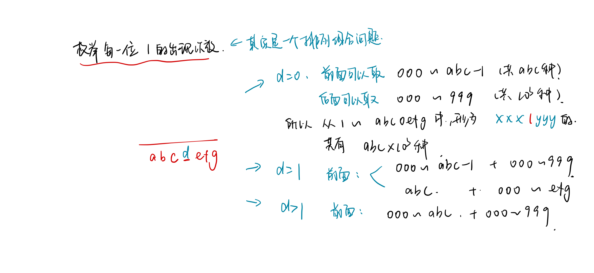
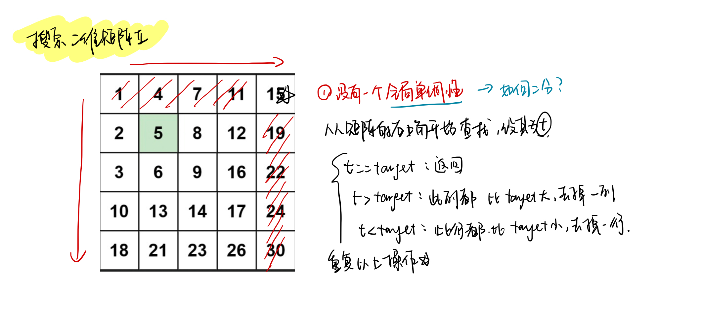

<!--
 * @Description: 
 * @Versions: 
 * @Author: Vernon Cui
 * @Github: https://github.com/vernon97
 * @Date: 2021-01-12 22:12:37
 * @LastEditors: Vernon Cui
 * @LastEditTime: 2021-01-18 17:59:21
 * @FilePath: /.leetcode/Users/vernon/Leetcode-notes/week24.md
-->

# Week 24 - Leetcode 231 - 240

#### 231 - 2的幂

是2的幂次 就证明 这个数的二进制位只能有一个1;

lowbit运算: 返回保留最后一个1的二进制数 e.g. lowbit(1010) -> 10

其实就是 `x & (-x) == x`

```cpp
class Solution {
public:
    bool isPowerOfTwo(int n) {
        // 这题 2的幂次 证明 二进制只能有一个1
        if(n <= 0) return false;
        return (n & (-n)) == n;
    }
};
```

#### 232 - 用栈实现队列

怎么在栈中找到最早插入的元素？ -> 辅助栈 每次插入新元素都插入`stk`头部

> 感谢jp人提供的思路

```cpp
class MyQueue {
public:
    stack<int> stk, helper;
public:
    /** Initialize your data structure here. */
    MyQueue() = default;
    
    /** Push element x to the back of queue. */
    void push(int x) {
        // 每次插入 都插入到头部
        while(stk.size())
        {
            helper.push(stk.top());
            stk.pop();
        }
        stk.push(x);
        while(helper.size())
        {
            stk.push(helper.top());
            helper.pop();
        }
    }
    /** Removes the element from in front of queue and returns that element. */
    int pop() {
        int res = stk.top();
        stk.pop();
        return res;
    }
    
    /** Get the front element. */
    int peek() {
        return stk.top();
    }
    
    /** Returns whether the queue is empty. */
    bool empty() {
        return stk.empty();
    }
};
```

#### 233 - 数字1的个数

```diff
+ 数位DP
```

经典的数位DP了 快来复习一下数位DP

 

这一题 我们枚举的是每一位中1的出现次数


```cpp
class Solution {
public:
    int countDigitOne(int n) {
        if(n <= 0) return 0;
        // * 1. 把n的每一位扣出来
        int num = n;
        vector<int> nums;
        while(num)
        {
            nums.push_back(num % 10);
            num /= 10;
        }
        reverse(nums.begin(), nums.end());
        int left = 0, p = pow(10, nums.size() - 1), right = n % p, res = 0;
        // * 2. 计算每一位的1出现情况
        // 这里的left就是上面的abc right 就是efg 
        for(int i = 0; i < nums.size(); i++)
        {
            int d = nums[i];
            if(d == 0)  res += left * p;
            else if (d == 1) res += left * p + right + 1;
            else res += (left + 1) * p;
            // 处理
            left = left * 10 + nums[i];
            p /= 10;
            if(p) right = n % p;
        }
        return res;
    }
};
```

#### 234 - 回文链表

>进阶： 你能否用 O(n) 时间复杂度和 O(1) 空间复杂度解决此题？

这题把链表的好多操作都用上了：
- 找中点：快慢指针
- 反转链表

整体思路就是找到中点 -> 反转后半链表，得到两个子链表 -> 对比元素 不一致就不满足回文要求

```cpp
class Solution {
public:
    bool isPalindrome(ListNode* head) {
        // * 太经典了 找中点 后半部分反转链表 然后再遍历
        if(!head || !head->next) return true;
        ListNode* slow = head, *fast = head;
        while(fast && fast->next)
        {
            slow = slow->next;
            fast = fast->next->next;
        }
        // * 此时 slow 是中点前面的那个节点
        ListNode* a = slow, *b = slow->next;
        a->next = nullptr;
        while(b)
        {
            ListNode* tmp = b->next;
            b->next = a;
            a = b, b = tmp;
        }
        // * 此时 两个链表 一个头结点是head 一个头结点是a
        while(a && head)
        {
            if(a->val != head->val) return false;
            a = a->next;
            head = head->next;
        }
        return true;
    }
};
```

#### 235 - 二叉搜索树的最近公共祖先

```diff
+ 最近公共祖先（LCA)
```

肯定是递归搜索了 和root比 一大一小就是当前的root为答案, 不然就往两边走
相等直接返回即可（根据定义）

那个bool判断异或 `if((rootval < pval) ^ (rootval < qval))` 是两个之中保证一个成立的意思 简化if的判断条件

```cpp
class Solution {
public:
    TreeNode* lowestCommonAncestor(TreeNode* root, TreeNode* p, TreeNode* q) {
        // 肯定是递归搜索了 和root比 一大一小就是当前的root为答案
        // 最近公共祖先节点可以为节点本身。
        int pval = p->val, qval = q->val;
        while(root)
        {
            int rootval = root->val;
            if(rootval == pval || rootval == qval) return root;
            if((rootval < pval) ^ (rootval < qval)) return root;
            if(pval < rootval) root = root->left;
            else root = root->right;
        }
        return nullptr;   
    }
};
```

#### 236 - 二叉树的最近公共祖先

```diff
+ 最近公共祖先(LCA)问题
```

这里指路图论总结专题 有两个算法 **在线：倍增法 和 离线：Tarjan**

这里因为就查询一次，所以直接**标记法**就好了，分别记录从`root`到`p`和`q`的路径 重合的就是公共祖先
找到最后一个就是最近公共祖先了

总的来说还是不太正经 正经的LCA问题上面的两个算法还是要背好

```cpp
class Solution {
public:
    bool dfs(TreeNode* root, vector<TreeNode*>& path, TreeNode* target)
    {
        path.push_back(root);
        if(root->val == target->val) return true;
        if(root->left && dfs(root->left, path, target)) return true;
        if(root->right && dfs(root->right, path, target)) return true;
        path.pop_back();
        return false;
    }
    TreeNode* lowestCommonAncestor(TreeNode* root, TreeNode* p, TreeNode* q) {
        // 这里只用查询一次 就标记法？
        vector<TreeNode*> pathp, pathq;
        dfs(root, pathp, p);
        dfs(root, pathq, q);
        TreeNode* res = nullptr;
        for(int i = 0; i < min(pathp.size(), pathq.size()); i++)
        {
            if(pathp[i]->val == pathq[i]->val)
                res = pathp[i];
            else break;
        }
        return res;
    }
};
```

另外补一个递归做法：
```cpp
class Solution {
public:
    TreeNode* lowestCommonAncestor(TreeNode* root, TreeNode* p, TreeNode* q) {
        if(root == nullptr || root == p || root == q) return root;
        TreeNode *left = lowestCommonAncestor(root->left, p, q);
        TreeNode *right = lowestCommonAncestor(root->right, p, q);
        if(left == nullptr) return right;
        if(right == nullptr) return left;
        return root;
    }
};
```

#### 237 - 删除链表中的节点

这题没有给任何前驱节点 怎么删呢？ **假扮后继**

> 先把node后面的点删了 再把node改成后面删除点的val

```cpp
class Solution {
public:
    void deleteNode(ListNode* node) {
        // 前驱结点呢？？
        node->val = node->next->val;
        node->next = node->next->next;
    }
};
```

#### 238 - 除自身以外数组的乘积

> 请不要使用除法，且在 O(n) 时间复杂度内完成此题

> 你可以在常数空间复杂度内完成这个题目吗 （出于对空间复杂度分析的目的，输出数组不被视为额外空间。）

**前后缀分解**
前后缀分解是一个非常重要的技巧，将数组按照`i` 分为前半段前缀和后半段后缀 而前缀和后缀都可通过递推来实现；

这里题目要求常数空间复杂度（输出数组不算） 相当于只能开一个数组，这里我们把前缀成绩直接存储在输出数组`res`中， 在求后缀的过程直接用一个变量`sub`代替

```cpp
class Solution {
public:
    vector<int> productExceptSelf(vector<int>& nums) {
        int n = nums.size();
        vector<int> res(n, 0);
        // * 前缀乘积 -> res
        for(int i = 0; i < n; i++)
        {
            if(i == 0) res[i] = nums[0];
            else res[i] = nums[i] * res[i - 1];
        }
        // * 后缀乘积 由于也不会用到 直接就用一个变量sub替代
        int sub = 1;
        for(int i = n - 1; ~i; i--)
        {
            if(i) res[i] = sub * res[i - 1];
            else res[i] = sub;
            sub *= nums[i];
        }
        return res;
    }
};
```

#### 239 - 滑动窗口最大值

```diff
+ 单调队列
```

单调队列就是拿来求**滑动窗口最值**问题的， 直接默写8

注意队列是双端队列 用数组模拟就好

```cpp
class Solution {
public:
    vector<int> maxSlidingWindow(vector<int>& nums, int k) {
        vector<int> res;
        int n = nums.size();
        vector<int> q(n + 2, 0);
        int hh = 0, tt = -1;
        for(int i = 0; i < n; i++)
        {
            if(hh <= tt && q[hh] < i - k + 1) hh++;
            while(hh <= tt && nums[q[tt]] <= nums[i]) tt--;
            q[++tt] = i;
            if(i >= k - 1) res.push_back(nums[q[hh]]);
        }
        return res;
    }
};
```

#### 240 - 搜索二维矩阵II

有单调性搜索肯定考虑二分 但本题没有一个合适的全局单调性来处理 -> 很巧妙的一个做法



```cpp
class Solution {
public:
    bool searchMatrix(vector<vector<int>>& matrix, int target) {
        if(matrix.empty() || matrix[0].empty()) return false;
        int n = matrix.size(), m = matrix[0].size();
        int i = 0, j = m - 1;
        while(i < n && j >= 0)
        {
            int t = matrix[i][j];
            if(t == target) return true;
            else if (t > target) j--;
            else i++;
        }
        return false;
    }
};
```

