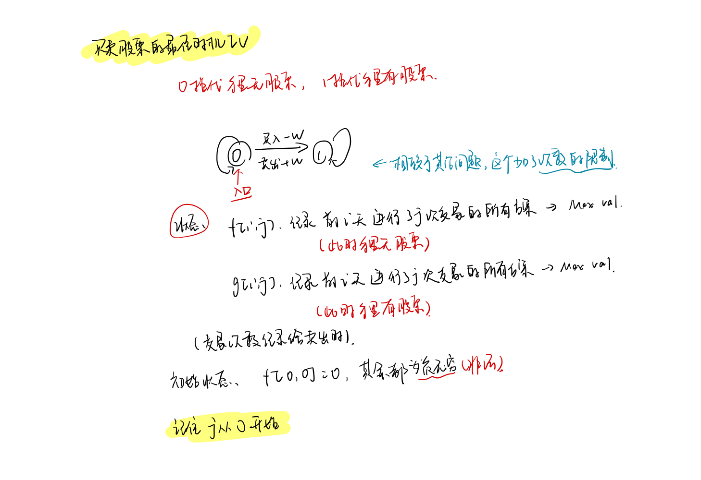

<!--
 * @Description: 
 * @Versions: 
 * @Author: Vernon Cui
 * @Github: https://github.com/vernon97
 * @Date: 2021-01-06 18:49:04
 * @LastEditors: Vernon Cui
 * @LastEditTime: 2021-01-07 15:58:57
 * @FilePath: /.leetcode/Users/vernon/Leetcode-notes/week19.md
-->

# Week 19 - Leetcode 181 - 190

```diff
+ 本周只有四道题（？
```

#### 187 - 重复的DNA序列

感觉这个题 也不是KMP.. 主要是子串要枚举很多次 字符串哈希吧应该是

复习一下KMP tmd 写一次忘一次（暴躁）

```cpp
int n = s.size(), m = p.size();
s = ' ' + s, p = ' ' + p;
vector<int> ne(m + 2);
// 1. 统计ne
for(int i = 2, j = 0; i <= m; i++)
{
    while(j && p[i] != p[j + 1]) j = ne[j];
    if(p[i] == p[j + 1]) j++;
    ne[i] = j;
}
// 2. KMP匹配
for(int i = 1, j = 0; i <= n; i++)
{
    while(j && s[i] != s[j + 1]) j = ne[j];
    if(s[i] == p[j + 1]) j++;
    if(j == m)
    {
        // 匹配成功的逻辑
    }
}
```

这题应该就是字符串哈希了, 这里除了常规的字符串哈希逻辑之外,
找到出现过的就清空 这里就直接改count就好了

```cpp
typedef unsigned long long ULL;
class Solution {
public:
    static const ULL M = 13331;
    vector<ULL> h, p;
public:
    ULL get(int l, int r)
    {
        return h[r] - h[l - 1] * p[r - l + 1];
    }
    vector<string> findRepeatedDnaSequences(string s) {
        // 一看就是字符串哈希
        int n = s.size();
        vector<string> res;
        s = ' ' + s;
        h = vector<ULL>(n + 1), p = vector<ULL>(n + 1);
        p[0] = 1;
        for(int i = 1; i <= n; i++)
        {
            h[i] = h[i - 1] * M + s[i] - 'A' + 1;
            p[i] = p[i - 1] * M;
        }
        
        unordered_map<ULL, int> hash;
        // 枚举起点
        for(int k = 1; k <= 10; k++)
        {
            for(int i = k; i + 9 <= n; i += 10)
            {
                ULL temp  = get(i, i + 9);
                hash[temp]++;
                if(hash[temp] > 1)
                {
                    res.push_back(s.substr(i, 10));
                    hash[temp] = -1e9;
                }
            }
        }
        return res;
    }
};
```

#### 188 - 买卖股票的最佳时期IV

是的 这题就是状态机模型 股票终极版

首先，提前判断-> 如果k足够大, 就相当于 可以无限买卖 这样的话实际就是之前做过的122题 当时那个把整段交易拆分成每天交易一次的思想

除了这个之外, **状态机模型**:



```cpp
class Solution {
public:
    int maxProfit(int k, vector<int>& prices) {
        int res = 0, n = prices.size();
        if(k >= n / 2 + 1)
        {
            for(int i = 0; i + 1 < prices.size(); i++)
                res += max(0, prices[i + 1] - prices[i]);
            return res;
        }
        else
        {
            // * 这里f表示的是手里无股票 g表示的是手里有股票
            vector<vector<int>> f(n + 1, vector<int>(k + 1, -2e9)), g(n + 1, vector<int>(k + 1, -2e9));
            f[0][0] = 0;
            for(int i = 1; i <= n; i++)
                for(int j = 0; j <= k; j++)
                {
                    f[i][j] = max(f[i - 1][j], g[i - 1][j] + prices[i - 1]);
                    res = max(res, f[i][j]);
                    if(j) g[i][j] = max(g[i - 1][j], f[i - 1][j - 1] - prices[i - 1]);
                    else g[i][j] = g[i - 1][j];
                }
            return res;
        }
        
    }
};
```

#### 189 - 旋转数组

> 要求使用空间复杂度为 O(1) 的 原地 算法

1. 将整个数组翻转一遍

`[1,2,3,4,5,6,7] -> [7,6,5,4,3,2,1]`

2. 将前k个数翻转 后k个数翻转

`-> [5,6,7, | 1,2,3,4]`

翻转可以采用双指针算法，空间复杂度是`o(1)`的

```cpp
class Solution {
public:
    void rotate(vector<int>& nums, int k) {
        k = k % nums.size();
        reverseVec(nums, 0, nums.size() - 1);
        // 翻转前半部分
        reverseVec(nums, 0, k - 1);
        // 翻转后半部分
        reverseVec(nums, k, nums.size() - 1);
    }
    void reverseVec(vector<int>& nums, int l, int r)
    {
        while(l < r)
        {
            swap(nums[l], nums[r]);
            l++, r--;
        }
    }
};
```

#### 190 - 颠倒二进制位

从右到左扣出每一位 反过来补给res上

```cpp
class Solution {
public:
    uint32_t reverseBits(uint32_t n) {
        uint32_t res = 0, cnt = 31;
        while(n)
        {
            if(n & 1)
                res += 1 << cnt;
            n >>= 1;
            cnt--;
        }
        return res;
    }
};
```


