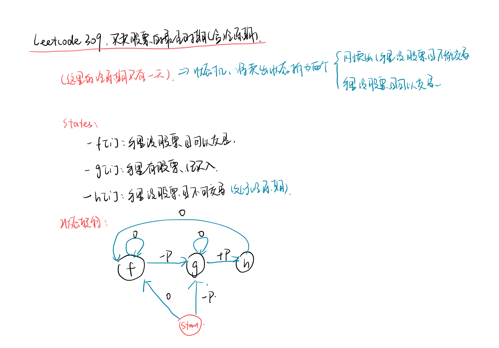
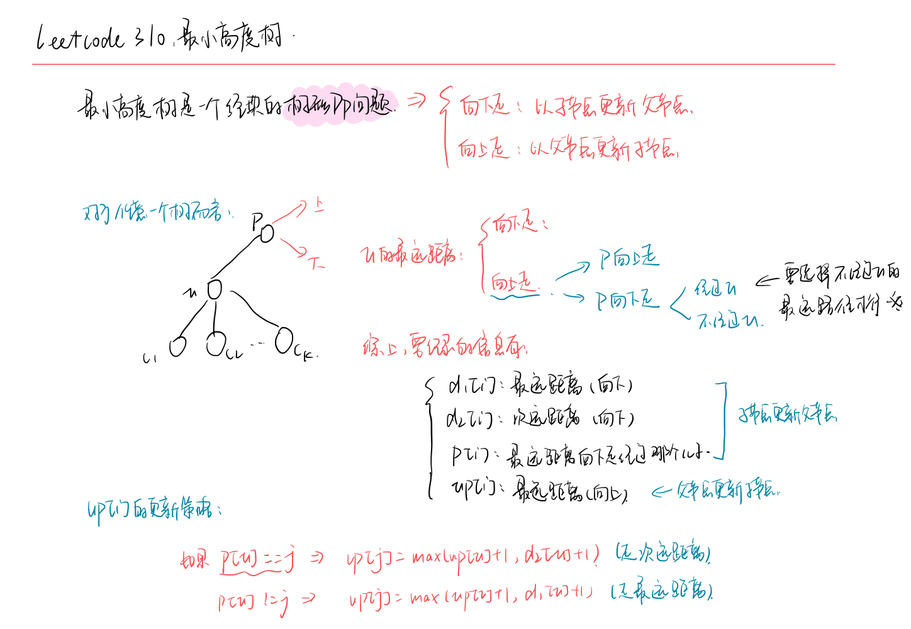

<!--
 * @Description: 
 * @Versions: 
 * @Author: Vernon Cui
 * @Github: https://github.com/vernon97
 * @Date: 2021-04-14 20:05:45
 * @LastEditors: Vernon Cui
 * @LastEditTime: 2021-04-16 20:05:45
 * @FilePath: /.leetcode/Users/vernon/Leetcode-notes/notes/week31.md
-->
# Week 31 - Leetcode 301 - 310

好家伙上来就这么硬核的吗...

### 301 - 删除无效的括号

记得复习一下leetcode 32.最长有效括号

**有效括号序列**要满足的要求：

- 左右括号数量相同
- 任意一个前缀中，左括号数量 >= 右括号数量

**第一步：统计要删掉多少左括号和右括号**

> `l` 表示还剩多少未匹配的左括号 `r`表示多少非法的右括号

那么`l ++`代表当前未匹配的左括号，如果遇到右括号并且当前未匹配的左括号个数大于0，那么`l --`，说明当前右括号前面有与之匹配的左括号，如果未匹配的左括号个数等于0，说明当前这个括号是不合法的，`r ++`

最后`l`代表还没有匹配的左括号个数，`r`表示非法的右括号个数，都是我们需要删除的个数。


**第二步：DFS搜索+剪枝**

这里的剪枝策略有两部分：

- 预处理删除的括号数
- 重复去重 ((( 对于这种连续的括号序列删除那个都是一样的 所以这里枚举的是删除的个数

函数签名`void dfs(string& s, int u, string path, int cnt, int l, int r)`

这里面`cnt`和上面的`l`含义一致，还有多少未匹配的左括号， `l` `r`都是还需要删除的括号数量


```cpp
class Solution {
public:
    vector<string> res;
public:
    vector<string> removeInvalidParentheses(string s) {
        int l = 0, r = 0;
        // 第一步：统计待删除的字符数量
        for(auto x : s)
        {
            if(x == '(') l++;
            else if (x == ')')
            {
                if(l == 0) r++;
                else l--;
            }
        }
        dfs(s, 0, "", 0, l, r);
        return res;
    }
    void dfs(string& s, int u, string path, int cnt, int l, int r)
    {
        if(u == s.size())
        {
            if(!cnt) res.push_back(path); // 合法条件：左右括号数量一致
            return;
        }
        if(s[u] != '(' && s[u] != ')') dfs(s, u + 1, path + s[u], cnt, l, r);
        else if (s[u] == '(')
        {
            int k = u;
            while(k < s.size() && s[k] == '(') k++;
            // 按照数量枚举，先把所有的都删了
            l -= k - u;
            for(int i = k - u; i >= 0; i--)
            {
                if(l >= 0) dfs(s, k, path, cnt, l, r);
                path += '(';
                cnt++, l++; // 
            }
        }
        else if (s[u] == ')')
        {
            int k = u;
            while(k < s.size() && s[k] == ')') k++;
            r -= k - u;
            for(int i = k - u; i >= 0; i--)
            {
                if(cnt >= 0 && r >= 0) dfs(s, k, path, cnt, l, r); // 注意这里的 cnt >= 0
                path += ')';
                cnt--, r++;
            }
        }
    }
};
```

### 303 - 区域和检索 - 数组不可变

这题简单 一维前缀和罢了

```cpp
class NumArray {
public:
    vector<int> s;
public:
    NumArray(vector<int>& nums) {
        int n = nums.size();
        s = vector<int>(n + 1);
        for(int i = 1; i <= n; i++)
        {
            s[i] = s[i - 1] + nums[i - 1];
        }
    }
    
    int sumRange(int left, int right) {
        return s[right + 1] - s[left];
    }
};
```

### 304 - 二维区域和检索 - 数组不可变

这题就是上一题的推广 二维前缀和

注意的点一个是下标要从0映射到1 另一个是是闭区间 所以`row1` 和 `col1`都要减去1

```cpp
class NumMatrix {
public:
    int n, m;
    vector<vector<int>> s;
public:
    NumMatrix(vector<vector<int>>& matrix) {
        n = matrix.size(), m = matrix[0].size();
        s = vector<vector<int>>(n + 1, vector<int>(m + 1));
        for(int i = 1; i <= n; i++)
            for(int j = 1; j <= m; j++)
                s[i][j] = s[i - 1][j] + s[i][j - 1] - s[i - 1][j - 1] + matrix[i - 1][j - 1];
    }
    
    int sumRegion(int row1, int col1, int row2, int col2) {
        return s[row2 + 1][col2 + 1] - s[row2 + 1][col1] - s[row1][col2 + 1] + s[row1][col1];
    }
};
```

### 306 - 累加数

判断一个字符串是不是斐波那契数列 但是没有分隔符

**用高精度的方式来存每个数**

枚举第一个数的长度和第二个数的长度，然后递归判断是不是斐波那契数列, 所以三个数分别是 `[a + 1, b]` 和 `[b + 1, c]` 和 `[c + 1, c + z.size()]`, 不断往后指就可以了

时间复杂度：`o(n^3)` 枚举+判断

不能枚举有前导0的数

```cpp
class Solution {
public:
    string add(string sa, string sb)
    {
        // 高精度加法
        if(sa.size() < sb.size()) return add(sb, sa);
        vector<int> a, b, res;
        for(int i = sa.size() - 1; i >= 0; i--) a.push_back(sa[i] - '0');
        for(int i = sb.size() - 1; i >= 0; i--) b.push_back(sb[i] - '0');
        int t = 0;
        for(int i = 0; i < a.size(); i++)
        {
            if(i < a.size()) t += a[i];
            if(i < b.size()) t += b[i];
            res.push_back(t % 10);
            t /= 10;
        }
        if(t) res.push_back(t);
        stringstream ss;
        for(int i = res.size() - 1; i >= 0; i--)
            ss << res[i];
        return ss.str();
    }
    bool isAdditiveNumber(string num) {
        // 枚举前两个数
        for(int i = 0; i < num.size(); i++)
            for(int j = i + 1; j + 1 < num.size(); j++) // 保证有第三个数
            {
                int a = -1, b = i, c = j;
                while(true)
                {
                    if((b - a > 1 && num[a + 1] == '0')|| (c - b > 1 && num[b + 1] == '0')) break; // 有前导0;
                    auto x = num.substr(a + 1, b - a), y = num.substr(b + 1, c - b);
                    auto z = add(x, y);
                    if(num.substr(c + 1, z.size()) != z) break;
                    a = b, b = c, c += z.size();
                    if(c + 1 == num.size()) return true;
                }
            }
        return false;
    }
};
```

### 307 - 区域和检索 - 数组可修改

能用树状数组就用树状数组，不行再用线段树；

**树状数组**：代码更短 空间更少 时间更快

```cpp
int lowbit(int x)
{
    return x & (-x);
}

// 注意这里的更新是差值 不是修改
void update(int i, int val)
{
    while(i <= len)
    {
        tree[i] += val;
        i += lowbit(i);
    }
}
//  求前缀和
int query(int i)
{
    int sum = 0;
    while(i > 0)
    {
        sum += tree[i];
        i -= lowbit(i);
    }
}
```

所以本题就是树状数组的应用

```cpp
class NumArray {
public:
    int n;
    vector<int> tree;
    vector<int> nums;
public:
    // 树状数组
    int lowbit(int x)
    {
        return x & (-x);
    }
    NumArray(vector<int>& nums) {
        this->n = nums.size();
        this->nums = nums;
        tree = vector<int>(n + 1, 0);
        for(int i = 1; i <= n; i++)
            add(i, nums[i - 1]);
    }

    void add(int index, int val)
    {
        while(index <= n)
        {
            tree[index] += val;
            index += lowbit(index);
        }
    }
    
    void update(int index, int val) {
        int delta = val - nums[index];
        nums[index] = val; 
        add(index + 1, delta);
    }

    int query(int index)
    {
        int sum = 0;
        while(index > 0)
        {
            sum += tree[index];
            index -= lowbit(index);
        }
        return sum;
    }
    int sumRange(int left, int right) {
        return query(right + 1) - query(left);
    }
};
```

### 309 - 最佳买卖股票时机含冷冻期

经典的买卖股票问题了-> 状态机模型

这里含冷冻期的状态共有三个：

- **在冷冻期**
- **已买入**
- **今天卖出**


有没有冷冻期的区别无非是把之前只有一个的卖出状态 拆成了今天卖出（手里有股票且不能买 和 在冷冻期（手里有股票且可以买 两个状态

```cpp
class Solution {
public:
    int maxProfit(vector<int>& prices) {
        int n = prices.size();
        vector<int> f(n + 1, -1e9), g(n + 1, -1e9), h(n + 1, -1e9);
        f[0] = 0, g[0] = -prices[0];
        for(int i = 1; i < n; i++)
        {
            f[i] = max(f[i - 1], h[i - 1]);
            g[i] = max(g[i - 1], f[i - 1] - prices[i]);
            h[i] = g[i - 1] + prices[i];
        }
        return max(f[n - 1], h[n - 1]);
    }
};
```

同样的 只需要前一个状态 那个空间可以优化成`o(1)` 注意缓存历史状态就行了

```cpp
class Solution {
public:
    int maxProfit(vector<int>& prices) {
        int f = 0, g = -prices[0], h = -0x3f3f3f3f;
        for(int i = 1; i < prices.size(); i++)
        {
            int f_cpy = f, g_cpy = g, h_cpy = h; 
            f = max(f, h);
            g = max(g, f_cpy - prices[i]);
            h = g_cpy + prices[i];
        }
        return max(f, h);
    }
};
```

### 310 - 最小高度树

```diff
+ 树形dp的经典问题
```

**记录最大距离最小的点**



剩下的细节大概就是要建双向边，dfs的时候额外记录father就行了
```cpp
class Solution {
public:
    static const int N = 20020, M = N * 2;
    int n;
    int h[N], e[M], ne[M], idx = 0;
    int d1[N], d2[N], p[N], up[N];
public:
    void add(int a, int b)
    {
        e[idx] = b, ne[idx] = h[a], h[a] = idx++;
    }
    int dfs_down(int u, int father)
    {
        for(int i = h[u]; ~i; i = ne[i])
        {
            int j = e[i];
            if(j == father) continue;
            int d = dfs_down(j, u) + 1;
            if(d >= d1[u])
            {
                d2[u] = d1[u];
                d1[u] = d;
                p[u] = j;
            }
            else if(d >= d2[u])
            {
                d2[u] = d;
            }
        }
        return d1[u];
    }
    void dfs_up(int u, int father)
    {
        for(int i = h[u]; ~i; i = ne[i])
        {
            int j = e[i];
            if(j == father) continue;
            // 以父节点更新子节点
            if(p[u] == j)
                up[j] = max(up[u] + 1, d2[u] + 1);
            else
                up[j] = max(up[u] + 1, d1[u] + 1);
            dfs_up(j, u);
        }
    }
    vector<int> findMinHeightTrees(int n, vector<vector<int>>& edges) {
        memset(h, -1, sizeof h);
        for(vector<int>& edge : edges)
        {
            add(edge[0], edge[1]);
            add(edge[1], edge[0]);
        }
        // 1. 从上到下
        dfs_down(0, -1);
        // 2. 从下到上
        dfs_up(0, -1);
        // 3. 枚举根节点
        int res = 0x3f3f3f3f;
        vector<int> roots;
        for(int i = 0; i < n; i++)
        {
            int d = max(up[i], d1[i]);
            if(res > d)
            {
                res = d;
                roots.clear();
                roots.push_back(i);
            }
            else if (res == d)
                roots.push_back(i);
        }
        return roots;
    }
};
```
