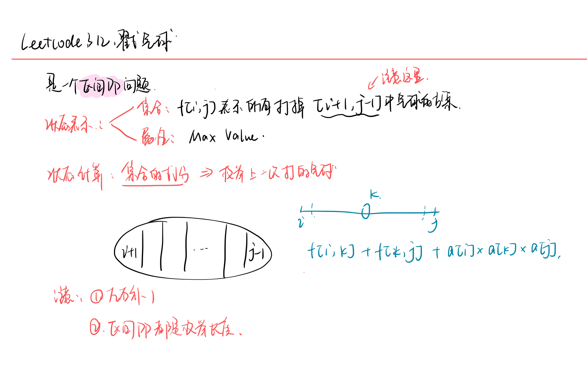

<!--
 * @Description: 
 * @Versions: 
 * @Author: Vernon Cui
 * @Github: https://github.com/vernon97
 * @Date: 2021-04-16 19:41:05
 * @LastEditors: Vernon Cui
 * @LastEditTime: 2021-04-16 20:41:58
 * @FilePath: /.leetcode/Users/vernon/Leetcode-notes/notes/week32.md
-->
# Week 32 - Leetcode 311 - 320

### 312 - 戳气球

经典的区间dp问题了，**记住记住区间dp是先枚举长度 再枚举左端点**

他这个状态设计注意一下 `l` 和 `r` 都是没有打掉的 因为计算分数需要


还有一个优化： 每次计算`nums[l] * nums[k] * nums[r]` 可以先把`nums[l] * nums[r]` 存下来

```cpp
class Solution {
public:
    int maxCoins(vector<int>& nums) {
        int n = nums.size();
        nums.insert(nums.begin(), 1);
        nums.push_back(1);
        vector<vector<int>> f(n + 2, vector<int>(n + 2));
        // 区间DP模板
        for(int len = 3; len <= n + 2; len++)
            for(int l = 0; len + l - 1 <= n + 1; l++)
            {
                int r = l + len - 1;
                int reslr = nums[l] * nums[r];
                for(int k = l + 1; k < r; k++)
                    f[l][r] = max(f[l][r], f[l][k] + f[k][r] + reslr * nums[k]);
            }
        return f[0][n + 1];
    }
};
```