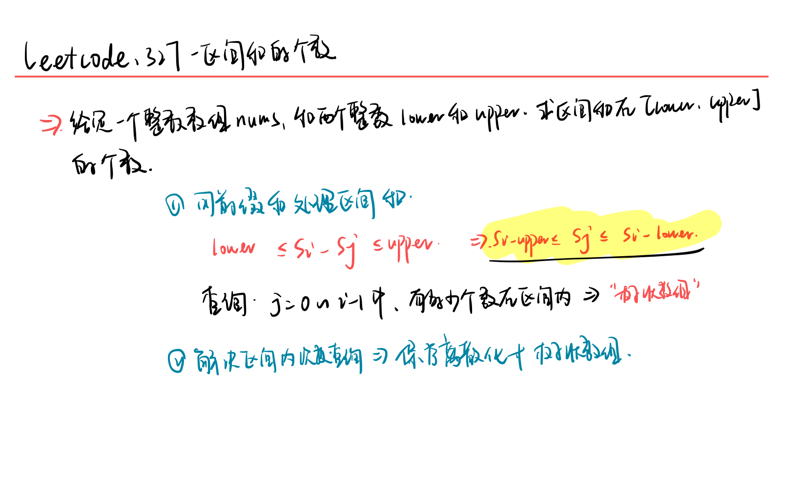
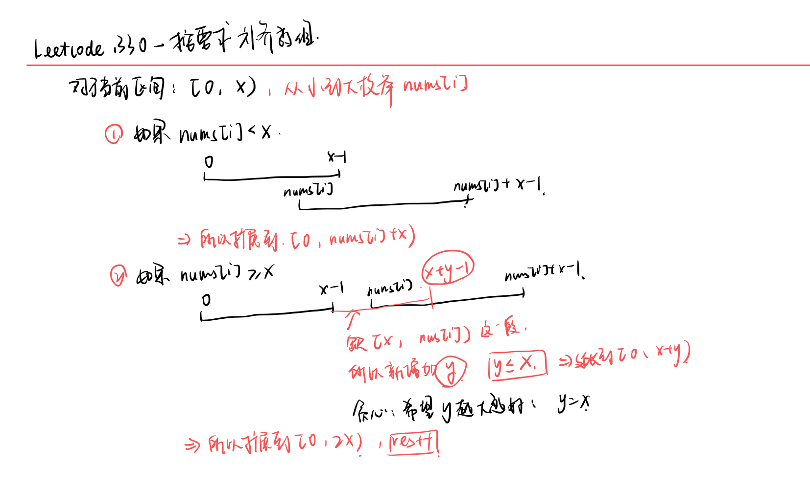

<!--
 * @Description: 
 * @Versions: 
 * @Author: Vernon Cui
 * @Github: https://github.com/vernon97
 * @Date: 2021-05-05 21:07:20
 * @LastEditors: Vernon Cui
 * @LastEditTime: 2021-05-07 14:18:24
 * @FilePath: /.leetcode/Users/vernon/Leetcode-notes/notes/week33.md
-->
# Week 33 - Leetcode 321 - 330

### 321 - 拼接最大数

首先把这个问题拆分成如下的子问题：

- 枚举从第一个数组中选几个数
- 从一个长度为m的数组中，按顺序选择k个数，使其字典序最大
- 按顺序合并两个数组，使其字典序最大

总结一下，按顺序选择子序列使其字典序最大这样都是贪心+栈 来删除，这里和316题是一个思路 都是比较大小，能删就删

**学习一下这个代码**

```cpp
vector<int> maxArray(vector<int>& nums, int k)
{
    int n = nums.size();
    vector<int> res(k);
    for(int i = 0, j = 0; i < nums.size(); i++)
    {
        int x = nums[i];
        // 这里的逻辑是 如果栈里有元素 且栈顶元素比x小，且弹出后还能凑成k个数的话（能删） 就删
        while(j && res[j - 1] < x && j + n - i > k) j--;
        if(j < k) res[j++] = x; // 如果可以加入就加入 这里学习一下
    }
}
```

按顺序合并两个子数组使得字典序最大，也是同样的贪心思路，按大的元素合并；

**如果两个元素相同的话** 则比较后面的元素 选择后面元素大的那一排 

代码中利用到了vector的比较大小 这里直接是按照字典序比较的 所以简洁很多 这里学习一下

```cpp
class Solution {
public:
    vector<int> maxNumber(vector<int>& nums1, vector<int>& nums2, int k) {
        int n = nums1.size(), m = nums2.size();
        vector<int> res(k, 0);
        for(int i = max(0, k - m); i <= min(k, n); i++)
        {
            auto a = maxArray(nums1, i);
            auto b = maxArray(nums2, k - i);
            auto c = mergeArray(a, b);
            res = max(res, c);
        }
        return res;
    }
    vector<int> maxArray(vector<int>& nums, int k)
    {
        int n = nums.size();
        vector<int> res(k);
        for(int i = 0, j = 0; i < nums.size(); i++)
        {
            int x = nums[i];
            while(j && res[j - 1] < x && j + n - i > k) j--;
            if(j < k) res[j++] = x;
        }
        return res;
    }
    vector<int> mergeArray(vector<int>& a, vector<int>& b)
    {
        vector<int> res;
        while(a.size() && b.size())
            if(a > b) // 注意啊注意 这里是vector的比较-> 字典序
                res.push_back(a[0]), a.erase(a.begin());
            else 
                res.push_back(b[0]), b.erase(b.begin());
        if(a.size()) res.insert(res.end(), a.begin(), a.end());
        if(b.size()) res.insert(res.end(), b.begin(), b.end());
        return res;
    }
};
```

### 322 - 零钱兑换

经典的完全背包问题，完全背包就是从小到大遍历体积`v`，然后注意一下初始状态定义就好了

这里由于要装满 所以`f[0] = 0` 其余都是无穷大

```cpp
class Solution {
public:
    int coinChange(vector<int>& coins, int amount) {
        // 完全背包问题 注意初始状态和状态转移
        vector<int> f(amount + 1, 1e9);
        f[0] = 0;
        for(int i = 0; i < coins.size(); i++)
            for(int j = coins[i]; j <= amount; j++)
                f[j] = min(f[j], f[j - coins[i]] + 1);
        return f[amount] != 1e9 ? f[amount] : -1;
    }
};
```

### 324 - 摆动排序II

给你一个整数数组 nums，将它重新排列成 `nums[0] < nums[1] > nums[2] < nums[3]...` 的顺序

没啥可说的 智力题 背一背就好

有这么几个要复习的地方：

- 1. 快速选择算法
  快速选择还记得吗？

  ```cpp
  int quick_select(vector<int>& nums, int l, int r, int k)
  {
      if(l == r) return nums[l];
      int x = nums[l], i = l - 1, j = r + 1;
      while(i < j)
      {
          while(nums[++i] < x);
          while(nums[--j] > x);
          if(i < j) swap(nums[i], nums[j]);
      }
      int sl = j - l + 1;
      if(k <= sl) return quick_select(nums, l, j, k);
      else return quick_select(nums, j + 1, r, k - sl);
  }
  ```
  STL中是有第k个元素选择的函数的，`nth_element(nums.begin(), *, nums.end())` 注意传入的是迭代器 而且在中间的参数

- 2. 荷兰国旗问题（leetcode 75）

  ```cpp
  class Solution {
  public:
      void sortColors(vector<int>& nums) {
          int i = 0, j = 0, k = nums.size() - 1;
          while(i <= k)
          {
              int a = nums[i];
              if(a == 0)
              {
                  swap(nums[i], nums[j]);
                  i++, j++;
              }
              else if (a == 1)
                  i++;
              else
                  swap(nums[k], nums[i]), k--;
          }
      }
  };
  ```

**思路：**
将所有数分成三种：小于`mid`的数、等于`mid`的数和大于`mid`的数。
然后对数组排序，使得大于`mid`的数在最前面，等于`mid`的数在中间，小于`mid`的数在最后面。

这一步可以直接利用三数排序，三数排序算法可以参考`LeetCode 75. Sort Colors`。

然后我们将排好序的数组重排，**将前半段依次放到奇数位置上，将后半段依次放到偶数位置上**。此时就会有：
`nums[0] < nums[1] > nums[2] < nums[3] ...`

这一步重排我们可以在三数排序时做，只需在排序时做一个数组下标映射即可：
> `i => (1 + 2 * i) % (n | 1)`
该映射可以将数组前一半映射到奇数位置上，数组后一半映射到偶数位置上。

> 这个下标映射显然是硬凑的 

然后记得把三路快排直接套上去，这里有个技巧可以直接按照这个映射排序即可；

然后学习一下宏函数

```cpp
class Solution {
public:
    void wiggleSort(vector<int>& nums) {
        int n = nums.size();
        vector<int>::iterator midptr = nums.begin() + n / 2;
        nth_element(nums.begin(), midptr, nums.end()); // 没有返回值
        int mid_num = *midptr; 
        #define A(i) nums[(2 * i + 1) % (n | 1)]
        int i = 0, j = 0, k = n - 1;
        while(j <= k)
        {
            if(A(j) > mid_num) swap(A(i++), A(j++));
            else if (A(j) < mid_num && j <= k) swap(A(k--), A(j));
            else j++;
        }
    }
};
```

### 326 - 3的幂

首先 int 范围内最大的3的幂是`3 ^ 19` , 看n是否能够整除它

- 如果可以，那么n的所有质因子一定都为3 是3的幂
- 如果不可以，则一定存在非3质因子，不是3的幂


```cpp
class Solution {
public:
    bool isPowerOfThree(int n) {
        // int 范围内最大的 3 ^ 19
        // 如果 n 能够整除3 ^ 19 则 n为3的幂
        // 如果不能 则一定存在非3质因子 
        if(n <= 0) return false;
        int max_prime_3 = pow(3, 19);
        return max_prime_3 % n == 0;
    }
};
```

### 327 - 区间和的个数

宇宙无敌经典的树状数组题了



保序离散化 + 树状数组查询区间 代码里还是有不少细节的 建议多看看

此外记得提前把0加进去 `s[0] = 0;`

然后边界问题 记得区间长度用`long long`来存

```cpp
using LL = long long;
class Solution {
public:
    int n, m;
    vector<int> tree;
    vector<LL> alls;
public:
    int lowbit(int x)
    {
        return x & (-x);
    }
    void add(int i, int x)
    {
        while(i <= m) // 记住这里是树状数组的大小 不是n
        {
            tree[i] += x;
            i += lowbit(i);
        }
    }
    int query(int i)
    {
        int res = 0;
        while(i > 0)
        {
            res += tree[i];
            i -= lowbit(i);
        }
        return res;
    }
    int find(LL x)
    {
        return lower_bound(alls.begin(), alls.end(), x) - alls.begin() + 1;
    }
    int countRangeSum(vector<int>& nums, int lower, int upper) {
        // 1. 处理所有的区间边界
        n = nums.size();
        LL sum = 0;
        int res = 0;
        alls = vector<LL>{0, -lower, -upper - 1};
        for(int x : nums)
        {
            sum += x;
            alls.push_back(sum);
            alls.push_back(sum - lower);   
            alls.push_back(sum - upper - 1);    // 为什么减去1呢 ： 闭区间
        }
        // 2. 保序离散化
        sort(alls.begin(), alls.end());
        alls.erase(unique(alls.begin(),alls.end()), alls.end());
        m = alls.size();
        tree.resize(m + 2, 0);
        // 3. 查询
        sum = 0;
        add(find(0), 1);
        for(int x : nums)
        {
            sum += x;
            res += query(find(sum - lower)) - query(find(sum - upper - 1));
            add(find(sum), 1);
        }
        return res;
    }
};
```

### 328 - 奇偶链表

按照奇偶位数重排成两个链表然后拼在一起就可以了 记住要置`nullptr`

```cpp
/**
 * Definition for singly-linked list.
 * struct ListNode {
 *     int val;
 *     ListNode *next;
 *     ListNode() : val(0), next(nullptr) {}
 *     ListNode(int x) : val(x), next(nullptr) {}
 *     ListNode(int x, ListNode *next) : val(x), next(next) {}
 * };
 */
class Solution {
public:
    ListNode* oddEvenList(ListNode* head) {
        if(!head) return head;
        ListNode* dummy_odd  = new ListNode(-1), *cur_odd  = dummy_odd;
        ListNode* dummy_even = new ListNode(-1), *cur_even = dummy_even;
        // 1. 按照奇偶分别排列
        for(int i = 1; head; i++)
        {
            if(i & 1)
                cur_odd = cur_odd->next = head;
            else 
                cur_even = cur_even->next = head;
            head = head->next;
        }
        // 2. 拼成同一个链表
        cur_odd->next = dummy_even->next;
        cur_even->next = nullptr;
        return dummy_odd->next;
    }
};
```

### 329 - 矩阵中的最长递增路径

上下左右四个方向是连通的, 要找到最长的递增路径（严格递增）

实际上是用记忆化搜索实现的动态规划问题，要想动态规划必须保证的前提是**没有环形依赖**

这里由于限制了严格递增，肯定是没有环形路径存在的，所以可以动态规划来解，但是方向是从上下左右，这里用**记忆化搜索**来实现

剩下的就是一个标准的矩阵搜索模板了

```cpp
class Solution {
public:
    int n, m;
    vector<vector<int>> f;
    int dx[4] = {1, 0, -1, 0}, dy[4] = {0, 1, 0, -1};
public:
    int dp(vector<vector<int>>& matrix, int x, int y)
    {
        if(f[x][y] != -1) return f[x][y];
        f[x][y] = 1;
        for(int i = 0; i < 4; i++)
        {
            int nx = x + dx[i], ny = y + dy[i];
            if(nx < 0 || nx >= n || ny < 0 || ny >= m) continue;
            if(matrix[nx][ny] <= matrix[x][y]) continue; // 注意这里限制的是严格递增
            f[x][y] = max(f[x][y], dp(matrix, nx, ny) + 1);
        }
        return f[x][y];
    }
    int longestIncreasingPath(vector<vector<int>>& matrix) {
        // 记忆化搜索
        n = matrix.size(), m = matrix[0].size();
        f = vector<vector<int>>(n + 1, vector<int>(m + 1, -1));
        int res = 1;
        for(int i = 0; i < n; i++)
            for(int j = 0; j < m; j++)
                res = max(res, dp(matrix, i, j));
        return res; 
    }
};
```

### 330 - 按要求补齐数组

其实是个贪心题 贪心题就记一记方法就好



所以是贪心选更大的数就好（nums已经是有序的了）

```cpp
class Solution {
public:
    int minPatches(vector<int>& nums, int n) {
        int res = 0, i = 0;
        long long x = 1; // 数可能很大 所以这里是long long
        while(x <= n)
        {
            if(i < nums.size() && nums[i] <= x) x += nums[i++];  
            else x += x, res ++;
        }
        return res;
    }
};
```