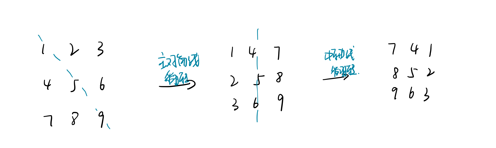

<!--
 * @Description: 
 * @Versions: 
 * @Author: Vernon Cui
 * @Github: https://github.com/vernon97
 * @Date: 2020-11-24 20:13:43
 * @LastEditors: Vernon Cui
 * @LastEditTime: 2020-11-26 01:41:39
 * @FilePath: /Leetcode-notes/week05.md
-->
# Week 05 - Leetcode 41 - 50

#### 41 - 缺失的第一个正数

```diff
+ 原地Hash
```

这种要求常数复杂度的很多都是用数组元素当成数组下标完成一些操作，本题就是这样；

- 保证1出现在`nums[0]`的位置上，2出现在`nums[1]`的位置上，… ，`n`出现在`nums[n-1]`的位置上，其他的数字不管。例如`[3,4,-1,1]`将被排序为`[1,-1,3,4]`
  
- 遍历nums 找到第一个不满足`nums[i] == i + 1`的数即为答案；
  
要注意的点在于 是while 不是 if 换过来之后当前位置出现的新数字也需要判断；

```cpp
class Solution {
public:
    int firstMissingPositive(vector<int>& nums) {
        //o(n) + 常数级别的额外空间
        int n = nums.size();
        for(int i = 0; i< n; i++)
        {
            while(nums[i] > 0 && nums[i] <= n && nums[i] != nums[nums[i] - 1]) // 在范围内 且 交换的两个元素不同 （避免死循环） -> 把nums[i] 放到下标为 nums[i] - 1的位置上
                swap(nums[i], nums[nums[i] - 1]);
        }

        for(int i = 0; i < n; i++)
            if(nums[i] != i + 1)
                return i + 1;
        return n + 1;
    }
};
```

#### 42 - 接雨水

```diff
+ 单调栈
```

__按列划分__ 本题可以从左到右扫描一遍记录左边比i高的元素高度， 从右到左扫描一遍记录右边比高的元素高度，然后累加即可。

__按行划分__ 这里利用单调栈维护左边第一个比他高的元素的下标

1. 维护严格单调递减的单调栈。在每次检查栈顶要出栈时，`i`为右边第一个比 `st.top()` 不低的矩形，`st.top()` 弹出栈顶，并将其记为 `top`。

2. 假设此时栈中仍然存在矩形，现在 `st.top()`（弹栈后的栈顶）、`top` 与 `i` 三个位置构成一个 U 型，其中 `top` 位置代表 U 型的底部，此时可以计算出该 U 型所能接受的水的面积为`(i - st.top() - 1) * (min(height[st.top()], height[i]) - height[top])`。
   
3. 最后当前矩形进栈。


```cpp
class Solution {
public:
    int trap(vector<int>& height) {
        int res = 0, n = height.size(), tt = -1;
        if(n < 3) return 0;
        int stk[n];
        for(int i = 0; i < n; i++)
        {
            while(tt != -1 && height[stk[tt]] <= height[i])
            {
                int top = stk[tt--];
                if(tt == -1) break;
                res += (i - stk[tt] - 1) * (min(height[stk[tt]], height[i]) - height[top]);
            }
            stk[++tt] = i;
        }
        return res;
    }
};
```

#### 43 - 字符串相乘

```diff
+ 高精度乘法
```


```cpp
class Solution {
public:
    string multiply(string num1, string num2) {
        int n = num1.size(), m = num2.size();
        vector<int> A, B,  C(n + m);
        for(int i = n - 1; i >= 0; i--) A.push_back(num1[i] - '0');
        for(int i = m - 1; i >= 0; i--) B.push_back(num2[i] - '0');

        for(int i = 0; i < n; i++)
            for(int j = 0; j < m; j++)
                C[i + j] += A[i] * B[j];
        // 处理进位
        for(int i = 0, t = 0; i < C.size(); i++) 
        {
            t += C[i];
            C[i] = t % 10;
            t /= 10;
        }
        // 找到结果首位
        int k = C.size() - 1;
        while(k > 0 && !C[k]) k--;
        // 写答案 直接stringstream写
        stringstream ss;
        while(k >= 0) ss << C[k--];
        return ss.str();
    }
};
```

#### 44 - 通配符匹配

```diff
+ 动态规划
```

和第十题：正则表达式匹配是类似的，都是动态规划；

`f(i, j)` 表示 `s[1..i]` 和 `p[1..j]`匹配 分为 `p[j]== '*'` 和 `p[j] != '*'` 两种

__不是 *__ : `f[i][j] = f[i - 1][j - 1] && (s[i] == p[j] || p[j] == '?')`
__是 *__ : 枚举 * 可以代替多少个字符
`f[i][j] = f[i][j - 1] || f[i - 1][j - 1] || f[i - 2][j - 1] ...`
`f[i - 1][j] = f[i - 1][j - 1] || f[i - 2][j - 1] ...`
所以 `f[i][j] == f[i][j - 1] || f[i - 1][j]`

然后初始状态 `f[0][0] = true`， i 从0枚举 j 从1枚举;

```cpp
class Solution {
public:
    bool isMatch(string s, string p) {
        int n = s.size(), m = p.size();
        s = ' ' + s, p = ' ' + p;
        bool f[n + 1][m + 1];
        memset(f, false, sizeof f);
        f[0][0] = true;

        for(int i = 0; i <= n; i++)
            for(int j = 1; j <= m; j++)
            {
                if(p[j] != '*')
                    f[i][j] = i && f[i - 1][j - 1] && (s[i] == p[j] || p[j] == '?');
                else 
                    f[i][j] = f[i][j - 1] || (i && f[i - 1][j]);
            }
        return f[n][m];
    }
};
```

#### 45 - 跳跃游戏II

```diff
+ 动态规划 + 贪心优化
```

没加优化前这可以看成一个普通的动态规划问题 用`f[i]` 表示走到`i`的最小步数；

```cpp
class Solution {
public:
    int jump(vector<int>& nums) {
        int n = nums.size();
        vector<int>f(n+1);
        for(int i = 1;i < n;i++)
        {
            int t = INT_MAX;
            // 枚举前面的边能走到i的最小步数
            for(int j = 0;j < i;j++)
            {
                if(j + nums[j] >= i)
                {
                    t = min(t,f[j]+1);
                }
            }
            f[i] = t;
        }

        return f[n-1];
    }
};
```

这样是``O(N^2)``的 复杂度, 对于本题而言是无法通过的，还要根据贪心发掘一些性质；
显然`f`数组是单调的， 举个例子：


因此`f[i]`就变成了`0 1...1 2...2 3...3 ......`，在动态规划时瓶颈就在于更新每个点的最小值时需要遍历所有能跳到`i`的点，而有了单调性以后就可以用第一个能跳到`i`的点更新了，这里无论是取哪一个点跳到`i`，其最终的结果是一样的，但是取第一个点和取最后一个点所需要的步数可能不相同，所以尽量选择靠前的点，这样步数就可能会减少，贪心的思想。

#### 46 - 全排列

```diff
+ DFS
```

这题肯定是按组合数搜索了 不过先复习一下之前用到过的next_permutation怎么用
那个next_permutation的题是找到第一个递减点， 右边第一个比他大的数， 交换位置并reverse；

```cpp
class Solution {
public:
    vector<vector<int>> res;
    int n ;
public:
    vector<vector<int>> permute(vector<int>& nums) {
        n = nums.size();
        sort(nums.begin(), nums.end());
        do{
            res.push_back(nums);
        }while(next_permutation(nums.begin(), nums.end()));
        return res;
    }
};
```

__枚举每个位置填什么__ / __枚举每个数放在哪个位置__（字典序输出）

```cpp
class Solution {
public:
    vector<vector<int>> res;
    vector<int> path;
    vector<bool> st;
public:
    vector<vector<int>> permute(vector<int>& nums) {
        //path = vector<int>(nums.size());
        st   = vector<bool>(nums.size());
        dfs(0, nums);
        return res;
    }
    void dfs(int u, vector<int>& nums)
    {
        if(u == nums.size()) res.push_back(path);
        else
        {
            for(int i = 0; i < nums.size(); i++)
            {
                if(!st[i])
                {
                    path.push_back(nums[i]);
                    st[i] = true;
                    dfs(u + 1, nums);
                    st[i] = false;
                    path.pop_back();
                }
            }
        }
    }
};
```

#### 47 - 全排列II

__相同的数规定一个相对顺序 保证唯一就可以__

对于相同的数 只用第一个没用过的, 举个例子来说 1 1 1 1, 第一个1没用之前不许用第二个1， 以这种方式保证相对顺序；
所以排序来处理相同元素 和上一题的代码有几行变化。

```diff
class Solution {
public:
    vector<vector<int>> res;
    vector<int> path;
    vector<bool> st;
public:
    vector<vector<int>> permuteUnique(vector<int>& nums) {
+        st   = vector<bool>(nums.size());
+        sort(nums.begin(), nums.end());
        dfs(0, nums);
        return res;
    }
    void dfs(int u, vector<int>& nums)
    {
        if(u == nums.size()) res.push_back(path);
        else
        {
            for(int i = 0; i < nums.size(); i++)
            {
+               if(i && nums[i - 1] == nums[i] && !st[i - 1]) continue;
                if(!st[i])
                {
                    path.push_back(nums[i]);
                    st[i] = true;
                    dfs(u + 1, nums);
                    st[i] = false;
                    path.pop_back();
                }
            }
        }
    }
};
```

#### 48 - 旋转图像

__先按照主对角线翻转，在按照中轴线翻转__

这样的操作等于顺时针旋转九十度， 记住就好了；

```cpp
class Solution {
public:
    void rotate(vector<vector<int>>& matrix) {
        int n = matrix.size();
        for(int i = 0; i < n; i++)
            for(int j = i + 1; j < n; j++)
                swap(matrix[i][j], matrix[j][i]);
        for(int i = 0; i < n; i++)
            for(int j = 0; j < n / 2; j++)
                swap(matrix[i][j], matrix[i][n - j - 1]);
    }
};
```

#### 49 - 字母异位词分组

异位词找到一个统一的表达方式 -> 排序
这里从hash往vector拷数据的时候，记得用`std::move` 移动构造函数节省资源

```cpp
class Solution {
public:
    vector<vector<string>> groupAnagrams(vector<string>& strs) {
        unordered_map<string, vector<string>> hash;
        for(string& str : strs)
        {
            string nstr = str;
            sort(nstr.begin(), nstr.end());
            hash[nstr].push_back(str);
        }
        vector<vector<string>> res;
        for(auto& x : hash)
            res.push_back(move(x.second));
        return res;
    }
};
```

#### 50 - Pow(x, n)

```diff
+ 快速幂
```

经典快速幂 注意一下边界情况 (i = INT_MIN 转正数的坑。。)

```cpp
typedef long long LL;
class Solution {
public:
    double myPow(double x, int kk) {
        bool is_neg_k = false, is_neg_x = false;
        LL k = kk;
        if(k < 0)
            is_neg_k = true, k = -k;
        if(x < 0)
        {
            x = -x;
            if(k & 1) is_neg_x = true;
        }
        double res = 1.0;
        double t = x;
        while(k)
        {
            if(k & 1) res = res * t;
            t = t * t;
            k >>= 1;
        } 
        if(is_neg_k)
            res =  1 / res;
        if(is_neg_x)
            res = -res;
        return res;
    }
};
```
