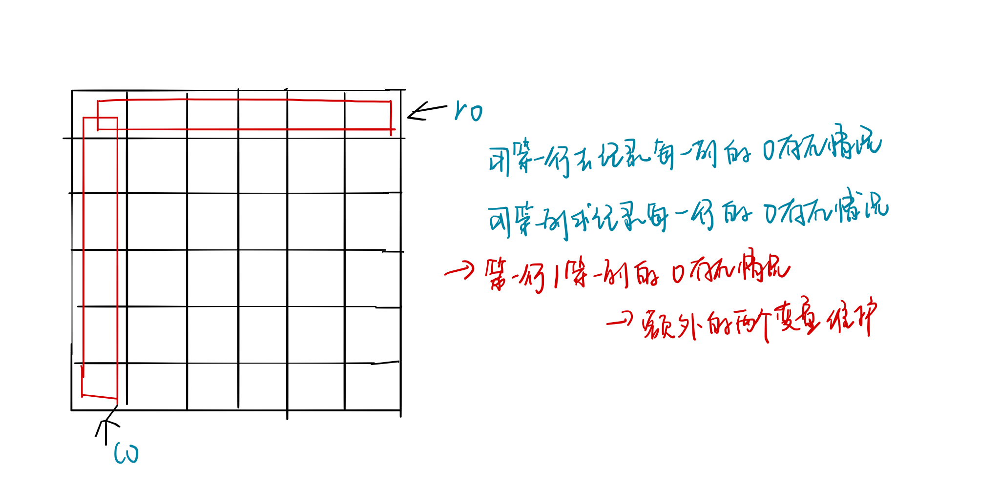

<!--
 * @Description: 
 * @Versions: 
 * @Author: Vernon Cui
 * @Github: https://github.com/vernon97
 * @Date: 2020-11-29 18:13:53
 * @LastEditors: Vernon Cui
 * @LastEditTime: 2020-12-01 00:18:27
 * @FilePath: /Leetcode-notes/week08.md
-->
# Week 08 - Leetcode 71 - 80

#### 71 - 简化路径

模拟题， 这里相当于把string 当栈来用，遇到`..` 就把上一个name弹出来；

```cpp
class Solution {
public:
    string simplifyPath(string path) {
        string res, name;
        if(path.back() != '/') path += '/';
        for(auto c : path)
        {
            if(c != '/') name += c;
            else
            {
                if(name == "..")
                {
                    while(res.size() && res.back() != '/') res.pop_back(); // 除去上一个name
                    if(res.size()) res.pop_back(); // 除去 /
                }
                else if (name != "." && name.size())
                    res += '/' + name;     // 加在结果里
                name.clear();
            }
        }
        if(res.empty()) return "/"; // 如果res为空 -> 处于根目录
        else return res;
    }
};
```

#### 72 - 编辑距离 

```diff
+ DP
```

很**经典**的动态规划问题了；

`f[i][j] 表示 a[1..i] 到 b[1..j] 按顺序操作的最短编辑距离`

1. 不会有多余操作
2. 操作顺序不会影响答案

删除 `f[i - 1, j] + 1`
添加 `f[i, j - 1] + 1`
替换 `f[i - 1, j - 1] + 0 / 1` （取决于`a[i]` 和 `b[j]`是否相等）

初始化要稍微注意一下；

```cpp
class Solution {
public:
    int minDistance(string word1, string word2) {
        int n = word1.size(), m = word2.size();
        if(!n || !m) return n + m;
        word1 = " " + word1, word2 = " " + word2;
        vector<vector<int>> f(n + 1, vector<int>(m + 1));
        f[0][0] = 0;
        for(int i = 1; i <= n; i++)
            f[i][0] = i;
        for(int i = 1; i <= m; i++)
            f[0][i] = i;
        for(int i = 1; i <= n; i++)
            for(int j = 1; j <= m; j++)
            {
                f[i][j] = min(f[i - 1][j], f[i][j - 1]) + 1;
                if(word1[i] == word2[j])    f[i][j] = min(f[i][j], f[i - 1][j - 1]);
                else f[i][j] = min(f[i][j], f[i - 1][j - 1] + 1);
            }
        return f[n][m];
    }
};
```

#### 73 - 矩阵置0

行列互相影响 -> 先开两个数组去记录行 列是否出现过0， 然后再遍历一次赋值就好；这里的空间复杂度是`o(m + n)`

对于本题的常数空间，实际上就是利用原数组去记录；

> 用第一行去记录每一列是否出现过0， 第一列去记录每一行是否出现过0； 而第一行和第一列是否出现过0可以用额外的两个变量记录；

这样就保证了常数空间;


**空间：o(n + m)**

```cpp
class Solution {
public:
    void setZeroes(vector<vector<int>>& matrix) {
        // o(mn) 标记每个位置是否为0
        // o(m + n) 标记行 列 是否出现过0
        // 常数？
        if(matrix.empty() || matrix[0].empty()) return;
        int n = matrix.size(), m = matrix[0].size();
        vector<bool> row(n, false), col(n, false);
        for(int i = 0; i < n; i++)
            for(int j = 0; j < m; j++)
                if(matrix[i][j] == 0)
                    row[i] = col[j] = true;
        
        for(int i = 0; i < n; i++)
            for(int j = 0; j < m; j++)
                if(row[i] || col[j])
                    matrix[i][j] = 0;
        return;
        
    }
};
```

**空间：o(1)**

```cpp
class Solution {
public:
    void setZeroes(vector<vector<int>>& matrix) {
        if(matrix.empty() || matrix[0].empty()) return;
        int n = matrix.size(), m = matrix[0].size();
        //vector<bool> row(n, false), col(n, false);
        bool r0 = false, c0 = false;
        for(int i = 0; i < n; i++)
            for(int j = 0; j < m; j++)
            {
                if(!i || !j)
                { 
                    if(!i) r0 = r0 || matrix[i][j] == 0;
                    if(!j) c0 = c0 || matrix[i][j] == 0;
                }
                else if (matrix[i][j] == 0) matrix[0][j] = matrix[i][0] = 0;  
            }
        for(int i = 1; i < n; i++)
            for(int j = 1; j < m; j++)
            {
                if(matrix[i][0] == 0 || matrix[0][j] == 0)
                    matrix[i][j] = 0;
            }
        if(r0) 
            for(int i = 0; i < m; i++) 
                matrix[0][i] = 0;
        if(c0)
            for(int i = 0; i < n; i++)
                matrix[i][0] = 0;
        return; 
    }
};
```

#### 74 - 搜索二维矩阵

```diff
+ 二分
```

这题把这个矩阵抻长了就是一个单调上升的序列，所以直接二分就好了；
二维坐标的映射 `i * m + j` 从`0 - (n * m - 1)` 映射到二维坐标

```cpp
class Solution {
public:
    bool searchMatrix(vector<vector<int>>& matrix, int target) {
        // 新形态二分
        if(matrix.empty() || matrix[0].empty()) return false;
        int n = matrix.size(), m = matrix[0].size();
        int l = 0, r = n * m - 1;
        while(l < r)
        {
            int mid = l + r >> 1;
            int x = mid / m, y = mid % m;
            if(matrix[x][y] >= target) r = mid;
            else l = mid + 1; 
        }
        return matrix[l / m][l % m] == target;
    }
};
```

#### 75 - 颜色分类

**荷兰国旗问题**

和快排的那个partition是一个思路的，复习一下快排；

```cpp
void quick_sort(int[] q, int l, int r)
{
    if(l >= r) return;
    int i = l - 1, j = r + 1, x = q[l + r >> 1];
    while(i < j)
    {
        do i++; while(q[i] < x);
        do j--; while(q[j] > x);
        if(i < j) swap(q[i], q[j]);
    }
    quick_sort(q, l, j);
    quick_sort(q, j + 1, r);
}
```

这里是三路快排的应用，方法如下：


```cpp
class Solution {
public:
    void sortColors(vector<int>& nums) {
        int i = 0, j = 0, k = nums.size() - 1;
        while(i <= k)
        {
            int a = nums[i];
            if(a == 0)
            {
                swap(nums[i], nums[j]);
                i++, j++;
            }
            else if (a == 1)
                i++;
            else
            {
                swap(nums[k], nums[i]);
                k--;
            }
        }
    }
};
```

#### 76 - 最小覆盖子串

这题的思路和30题有点像的 都是滑动窗口 + 哈希；

如何判断窗口内元素是否符合要求：
> 增加： `if(window[c] <= hash[c])`
> 删除： `while(window[c] > hash[c])`
  
```cpp
class Solution {
public:
    string minWindow(string s, string t) {
        int res = 1e6, suc = 0, cnt = 0, ri = 0;
        unordered_map<char, int> hash, window;
        for(auto c : t)
            hash[c]++, cnt++;
        for(int l = 0, r = 0; r < s.size(); r++)
        {
            // 加入滑动窗口
            window[s[r]]++;
            if(window[s[r]] <= hash[s[r]]) suc++;
            // 从滑动窗口中弹出 注意这个条件
            while(window[s[l]] > hash[s[l]]) window[s[l++]]--;
            if(suc == cnt)
            {
                if(res > r - l + 1)
                {
                    res = r - l + 1;
                    ri = l;
                }
            }
        }
        if(res == 1e6) return "";
        return s.substr(ri, res);
    }
};
```

#### 77 - 组合

对于按组合数搜索的问题，重要的点在于如何判重：

`[1, 3]` 和 `[3, 1]` 这种由于搜索顺序导致的重复，可以通过**限制顺序** 来解决；

限制只能从小到大搜 不能搜完3再回过头搜1， 这样就可以完成去重；

dfs的时候除了传入次数`u`，还要传入上一个搜到的元素`i`， 后面直接从`i + 1` 开始搜；

```cpp
class Solution {
public:
    vector<vector<int>> res;
    int n, k;
public:
    vector<vector<int>> combine(int n, int k) {
        this->n = n;
        this->k = k;
        vector<int> path;
        dfs(0, 0, path);
        return res;
    }
    void dfs(int u, int t,  vector<int>& path)
    {
        if(u == k)
            res.push_back(path);
        else
        {
            for(int i = t + 1; i <= n; i++)
            {
                path.push_back(i);
                dfs(u + 1, i, path);
                path.pop_back();
            }
        }
    }
};
```