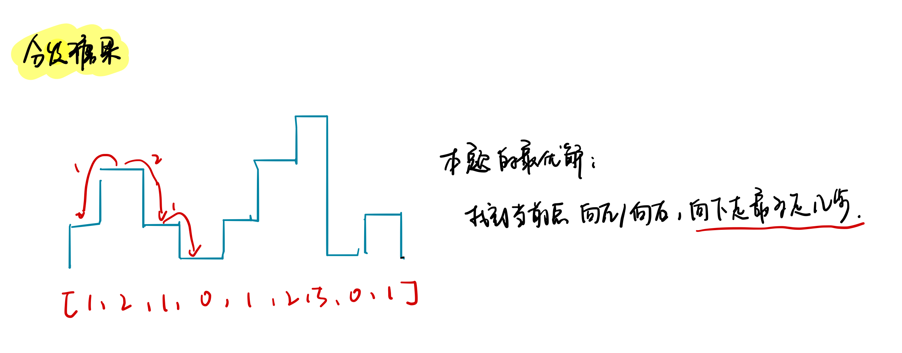

<!--
 * @Description: 
 * @Versions: 
 * @Author: Vernon Cui
 * @Github: https://github.com/vernon97
 * @Date: 2020-12-18 23:49:16
 * @LastEditors: Vernon Cui
 * @LastEditTime: 2020-12-26 23:51:51
 * @FilePath: /.leetcode/Users/vernon/Leetcode-notes/week14.md
-->
# Week 14 - Leetcode 131 - 140

#### 131 - 分割回文串

这里有一个很重要的思想，预处理减少复杂度；

这里可以用递推的思想把判断回文串的步骤提前判断出来；
从`f[i, j]` 表示 `s[i ... j]`是回文子串（闭区间）

`f[i, j]` 可以由 `f[i + 1, j - 1]` 递推而来 只要满足 `s[i+1 ... j-1]` 是回文子串并且`s[i] == s[j]`即可

这样再dfs搜索分界线即可。

```cpp
class Solution {
public:
    int n;
    vector<vector<string>> res;
    vector<vector<bool>> f;
    vector<string> path;
public:
    vector<vector<string>> partition(string s) {
        n = s.size();
        f = vector<vector<bool>>(n, vector<bool>(n));

        // 注意这里的枚举顺序
        for(int j = 0; j < n; j++)
            for(int i = 0; i <= j; i++)
            {
                if (i == j)
                    f[i][j] = true; // 只有一个字母 
                else if (s[i] == s[j])
                {
                    if (i + 1 > j - 1 || f[i + 1][j - 1]) // 只有两个字母 或者 f[i+1][j-1]为true
                        f[i][j] = true;
                }
            }

        dfs(s, 0);
        return res;
    }
    void dfs(string& s, int u)
    {
        if(u == n) res.push_back(path);
        else
        {
            for(int i = u; i < n; i++)
            {
                if(f[u][i])
                {
                    path.push_back(s.substr(u, i - u + 1));
                    dfs(s, i + 1);
                    path.pop_back();
                }
            }
        }
    }
};
```

#### 132 - 分割回文串ii

这里第一步 预处理回文串判断和上面一题是一样的；

接下来的动态规划的状态`f[i]` 表示 `s[1 ... i]`中满足都为回文子串的所有分割方式，值为最小的子块数量；

显然 `f[i]` 可以在所有满足`s[k ... i]`为回文子串的状态中转移过来， `f[i] = min(f[k - 1] + 1)`

最后的答案是`f[n] - 1` 分割次数比子块数量少1；

```cpp
class Solution {
public:
    int minCut(string s) {
        // 1. 预处理回文串判断
        int n = s.size();
        s = ' ' + s;
        vector<vector<bool>> isPara(n + 1, vector<bool>(n + 1));
        for(int j = 1; j <= n; j++)
            for(int i = 1; i <= j; i++)
            {
                if(i == j) isPara[i][j] = true;
                else if (s[i] == s[j])
                {
                    if(i + 1 > j - 1 || isPara[i + 1][j - 1])
                        isPara[i][j] = true;
                }
            }
        // 2. 动态规划 f[i] 指s[1..i]的所有分类情况
        vector<int> f(n + 1, 1e9);
        f[0] = 0;
        for(int i = 1; i <= n; i++)
            for(int j = 1; j <= i; j++)
            {
                if(isPara[j][i])
                    f[i] = min(f[i], f[j - 1] + 1);
            }
        return f[n] - 1;
    }
};
```

#### 133 - 克隆图

分为两次 先拷贝点 再拷贝边；

拷贝点要建立原始点和复制点的映射关系，遍历一遍图 （BFS/DFS) 注意遍历图要判重！

然后拷贝每个点的边就可以了

```cpp
class Solution {
public:
    unordered_map<Node*, Node*> hash; // 原始点和拷贝点的映射
public:
    Node* cloneGraph(Node* node)
    {
        if(!node) return nullptr;
        // 1. 复制所有点
        dfs(node);
        // 2. 复制所有边
        for(auto& p : hash)
        {
            Node* origin = p.first, *cpy = p.second;
            for(auto n : origin->neighbors)
                cpy->neighbors.push_back(hash[n]);
        }
        return hash[node];
    }
    void dfs(Node* node)
    {
        hash[node] = new Node(node->val);
        for(auto ver : node->neighbors)
        {
            if(hash.count(ver)) continue;
            dfs(ver);
        }
    }
};
```

#### 134 - 加油站

```diff
+ 单调队列
```

首先对于这种环状数组问题常见的操作方式就是复制一遍 破环成链；

`[1,2,3,4,5]`变成`[1,2,3,4,5,1,2,3,4,5]`, 再用一个长度为n的窗口 即为从不同起点开始的路径。

每一个加油站`i` 能到达的花费实际上是`gas[i] - cost[i]` 才能开到下一站

整段路程的花费实际上就是每一小段的花费的前缀和`s[j] - s[i]`，只要满足前缀和的最小值大于等于0就证明可以完整走完这一段路程。

> 转化为滑动窗口求最小值的问题：**单调队列**

枚举起点`i`, 对于`s[j] - s[i]` 而言 `i` 不变 实际上找的就是`s[j]`的在`[i ... i + n - 1]`中的最小值，这样我们需要从后往前维护单调队列才行（从前往后 `i` 后面的还没见过）

这样最小值即为队首元素`s[q[hh]]`

```cpp
class Solution {
public:
    int canCompleteCircuit(vector<int>& gas, vector<int>& cost) {
        if(gas.empty()) return -1;
        int n = gas.size();
        vector<int> s(2 * n + 2), q(2 * n + 2);
        for(int i = 1; i <= n; i++)
            s[i] = s[i + n] = gas[i - 1] - cost[i - 1];
        // 1. 计算前缀和
        for(int i = 1; i <= 2 * n; i++)
            s[i] += s[i - 1];
        // 2. 维护单调队列
        // 这里求的是[i ... i + n - 1] 中的最小值 所以是包含 i的 区间最小值就是队列的队首元素 q[hh]
        int hh = 0, tt = -1;
        for(int i = 2 * n; i; i --)
        {
            if(hh <= tt && q[hh] > i + n - 1) hh++; 
            while(hh <= tt &&  s[q[tt]] >= s[i]) tt--;
            q[++tt] = i;
            if(i <= n && s[q[hh]] >= s[i - 1]) return i - 1;       
        }
        return -1;
    }
};
```

#### 135 - 分发糖果



这题实际上就是 每个小朋友得到的最少糖果数是根据左右两边 连续下降的次数 决定的；
比如图上的情况 这个小朋友至少要得到3个 才能满足要求；

按照这个想法, 分别统计左右两边 连续下降的次数 最后加起来得到答案即可

```cpp
class Solution {
public:
    int candy(vector<int>& ratings) {
        int n = ratings.size();
        vector<int> sl(n + 1), sr(n + 1);
        for(int i = 0; i < n; i++)
            if(i && ratings[i] > ratings[i - 1]) 
                sl[i] = sl[i - 1] + 1;
        for(int i = n - 1; i >= 0; i--)
            if(i < n - 1 && ratings[i] > ratings[i + 1])
                sr[i] = sr[i + 1] + 1;
        int res = 0;
        for(int i = 0; i < n; i++)
            res += max(sl[i], sr[i]) + 1;
        return res;
    }
};
```

#### 136 - 只出现一次的数字

```diff
+ 位运算
```

> 相同两个数的异或值为0

所以所有的数异或操作后，剩下的一个数字就是只出现一次的了；

```cpp
class Solution {
public:
    int singleNumber(vector<int>& nums) {
        int res = 0;
        for(auto n : nums)
            res ^= n;
        return res;
    }
};
```

#### 137 - 只出现一次的数字ii


主要是这个按位的状态转移方程怎么来的很奇怪

> `one = (one ^ x) & (~two)`
> `two = (two ^ x) & (~one)`

理解这么做是对的就好了 

```cpp
class Solution {
public:
    int singleNumber(vector<int>& nums) {
        int one = 0, two = 0;
        for(auto x : nums)
        {
            one = (one ^ x) & (~two);
            two = (two ^ x) & (~one);
        }
        return one;
    }
};
```


