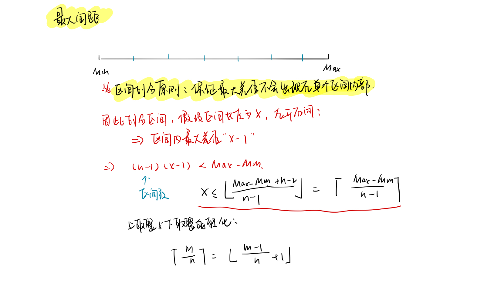

<!--
 * @Description: 
 * @Versions: 
 * @Author: Vernon Cui
 * @Github: https://github.com/vernon97
 * @Date: 2021-01-03 04:05:28
 * @LastEditors: Vernon Cui
 * @LastEditTime: 2021-01-06 11:22:27
 * @FilePath: /.leetcode/Users/vernon/Leetcode-notes/week17.md
-->
# Week 17 - 161 - 170

#### 162 - 寻找峰值

算是比较基础的二分，根据相邻元素是递增还是递减判断分界点就好

(这里没有单调性也可以用二分)

```cpp
class Solution {
public:
    int findPeakElement(vector<int>& nums) {
        int n = nums.size() - 1;
        int l = 0, r = n;
        while(l < r)
        {
            int mid = l + r >> 1;
            //if(mid == n || nums[mid] > nums[mid + 1]) r = mid;
            // 这里mid一定不会取到n 为什么 ： 反证法
            if(nums[mid > nums[mid + 1]]) r = mid;
            else l = mid + 1;
        }
        return l;
    }
};
```

#### 164 - 最大间距

这题是真的很神奇... 方法记一下吧hh



这题的前提在于将整个区间成连续的小区间，**保证最大差值一定不会出现在区间内的两个元素中**

这个保证很重要，通过这样的构造就可以实现**最大差值的两个元素一定在不同区间之内**

区间的长度`X` 计算方法：首先统计整个数组的最大值`Max` 和 最小值`Min`，区间为左开右闭

那么在区间内，最大的差值为`x - 1`；

> 假设最大差值出现在区间的两个元素中, 那么所有的相邻元素差值都应该小于等于`x - 1`

共有`n - 1` 个区间，则必然满足 **`(n - 1) * (x - 1) >= Max - Min + 1`**

反过来，如果 **`(n - 1) * (x - 1) < Max - Min`** 那么最大差值一定不会出现**在区间内**

有这个假设，我们维持区间， 最后计算区间和区间之间的相邻元素差值即可；


```cpp
class Solution {
public:
    int maximumGap(vector<int>& nums) {
        struct Range
        {
            int minv, maxv;
            bool used;
            Range() : minv(INT_MAX), maxv(INT_MIN), used(false) {}
        };
        int n = nums.size();
        vector<Range> r(n);
        int Min = INT_MAX, Max = INT_MIN;
        // 1. 找到全局最大值 最小值
        for(int x : nums)
        {
            Min = min(Min, x);
            Max = max(Max, x);
        }
        if(n < 2 || Min == Max) return 0;
        int X = (Max - Min + n - 2) / (n - 1);
        for(int x : nums)
        {
            if(x == Min) continue;
            int k = (x - Min - 1) / X;
            r[k].minv = min(r[k].minv, x);
            r[k].maxv = max(r[k].maxv, x);
            r[k].used = true;
        }
        int res = 0;
        // 这样 答案已经不会再区间之内 而是在区间之间;
        for(int i = 0, last = Min; i < n - 1; i++)
        {
            if(r[i].used)
            {
                res = max(res, r[i].minv - last);
                last = r[i].maxv;
            }
        }
        return res;
    }
};
```

#### 165 - 比较版本号

基础的模拟题 字符串转数字的常用方法 再比较就可以了

```cpp
class Solution {
public:
    int compareVersion(string version1, string version2) {
        int n = version1.size(), m = version2.size();
        int i = 0, j = 0;
        while(i < n || j < m) // 这里是或的关系 不存在默认是0
        {
            int val1 = 0, val2 = 0;
            while(i < n && version1[i] != '.') val1 = val1 * 10 + version1[i] - '0', i++;
            while(j < m && version2[j] != '.') val2 = val2 * 10 + version2[j] - '0', j++;
            if(val1 > val2) return 1;
            else if (val1 < val2) return -1;
            // 跳过逗号
            i++, j++;
        }
        return 0;
    }
};
```

#### 166 - 分数到小数

```diff
+ 高精度除法
```

结果一定是有限小数 / 无限循环小数

**余数相同 -> 出现相同的循环节**

可能结果会爆INT（用long long来存） e.g. `INT_MIN / (-1)`

这部分的代码还挺值得好好写写的 mark住

```cpp
class Solution {
public:
    string fractionToDecimal(int numerator, int denominator) {
        typedef long long LL;
        LL x = numerator, y = denominator;
        if(x % y == 0) return to_string(x / y);
        string res; 
        // 1. 正负号判断；
        // 记住这里的异或
        if((x < 0) ^ (y < 0)) res = "-"; 
        x = abs(x), y = abs(y);
        // 2. 整数部分
        res += to_string(x / y);
        x %= y; // x 取余数
        unordered_map<LL, int> hash; // 记录余数和其对应的是第几位 （寻找循环节）
        // 3. 加小数点
        res += '.';
        // 4. 模拟列竖式除法
        while(x)
        {
            hash[x] = res.size();
            x *= 10;
            res += to_string(x / y);
            x %= y;
            if(hash.count(x))
            {
                res = res.substr(0, hash[x]) + '(' + res.substr(hash[x]) + ')';
                return res;
            }
        }
        return res;
    }
};
```

#### 167 - 两数之和II - 输入有序数组

经典的双指针了

```cpp
class Solution {
public:
    vector<int> twoSum(vector<int>& numbers, int target) {
        // 经典双指针了
        int l = 0, r = numbers.size() - 1;
        while(l < r)
        {
            int cur_sum = numbers[l] + numbers[r];
            if(cur_sum == target) break;
            else if (cur_sum > target) r--;
            else l++;
        }
        return {l + 1, r + 1};
    }
};
```

#### 168 - Excel表列名称

这个题和二十六进制数转换还是有点区别的， 主要是是1~26的映射，而不是 像正常的k进制数转换一样是在0~25

所以要加一些额外处理， 除26余0 实际上就是这一位可以被26整除 代表的应该是`Z`

以十进制数举例来说， `10` 实际上是两位数字：

- 第一次除10: 等于1 余0
- 第二次除10: 等于0 余1

这里的逻辑就相当于把10当一整个数字看待，处理这个就是当余数为0的时候单独处理就好；


```cpp
class Solution {
public:
    string convertToTitle(int n) {
        string res;
        while(n)
        {
            if(n % 26)
                // 这里是转换到了 0 - 25 上 0 实际上表示26 要单独处理
                res += (n % 26 + 'A' - 1); 
            else
                res += 'Z', n--; 
            n = n / 26;
        }
        reverse(res.begin(), res.end());
        return res;
    }
};
```
