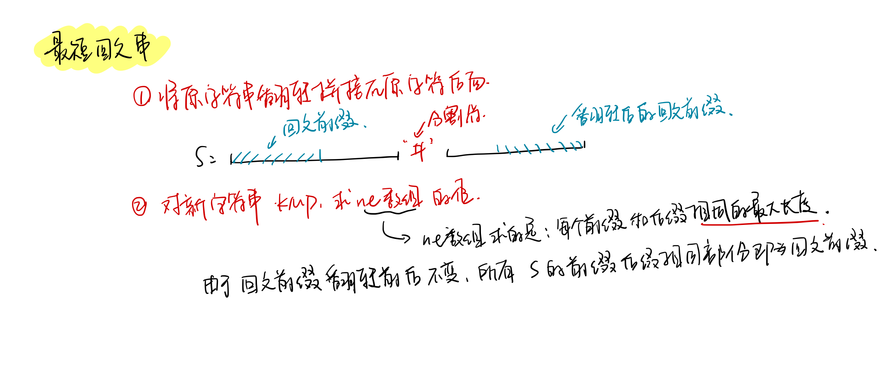
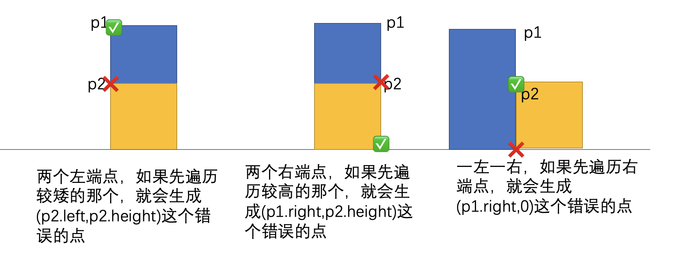

<!--
 * @Description: 
 * @Versions: 
 * @Author: Vernon Cui
 * @Github: https://github.com/vernon97
 * @Date: 2021-01-09 01:22:48
 * @LastEditors: Vernon Cui
 * @LastEditTime: 2021-01-11 16:22:56
 * @FilePath: /.leetcode/Users/vernon/Leetcode-notes/week22.md
-->
# Week 22 - Leetcode 211 - 220

#### 211 - 添加与搜索单词 - 数据结构设计

这题就是在Trie树的搜索结果上改一改，把通配符'.' 的搜索考虑进去；
由于通配符的存在，搜索改成递归形式的比较好一些；

```cpp
class WordDictionary {
public:
    struct Node
    {
        Node* son[26];
        bool is_end;
        Node()
        {
            is_end = false;
            for(int i = 0; i < 26; i++)
                son[i] = nullptr;
        }
    }*root;
    /** Initialize your data structure here. */
    WordDictionary() {
        root = new Node();
    }
    
    /** Adds a word into the data structure. */
    void addWord(string word) {
        auto p = root;
        for(auto c : word)
        {
            int u = c - 'a';
            if(!p->son[u]) p->son[u] = new Node();
            p = p->son[u];
        }
        p->is_end = true;
    }

    bool find_word(Node* p, string& word, int si)
    {
        if(si == word.size()) return p->is_end;
        if(word[si] == '.')
        {
            for(int i = 0; i < 26; i++)
                if(p->son[i] && find_word(p->son[i], word, si + 1))
                    return true;
        }
        else
        {    
            int u = word[si] - 'a';
            if(p->son[u]) return find_word(p->son[u], word, si + 1);   
            else return false;
        }
        return false;
    }
    
    /** Returns if the word is in the data structure. A word could contain the dot character '.' to represent any one letter. */
    bool search(string word) {
        return find_word(root, word, 0);
    }
};
```

#### 212 - 单词搜索II

单词搜索I 是啥来着 从二维网格搜一个单词

搜索II 搜多个单词 -> 构建Trie树

```cpp
class Solution {
public:
    struct Node
    {
        int id;
        Node* son[26];
        Node()
        {
            id = -1;
            for(int i = 0; i < 26; i++)
                son[i] = nullptr;
        }
    }*root;
    int n, m;
    int dx[4] = {1, 0, -1, 0}, dy[4] = {0, 1, 0, -1};
    vector<vector<char>> board;
    vector<vector<bool>> st;
    vector<string> res;
    unordered_set<int> findIds;
public:
    vector<string> findWords(vector<vector<char>>& board, vector<string>& words) {
        if(!board.size() || !board[0].size()) return res;
        root = new Node();
        n = board.size(), m = board[0].size();
        st = vector<vector<bool>>(n, vector<bool>(m));
        this->board = board;
        // * 1. 构建Trie树
        for(int i = 0; i < words.size(); i++)
        {
            Node* p = root;
            for(auto c : words[i])
            {
                int u = c - 'a';
                if(p->son[u] == nullptr) p->son[u] = new Node();
                p = p->son[u];
            }
            p->id = i;
        }
        // * 2. DFS (回溯)
        for(int i = 0; i < n; i++)
            for(int j = 0; j < m; j++)
            {
                int u = board[i][j] - 'a';
                if(root->son[u])
                {
                    st[i][j] = true;
                    dfs(i, j, root->son[u]);
                    st[i][j] = false;
                }
            }
        // * 3. 从id整理答案
        for(auto id : findIds)
            res.push_back(words[id]);
        return res;
    }
    void dfs(int sx, int sy, Node* p)
    {
        if(~(p->id))
            findIds.insert(p->id);
        for(int i = 0; i < 4; i++)
        {
            int x = sx + dx[i], y = sy + dy[i];
            if(x < 0 || x >= n || y < 0 || y >= m) continue;
            int u = board[x][y] - 'a';
            if(st[x][y]) continue;
            if(p->son[u] == nullptr) continue;
            st[x][y] = true;
            dfs(x, y, p->son[u]);
            st[x][y] = false;
        }
    }
};
```

效率比较低就是了.. 所以要用支持delete操作的trie树 (真的很难写...)

```cpp
class Trie
{
public:
    struct Node 
    {
        int id;
        int cnt;
        vector<Node*> son;
        Node(){
            id = -1;
            cnt = 0;
            son = vector<Node*>(26, nullptr);
        }
    }*root;

    Trie()
    {
        root = new Node();
    }
    void insert(string word, int id)
    {
        Node* p = root;
        for(auto c : word)
        {
            int u = c - 'a';
            if(p->son[u] == nullptr) p->son[u] = new Node(), p->cnt++;
            p = p->son[u];
        }
        p->id = id;
    }
    void remove(string word)
    {
        stack<Node*> stk;
        Node* p = root;
        stk.push(p);
        for(auto c : word)
        {
            int u = c - 'a';
            if(p->son[u] == nullptr) return;
            p = p->son[u];
            stk.push(p);
        }
        if(p->id == -1) return;
        if(p->cnt > 0) 
        {
            p->id = -1;
            return;
        }
        p->id = -1;
        int i = word.size() - 1;
        while(stk.size())
        {
            p = stk.top();
            stk.pop();
            if(p->cnt == 0 && p->id == -1)
            {
                stk.top()->cnt--;
                stk.top()->son[word[i--] - 'a'] = nullptr;
                //delete p;  在leetcode会有问题
            }
            else  break;
        }
    }
    bool search(string word)
    {
        Node* p = root;
        for(auto c : word)
        {
            int u = c - 'a';
            if(p->son[u] == nullptr)
                return false;     
            p = p->son[u]; 
        }
        return p->id != -1;
    }
};
```
这个时间复杂度真的差很多 


#### 213 - 打家劫舍II

复习一下Leetcode 198. 打家劫舍I;

那一题就是状态机模型的简单应用，用没偷0和偷了1记录状态；

这一题相较于上一题，成环相当于额外增加了一个限制条件：头尾不能同时偷;

所以我们就跑两次 `[1...n - 1]` 和 `[2...n]` 保证 1 和 n 不会同时被偷 最后返回两个中的最大值即可；


```cpp
class Solution {
public:
    int rob(vector<int>& nums) {
        int n = nums.size();
        if(n == 1) return nums[0];
        vector<int> f(n + 1, -2e9), g(n + 1, -2e9);
        f[0] = 0;
        int res = 0;
        for(int i = 1; i < n; i++)
        {
            f[i] = max(f[i - 1], g[i - 1]);
            g[i] = f[i - 1] + nums[i - 1];
        }
        res = max(res, max(f[n - 1], g[n - 1]));
        for(int i = 1; i < n; i++)
        {
            f[i] = max(f[i - 1], g[i - 1]);
            g[i] = f[i - 1] + nums[i];
        }
        res = max(res, max(f[n - 1], g[n - 1]));
        return res; 
    }
};
```

#### 214 - 最短回文串

```diff
+ KMP
```

这题一看就是KMP了， 很快啊就背一遍KMP

```cpp
vector<int> ne(n + 2);

for(int i = 2, j = 0; i <= m; i++)
{
    while(j && p[i] != p[j + 1]) j = ne[j];
    if(p[i] == p[j + 1]) j++;
    ne[i] = j;
}

for(int i = 1, j = 0; i <= n; i++)
{
    while(j && s[i] != p[j + 1]) j = ne[j];
    if(s[i] == p[j + 1]) j++;
    if(j == m)
    {
        j = ne[j];
        // 匹配成功的逻辑
    }
}
```

对于这个题而言 就是找到原字符串`s`的**最长回文前缀**

最长回文前缀常和KMP联系到一起，具体操作如下：



```cpp
class Solution {
public:
    string shortestPalindrome(string s) {
        // 1. 复制翻转串
        string rev_s(s.rbegin(), s.rend());
        string pattern = ' ' + s + '#' + rev_s;
        int n = pattern.size() - 1;
        vector<int> ne(n + 2);
        // 2. 求ne数组 找到最长回文前缀
        for(int i = 2, j = 0; i <= n; i++)
        {
            while(j && pattern[i] != pattern[j + 1]) j = ne[j];
            if(pattern[i] == pattern[j + 1]) j++;
            ne[i] = j;
        }
        return rev_s + s.substr(ne[n]);
    }
};
```

#### 215 - 数组中的第K个最大元素

快排 or 二分都可以解决这个问题

很快啊 就复习一下快排

```cpp
void quick_sort(vector<int>& q, int l, int r)
{
    if(l >= r) return;
    int i = l - 1, j = r + 1, x = q[l + r >> 1];
    while(i < j)
    {
        do i++; while(q[i] < x);
        do j--; while(q[j] > x);
        if(i < j) swap(q[i], q[j]);
    }
    quick_sort(q, l, j);
    quick_sort(q, j + 1, r);
}
```

为什么快排可以解决这种选择第k个数的问题呢，是因为快排每次可以确定一个数在已经排序数组中的位置（也就是上面代码中的x （也叫做pivot）

如此，我们如果只需要得到第K个数的话 最后了两边分别递归排序可以只递归K所在的那边；

```cpp
int quick_select(vector<int>& q, int l, int r, int k)
{
    if(l >= r) return q[l];
    int i = l - 1, j = r + 1, x = q[l + r >> 1];

    while(i < j)
    {
        do i++; while(q[i] < x);
        do j--; while(q[j] > x);
        if(i < j) swap(q[i], q[j]);
    }
    int sl = j - l + 1;
    if(k <= sl) return quick_select(q, l, j, k);
    else return quick_select(q, j + 1, r, k - sl);
}
```

对于本题的代码如下：

```cpp
class Solution {
public:
    int findKthLargest(vector<int>& nums, int k) {
        return quick_select(nums, 0, nums.size() - 1, nums.size() - k + 1);
    }
    int quick_select(vector<int>& nums, int l, int r, int k)
    {
        if(l >= r) return nums[l];
        int i = l - 1, j = r + 1, x = nums[l + r >> 1];
        while(i < j)
        {
            do i++; while(nums[i] < x);
            do j--; while(nums[j] > x);
            if(i < j) swap(nums[i], nums[j]);
        }
        int sl = j - l + 1;
        if(k <= sl) return quick_select(nums, l, j, k);
        else return quick_select(nums, j + 1, r, k - sl);
    }
};
```

#### 216 - 组合总和

显然是DFS了, 提到DFS就来和我背一下DFS的剪枝策略:

```diff
+ 优化搜索顺序： 大部分情况下应该优先搜索分支较少的节点
+ 排除等效冗余： 如果不考虑顺序，要按照组合数搜索；
+ 可行性剪枝： 不可行提前返回
+ 最优性剪枝：如果不能当前最优更好的话可以直接返回；
```

这题优化搜索顺序肯定是**从9开始搜索**了 (优化搜索顺序)
按照组合数搜索, dfs传参额外记录一个起点（排除等效冗余）

```cpp
class Solution {
public:
    int nums[9] = {9, 8, 7, 6, 5, 4, 3, 2, 1};
    vector<vector<int>> res;
public:
    vector<vector<int>> combinationSum3(int k, int sum) {
        // 最大值是 (n + n - k + 1) * k / 2
        if(sum <= 1 || sum > (2 * 9 - k + 1) * k / 2) return res;
        vector<int> p;
        dfs(-1, k, sum, p);
        return res;
    }
    void dfs(int u, int k, int sum, vector<int>& path)
    {
        if(k == 0)
        {
            if(sum == 0)
                res.push_back(path);
            return;
        }
        for(int i = u + 1; i < 9; i++)
        {
            if(sum >= nums[i])
            {
                path.push_back(nums[i]);
                dfs(i, k - 1, sum - nums[i], path);
                path.pop_back();
            }
        }
    }
};
```

#### 217 - 存在重复元素

这题有啥意义。。

```cpp
class Solution {
public:
    bool containsDuplicate(vector<int>& nums) {
        unordered_map<int, int> hash;
        for(int x : nums)
        {
            if(hash[x] > 0) return true;
            hash[x]++;
        }
        return false;
    }
};
```

#### 218 - 天际线问题

其实是一类问题: **扫描线问题** (别骂了图形学真的不会)

我们记录每个大楼的左端点和右端点以及对应的高度，然后使用一条扫描线从左向右扫描，每次遇到一个大楼的左端点或者右端点，就有可能是关键点。很直观我们可以得到以下的判别方式。
> **关键点是水平线段的左端点**
如果当前扫描到的点是左端点：如果当前左端点p是当前位置上最高的点，那么这一个点是一个关键点`(p.left,p.height)`。

如果当前扫描到的点是右端点：如果当前右端点p比除了这个右端点之外最高的点q还要高，那么我们形成了一个关键点，这个关键点的坐标就是`(p.right,q.height)`。

接下来我们就需要考虑如何能够高效的实现支持单点更新的区间最大值（楼的高度），线段树是可以的，但是这道题也没有区间查询，那么我们直接使用一个`multiset`就可以了，这里使用`multiset`而不是`set`是因为多个建筑物可以共享同一个高度。如果遇到左端点，我们就把这个楼的高度加入`multiset`；如果遇到右端点，我们就把这个楼的高度从`multiset`中移除。

> TODO:  **马上去背线段树**

但是这个题的边界问题很多，主要是**同一根扫描线出现不同点的遍历顺序问题**, 分段讨论吧（很坑）



**总结遍历规则：**

- 同一横坐标 两个左端点 先遍历高的
- 同一横坐标 两个右端点 先遍历矮的
- 同一横坐标 一左一右 先遍历左边

所以这里用`pair<int, int>`存储左右端点 存储规则为`<l, -h>` 和 `<r, h>`便可以在排序后支持以上的遍历规则;

其实一般的情况下扫描线算法可以用来算面积/周长 边界没有本题这么exin..

```cpp
using PII = pair<int, int>; 
class Solution {
public:
    vector<vector<int>> getSkyline(vector<vector<int>>& buildings) {
        vector<vector<int>> res;
        vector<PII> points;
        multiset<int> heights;
        // 1. 保存左右端点
        for(vector<int>& b : buildings)
        {
            points.emplace_back(b[0], -b[2]);
            points.emplace_back(b[1], b[2]);
        }
        // 2. 按横坐标排序
        sort(points.begin(), points.end());
        heights.insert(0);
        // 3. 遍历
        for(PII& p : points)
        {
            int x = p.first, h = abs(p.second);
            // 如果x为左端点
            if(p.second < 0)
            {
                if(h > *heights.rbegin())
                    res.push_back({x, h});
                heights.insert(h);
            }
            else
            {
                // ! 注意这里的删除规则！ 如果erase 传入的是值的话 会删除所有相等的元素 而这里我们只能删除一个 所以要传入find 返回迭代器
                heights.erase(heights.find(h));
                if(h > *heights.rbegin())
                    res.push_back({x, *heights.rbegin()});
            }
        }
        return res;
    }   
};
```

太难了 欣赏一下吧, 不过扫描线算法是值得学习的


#### 219 - 存在重复元素II

和上一题比起来 这里的hash 统计的就不是出现次数了 而是上一次出现的位置

```cpp
class Solution {
public:
    bool containsNearbyDuplicate(vector<int>& nums, int k) {
        unordered_map<int, int> hash;
        for(int i = 0; i < nums.size(); i++)
        {
            // 这里的hash 统计的就不是出现次数了 而是上一次出现的位置
            int x = nums[i];
            if(!hash.count(x))
                hash[x] = i;
            else
            {
                if(i - hash[x] <= k)
                    return true;
                hash[x] = i;
            }
        }
        return false;
    }
};
```

#### 220 - 存在重复元素III

来复习一下`lower_bound`和`upper_bound`操作

**lower_bound** 找到第一个 `>= x` 的元素 返回迭代器
**upper_bound** 找到第一个 `>  x` 的元素 返回迭代器

所以要想找到 `<x`且 距离x最接近的元素 就是lower_bound() 返回迭代器 前面的那个元素

对于本题, 我们维护一个长度为k的滑动窗口 找到窗口内离 ai最近的元素 计算绝对值；

> 当然了 滑动窗口的最大值最小值是单调队列

本题因为有一组INT_MAX 和 INT_MIN 的测试样例 所以要用long long;

```cpp
using LL = long long;
class Solution {
public:
    bool containsNearbyAlmostDuplicate(vector<int>& nums, int k, int t) {
        multiset<LL> S;
        S.insert(1E18);
        S.insert(-1E18);

        for(int i = 0, j = 0; i < nums.size(); i++)
        {
            if(i - j > k) S.erase(S.find(nums[j++]));
            auto it = S.lower_bound(nums[i]);
            LL greater_x = *it, lower_x = *(--it);
            if(min(greater_x - nums[i], nums[i] - lower_x) <= t) return true;
            S.insert(nums[i]);
        }
        return false;
    }
};
```

