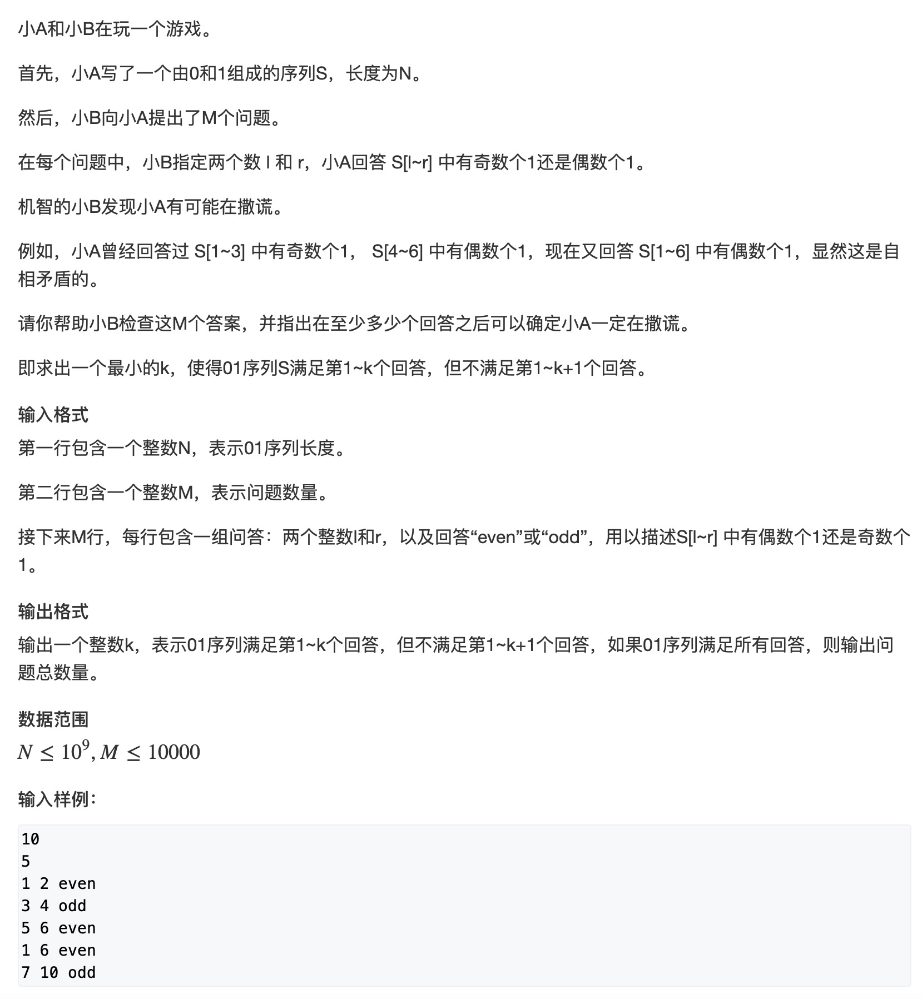
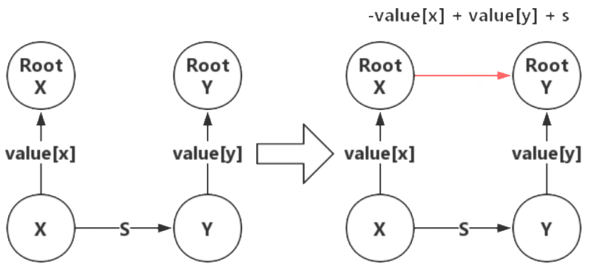
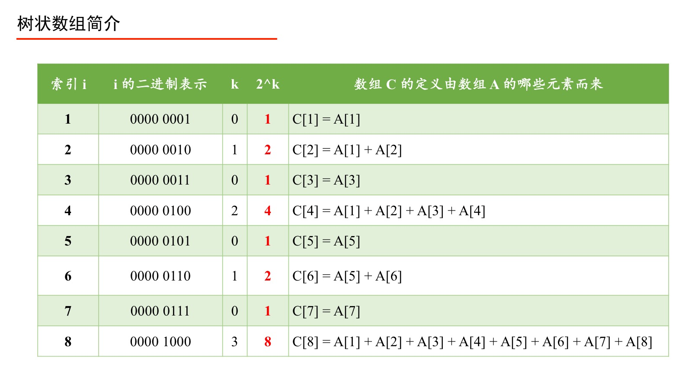

<!--
 * @Description: 
 * @Versions: 
 * @Author: Vernon Cui
 * @Github: https://github.com/vernon97
 * @Date: 2021-01-12 22:14:13
 * @LastEditors: Vernon Cui
 * @LastEditTime: 2021-01-28 19:03:37
 * @FilePath: /.leetcode/Users/vernon/Leetcode-notes/常用数据结构.md
-->
- [常用数据结构](#常用数据结构)
  - [1. 单调栈 / 单调队列](#1-单调栈--单调队列)
    - [1. 单调栈](#1-单调栈)
    - [2. 单调队列](#2-单调队列)
  - [2. 并查集](#2-并查集)
    - [1. 朴素并查集](#1-朴素并查集)
    - [2. 维护size的并查集](#2-维护size的并查集)
    - [3. 维护到祖宗节点距离的并查集](#3-维护到祖宗节点距离的并查集)
    - [4. 拓展域并查集](#4-拓展域并查集)
    - [5. 带权并查集](#5-带权并查集)
  - [3. 双链表](#3-双链表)
  - [4. 树状数组](#4-树状数组)
    - [1. 树状数组原理](#1-树状数组原理)
    - [2. 树状数组 + 差分](#2-树状数组--差分)
  - [5. 线段树](#5-线段树)
  - [6. treap](#6-treap)
  - [7. 可持久化数据结构](#7-可持久化数据结构)
  - [8. Trie 树 （可删除）](#8-trie-树-可删除)
  - [9. KMP](#9-kmp)
  - [10. 字符串哈希](#10-字符串哈希)
  - [11. 前缀和与差分](#11-前缀和与差分)
    - [1. 前缀和](#1-前缀和)
    - [2. 差分](#2-差分)
  - [12. STL 常用数据结构](#12-stl-常用数据结构)
## 常用数据结构

过于基础的就不提了，主要记一下算法题里面会用到的, 从应用场景记;

### 1. 单调栈 / 单调队列

#### 1. 单调栈

**单调栈:** 给定一个序列，求序列中`左边/右边`离它最近的且比它`小/大`的数

以找出每个数左边离他最近的比它小的数为例

```cpp
stack<int> stk;
vector<int> res;
for(int i = 0; i < nums.size(); i++)
{
    while(stk.size() && stk.top() >= nums[i]) stk.pop();
    // 此时栈顶元素 (如果有) 就是左边第一个比nums[i]小的数
    stack.push(nums[i]);
}
```

#### 2. 单调队列

**单调队列:** 滑动窗口的最值

记住单调队列存的是**下标** 方便判断是否已经划出窗口

```cpp
int hh = 0, tt = -1;
for(int i = 0; i < n; i++)
{
    if(hh <= tt && q[hh] < i - k + 1) hh++; // 判断对头是否划出窗口;
    while(hh <= tt && nums[q[tt]] >= nums[i]) tt--;
    // 区间最小值就是队头元素
    q[++tt] = i;
}
```

### 2. 并查集

并查集可以说代码短又好用第一名，我们记的都是带路径压缩的并查集

#### 1. 朴素并查集

```cpp
int p[N];
// 并查集别忘了初始化
for(int i = 1; i <= n; i++)
    p[i] = i;

int find(int x)
{
    if(p[x] != x)
        p[x] = find(p[x]);
    return p[x];
}
// 合并两个集合
p[find(a)] = find(b);
```

#### 2. 维护size的并查集

这里注意 只有每个集合root的size才有意义哦！

```cpp
int p[N], size[N];

int find(int x)
{
    if(p[x] != x) p[x] = find(p[x]);
    return p[x];
}
for(int i = 1; i <= n; i++)
    p[i] = i, size[i] = 1;

// 合并两个集合；-> root 变为 b
size[find(b)] += size[find(a)];
p[find(a)] = find(b);
```

#### 3. 维护到祖宗节点距离的并查集

```cpp
int p[N], d[N];
//p[]存储每个点的祖宗节点, d[x]存储x到p[x]的距离

// 返回x的祖宗节点
int find(int x)
{
    if (p[x] != x)
    {
        int u = find(p[x]);
        d[x] += d[p[x]];
        p[x] = u;
    }
    return p[x];
}

// 初始化，假定节点编号是1~n
for (int i = 1; i <= n; i ++ )
{
    p[i] = i;
    d[i] = 0;
}

// 合并a和b所在的两个集合：
p[find(a)] = find(b);
d[find(a)] = distance; // 根据具体问题，初始化find(a)的偏移量
```
#### 4. 拓展域并查集
**拓展域并查集的思想：** **枚举** 在带拓展域的并查集中，同一个集合内，只要有一个条件成立，则集合内所有元素的条件都成立

这里还是举个题来解释一下比较好(带权并查集也会举这个题来解释)

**奇偶游戏**


除了并查集之外 这题还有点别的处理，`sum[N]`表示有从`S[0...i]` 1的个数（前缀和）

这样，题中区间1的个数就转换为：
- 如果S[L ~ R] 有奇数个1 -> sum[L - 1] 和 sum[R] 的奇偶性相反
- 如果S[L ~ R] 有偶数个1 -> sum[L - 1] 和 sum[R] 的奇偶性相同

这里带权并查集就把每个元素的可能性都**枚举**出来:

`x` 表示 如果x是偶数

`x + n` 表示 如果x是 奇数

**A. x, y 是同类**
- 1. x是奇数, y也是奇数 => merge(x + n, y + n);
- 2. x是偶数, y也是偶数 => merge(x, y);

**B. x, y 是不同类**
- 1. x是奇数, y是偶数 => merge(x + n, y);
- 2. x是偶数, y是奇数 => merge(x, y + n);

查询中 如果每种都不成立 则证明一定是矛盾的
```cpp
#include <iostream>
#include <algorithm>
#include <cstdio>
#include <unordered_map>

using namespace std;

const int N = 40020;

int n, m, cnt;
unordered_map<int, int> ha;
int p[N]; // 这里因为只有奇偶 所以可以用bool值和异或解决
bool d[N];

int find(int x)
{
    if(p[x] != x)
        p[x] = find(p[x]);
    return p[x];
}
int main()
{
    scanf("%d", &n);
    scanf("%d", &m);
    int i = 1;
    n = 2 * m;
    for(i = 1; i < N; i++) p[i] = i;
    bool flag = false;
    for(i = 1; i <= m; i++)
    {
        int oria, orib;
        string type;
        cin >> oria >> orib >> type;
        if(!ha.count(oria - 1)) ha[oria - 1] = ++cnt;
        if(!ha.count(orib)) ha[orib] = ++cnt;
        int a = ha[oria - 1], b = ha[orib];
        if(type == "even")
        {
            if(find(a + n) == find(b))
            {
                flag = true;
                break;
            }
            p[find(a)] = find(b);
            p[find(a + n)] = find(b + n);
        }
        else
        {
            if(find(a) == find(b))
            {
                flag = true;
                break;
            }
            p[find(a + n)] = find(b);
            p[find(b + n)] = find(a);
        }
    }
    if(i < m || flag) cout << i - 1 << endl;
    else cout << m << endl;
    return 0;
}
```
#### 5. 带权并查集

**带权并查集的思想：偏差量**

带权并查集的代码和维护到祖宗节点的并查集很像, 是通**过维护与a, b 与根节点的关系（距离）来推导出a, b间的相对关系**；

比如本题 如果root 和 a 奇偶性相同 root 与 b 奇偶性相反 => a与b奇偶性相反

可以用异或维护， 更常见的是用0 ~ m - 1 表示状态 用mod操作来维护状态（环形关系） 指路食物链这个题

带权并查集和普通并查集在find函数和merge操作上有区别

```cpp
int find(int x)
{
    if(p[x] != x)
    {
        int u = find(p[x]);
        d[x] += d[p[x]]; // 记住不是d[u]
        p[x] = u;
    }
    return p[x];
}
```

merge操作要补上从`pa` 到 `pb`的路径长度


```cpp
int pa = find(a), pb = find(b);
if(pa != pb)
{
    p[pa] = pb;
    d[pa] = d[b] - d[a] + S; // 这里S表示 a->b的权值
}
```


```cpp
#include <iostream>
#include <algorithm>
#include <cstdio>
#include <unordered_map>

using namespace std;

const int N = 10010;

int n, m, cnt;
unordered_map<int, int> ha;
int p[N]; // 这里因为只有奇偶 所以可以用bool值和异或解决
bool d[N];

int find(int x)
{
    if(p[x] != x)
    {
        int u = find(p[x]);
        d[x] = d[x] ^ d[p[x]]; // 啊.. 这里因为是bool 值所以不能直接加法
        p[x] = u;
    }
    return p[x];
}
int main()
{
    scanf("%d", &n);
    scanf("%d", &m);
    int i = 1;
    for(i = 1; i<= N; i++) p[i] = i;
    bool flag = false;
    for(i = 1; i <= m; i++)
    {
        int a, b;
        string type;
        cin >> a >> b >> type;
        if(!ha.count(a - 1)) ha[a - 1] = ++cnt;
        if(!ha.count(b)) ha[b] = ++cnt;
        int pa = find(ha[a - 1]), pb = find(ha[b]);
        bool dist = false;
        if(type == "odd") dist = true;
        if(pa != pb)
        {
            p[pa] = pb;
            d[pa] = d[ha[a - 1]] ^ d[ha[b]] ^ dist;
        }
        else
        {
            if(d[ha[a - 1]] ^ d[ha[b]] != dist)
            {
                flag = true;
                break;
            }
        }
    }
    if(i < m || flag) cout << i - 1 << endl;
    else cout << m << endl;
    return 0;
}
```


### 3. 双链表

### 4. 树状数组

#### 1. 树状数组原理
树状数组(FenwickTree) 的场景: 快速求前缀和 + 单点修改（修改数组其中某一个数） 这两个操作都是`o(logn)`




很重要一个性质：`parent(i) = i + lowbit(i)`

**1. 单点更新**

记住 记住 这里更新的是**差值：新值 - 原值**

```cpp
int lowbit(int i)
{
    return i & (-i);
}

void update(int i, int val)
{
    while(i <= len)
    {
        tree[i] += val;
        i += lowbit(i);
    }
}
```

**2. 求前缀和**

```cpp
int query(int i)
{
    int sum = 0;
    while(i > 0)
    {
        sum += tree[i];
        i -= lowbit(i);
    }
}
```

#### 2. 树状数组 + 差分


### 5. 线段树

### 6. treap

### 7. 可持久化数据结构

### 8. Trie 树 （可删除）
**正常的Trie树**

数组模拟链表 搞struct效率会低一些

```cpp
int son[N][26], cnt[N], idx;
// 0 号点计时根节点，也是空节点
// son 存储树中每个节点的子节点
// cnt 存储以每个节点结尾的单词数量

void insert(char *str)
{
    int p = 0;
    for(int i = 0; str[i]; i++) // 字符串结尾是'\0'
    {
        int u = str[i] - 'a';
        if(!son[p][u]) son[p][u] = ++idx;
        p = son[p][u];
    }
    cnt[p]++;
}

int query(char *str)
{
    int p = 0;
    for(int i = 0; str[i]; i++)
    {
        int u = str[i] - 'a';
        if(!son[p][u]) return 0;
        p = son[p][u];
    }
    return cnt[p];
}
```
支持delete操作的Trie树其实用的挺少的 用到了就来这查吧hh
```cpp
class Trie
{
public:
    struct Node 
    {
        int id;
        int cnt;
        vector<Node*> son;
        Node(){
            id = -1;
            cnt = 0;
            son = vector<Node*>(26, nullptr);
        }
    }*root;

    Trie()
    {
        root = new Node();
    }
    void insert(string word, int id)
    {
        Node* p = root;
        for(auto c : word)
        {
            int u = c - 'a';
            if(p->son[u] == nullptr) p->son[u] = new Node(), p->cnt++;
            p = p->son[u];
        }
        p->id = id;
    }
    void remove(string word)
    {
        stack<Node*> stk;
        Node* p = root;
        stk.push(p);
        for(auto c : word)
        {
            int u = c - 'a';
            if(p->son[u] == nullptr) return;
            p = p->son[u];
            stk.push(p);
        }
        if(p->id == -1) return;
        if(p->cnt > 0) 
        {
            p->id = -1;
            return;
        }
        p->id = -1;
        int i = word.size() - 1;
        while(stk.size())
        {
            p = stk.top();
            stk.pop();
            if(p->cnt == 0 && p->id == -1)
            {
                stk.top()->cnt--;
                stk.top()->son[word[i--] - 'a'] = nullptr;
                //delete p;  在leetcode会有问题
            }
            else  break;
        }
    }
    bool search(string word)
    {
        Node* p = root;
        for(auto c : word)
        {
            int u = c - 'a';
            if(p->son[u] == nullptr)
                return false;     
            p = p->son[u]; 
        }
        return p->id != -1;
    }
};
```
### 9. KMP
默写就完事了

```cpp
int ne[N];

// 1. 求ne数组
for(int i = 2, j = 0; i < p.size(); i++)
{
    while(j && p[i] != p[j + 1]) j = ne[j];
    if(p[i] == p[j + 1]) j++;
    ne[i] = j;
}
// 2. 匹配
for(int i = 1, j = 0; i < s.size(); i++)
{
    while(j &&s[i != p[j + 1]]) j = ne[j];
    if(s[i] == p[j + 1]) j++;
    if(j == m)
    {
        // 匹配成功的逻辑
        ...
        // 匹配成功继续向下匹配
        j = ne[j];
    }
}


```


### 10. 字符串哈希
场景：快速判断子串是否相等

字符串哈希很好用 有一大半的字符串题都可以用字符串哈希来解决（剩下估计就是KMP 还有模拟了ha）

这里 P 的经验值有131 和 13331 两种，存储哈希值用的是`unsigned long long` 这样mod(2 ^ 64) 可以省略（溢出直接相当于取模了）

```cpp
using ULL = unsigned long long;

int P = 131;
char str[N];
ULL h[N], p[N]; // h[N]存储字符串哈希值 p[N] 存储 p^n

ULL get(int l, int r) // 这里是闭区间哦
{
    return h[r] - h[l - 1] * p[r - l + 1];
}

// 初始化
p[0] = 1;
for(int i = 1; i <= n; i++)
{
    p[i] = P * p[i - 1];
    h[i] = h[i - 1] * P + str[i] - 'a' + 1;
}
```

### 11. 前缀和与差分

#### 1. 前缀和
场景：快速求区间和

1. 一维前缀和
    `S[i] = a[1] + a[2] + ... a[i]`
    `a[l] + ... + a[r] = S[r] - S[l - 1]`
2. 二维前缀和
    `S[i, j]` = 第i行j列格子左上部分所有元素的和
    以`(x1, y1)`为左上角，`(x2, y2)`为右下角的子矩阵的和为：
    `S[x2, y2] - S[x1 - 1, y2] - S[x2, y1 - 1] + S[x1 - 1, y1 - 1]`

#### 2. 差分

1. 一维差分
   
场景：多次使区间`[l, r]`中的每个元素同时增加or减少`k`

差分实际上是前缀和的逆运算 构建数组`b`使得 `b`的前缀和数组等于`a`

给区间`[l, r]`中的每个数加上`c`：`B[l] += c`, `B[r + 1] -= c`

```cpp
int n, m;
int s[N], b[N];

void insert(int l, int r, int c)
{
    b[l] += c;
    b[r + 1] -= c;
}
int main()
{
    cin >> n >> m;
    for(int i = 1; i <= n; i++)
        cin >> s[i];
    // 初始化差分数组
    for(int i = 1; i <= n; i++)
    {
        // b[i] = s[i] - s[i - 1];
        insert(i, i, s[i]);
    }
    while(m--)
    {
        int l, r, c;
        cin >> l >> r >> c;
        insert(l, r, c);
    }
    // 恢复原数组
    for(int i = 1; i <= n; i++)
    {
        b[i] += b[i - 1];
        cout << b[i] << ' ';
    }
    cout << endl;
    return 0;
}
```
2. 二维差分

给以`(x1, y1)`为左上角，`(x2, y2)`为右下角的子矩阵中的所有元素加上`c`：
`S[x1, y1] += c, S[x2 + 1, y1] -= c, S[x1, y2 + 1] -= c, S[x2 + 1, y2 + 1] += c`

### 12. STL 常用数据结构