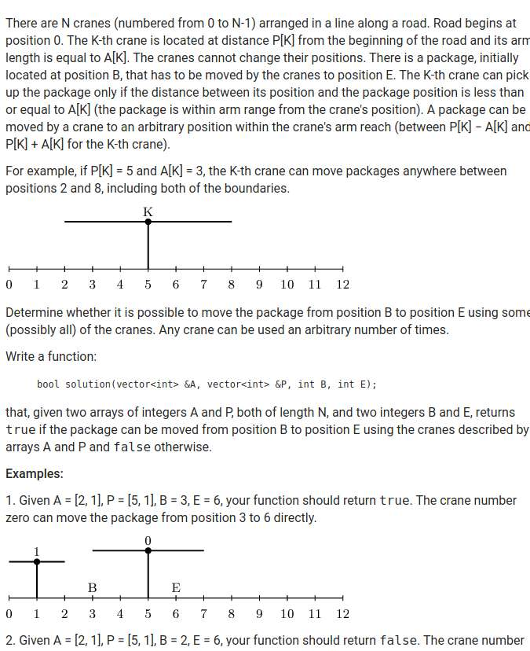
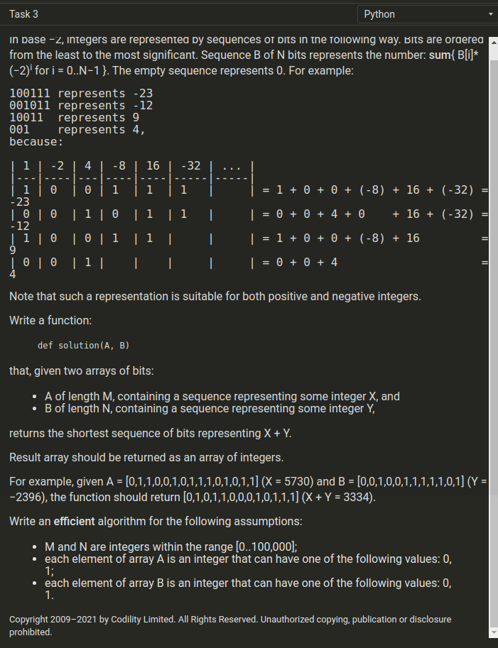

<!--
 * @Description: 
 * @Versions: 
 * @Author: Vernon Cui
 * @Github: https://github.com/vernon97
 * @Date: 2021-03-13 23:57:52
 * @LastEditors: Vernon Cui
 * @LastEditTime: 2021-03-14 01:25:35
 * @FilePath: /.leetcode/Users/vernon/Leetcode-notes/微软暑期实习笔试2021.03.13.md
-->
有个题真的没切出来 找找看

# 01 - 编程题01

You are given N numbers on a circle, described by an array A.
Find the maximum number of neighbouring pairs whose sums are even. 
On element can belong to only one pair.

Write a function:

that given an array A consisting of N integers, returns the maximum number of neighbouring pairs whos sums are even.

---
直接贪心就行了 并不是DP

```cpp
int solution(vector<int> &A) {
    // write your code in C++14 (g++ 6.2.0)
    int n = A.size();
    if(n < 2) return 0;
    A.push_back(A[0]);
    int res1 = 0, res2 = 0;
    for(int i = 0; i < n; i++)
        if(A[i] & 1 == A[i + 1] & 1)
            res1++, i++;
    for(int i = 1; i <= n; i++)
        if(A[i] & 1 == A[i + 1] & 1)
            res2++, i++;
    return max(res1, res2);
}
```

# 02 - 编程题02

太长了懒得抄了


经典的区间覆盖问题 -> 贪心

```cpp
using LL = long long;
using PLL = pair<LL, LL>;
bool solution(vector<int> &A, vector<int> &P, int B, int E) {
    // write your code in C++14 (g++ 6.2.0)
    // 区间覆盖问题 -> 贪心
    // 记得用long long 存
    vector<PLL> intervals;
    // 不在B到E之间的区间不处理
    int n = A.size();
    for(int i = 0; i < n; i++)
    {
        if((LL)P[i] - A[i] >= E || (LL)P[i] + A[i] <= B) continue;
        intervals.emplace_back(P[i] - A[i], P[i] + A[i]);
    }
    // 排序
    sort(intervals.begin(), intervals.end());
    LL ed = B;
    for(auto& interval : intervals)
    {
        if(ed < interval.first)
            return false;
        else
            ed = max(ed, interval.second);
    }
    return ed >= E; 
}
```

# 03 - 编程题03 



负进制转换 9m 原来是leetcode原题 好不起来了

知道是高精度 但是这个进位给我搞麻了
进位规则：

