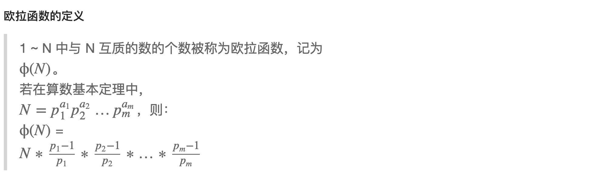

<!--
 * @Description: 
 * @Versions: 
 * @Author: Vernon Cui
 * @Github: https://github.com/vernon97
 * @Date: 2021-01-25 15:50:47
 * @LastEditors: Vernon Cui
 * @LastEditTime: 2021-01-25 18:27:29
 * @FilePath: /.leetcode/Users/vernon/Leetcode-notes/数论.md
-->

<script type="text/x-mathjax-config">
  MathJax.Hub.Config({
    tex2jax: {
      inlineMath: [ ['$','$'], ["\\(","\\)"] ],
      processEscapes: true
    }
  });
</script>

- [1. 排列问题（康托展开与逆康托展开）](#1-排列问题康托展开与逆康托展开)
  - [1. 康托展开](#1-康托展开)
  - [2. 逆康托展开](#2-逆康托展开)
  - [3. 下一个排列](#3-下一个排列)
  - [4. 对称的排列](#4-对称的排列)
- [2. 试除法判断质数](#2-试除法判断质数)
- [3. 试除法分解质因数](#3-试除法分解质因数)
- [4. 试除法求所有约数](#4-试除法求所有约数)
- [5. 线性筛求素数](#5-线性筛求素数)
- [6. 约数个数与约数之和](#6-约数个数与约数之和)
- [7. 最大公因数 最小公倍数](#7-最大公因数-最小公倍数)
- [8. 扩展欧几里得算法 （求 ax + by = gcd(a, b))](#8-扩展欧几里得算法-求-ax--by--gcda-b)
- [9. 快速幂](#9-快速幂)
- [10. 欧拉函数](#10-欧拉函数)
  - [1. 求欧拉函数](#1-求欧拉函数)
  - [2. 筛法求 1 ~ N 的欧拉函数](#2-筛法求-1--n-的欧拉函数)
- [11. 高斯消元法解线性方程组](#11-高斯消元法解线性方程组)
- [12. 乘法逆元](#12-乘法逆元)
  - [1. 扩展欧几里得法求乘法逆元](#1-扩展欧几里得法求乘法逆元)
  - [2. 快速幂求逆元](#2-快速幂求逆元)
  - [3. 递推法求逆元](#3-递推法求逆元)
- [13. 求组合数](#13-求组合数)
  - [1. 递推法求组合数](#1-递推法求组合数)
- [2. 预处理逆元求组合数](#2-预处理逆元求组合数)
- [3. Lucas定理求组合数](#3-lucas定理求组合数)
- [14. 博弈论基础](#14-博弈论基础)
  - [1. NIM游戏](#1-nim游戏)
  - [2.公平组合游戏ICG](#2公平组合游戏icg)
  - [3.有向图游戏](#3有向图游戏)
  - [4.Mex运算](#4mex运算)
  - [5.SG函数](#5sg函数)
  - [6. 有向图游戏的和](#6-有向图游戏的和)

### 1. 排列问题（康托展开与逆康托展开）

#### 1. 康托展开

`X=a1×(n−1)!+a2×(n−2)!+⋯+an×0!`

**X**代表当前排列在全排列中的排名

**ai** 代表当前数是数列中未出现的数中第几小的 从0开始计数，0是第一小的数

例如 `4,2,3,1`
`4`是当前数列中未出现的数中第3小的，`X+=3*(4−1)!`

`2`是当前数列中未出现的数中第1小的，`X+=1*(4−2)!`

`3`是当前数列中未出现的数中第1小的，`X+=1*(4−3)!`, 因为2已经输出过了，所以不算

`1`是当前数列中未出现的数中第0小的，`X+=0*(4−4)!`

这要就求出了`4,2,3,1`所唯一对应的在全排列中的名次`X=22`

**注意到我们每次要用到 当前有多少个小于它的数还没有出现**

```cpp
void init() {
    fact[0] = 1;
    for(int i = 1;i <= 9; ++i) fact[i] = fact[i - 1] * i;
    // 递推求阶乘
}
// 或者直接打表
int fact[10] = {1, 1, 2, 6, 24, 120, 720, 5040, 40320, 362880};

int cantor(int a[],int n) {
    int res = 0;
    for(int i = 0;i < n; ++i) {
        int cnt = 0;
        for(int j = i + 1;j < n; ++j) if(a[j] < a[i]) cnt ++;
        // 找到a[i]是当前数列中未出现的数中第几小的
        // 从1开始，即1-n的全排列
        // 从0开始，就变成了0-n的全排列，记得变通
        res += cnt * fact[n - i - 1];// 累加值
    }
    return res + 1;// 如果输出的是排名就要 + 1，如果是hash值可以直接返回 res
}
```

#### 2. 逆康托展开

首先把排名X减去1，变成以0开始的排名

例如求 `1,2,3,4`的全排列序列中，排名第22的序列是什么

`22−1=21`， 21代表着有多少个排列比这个排列小

第一个数 `a[1] ⌊21/(4−1)!⌋=3` 比`a[1]`小且没有出现过的数有3个，`a[1]=4`

`X=Xmod3×(4−1)!=3`

第二个数`a[2]⌊3/(4−2)!⌋=1`比`a[2]`小且没有出现过的数有1个，所以`a[2]=2`

`X=Xmod1×(4−2)!=1`

第三个数`a[3] ⌊1/(4−3)!⌋=1`比`a[3]`小且没有出现过的数有1个，所以`a[3]=3`

`X=Xmod1×(4−3)!=0`

第四个数`a[4] ⌊0/(4−4)!⌋=0`比`a[4]` 小且没有出现过的数有0个，所以`a[4]=1`

最终得到数列 `4,2,3,1`

```cpp
vector<int> incantor(int x,int n) {
    x--;// 得到以0开始的排名
    vector<int> res(n);// 保存数列答案
    int cnt;
    bool st[10];// 标记数组
    memset(st,0,sizeof st);
    for(int i = 0;i < n; ++i) {
        cnt = x/fact[n - i - 1];// 比a[i]小且没有出现过的数的个数
        x %= fact[n - i - 1];// 更新 x
        for(int j = 1;j <= n; ++j) {// 找到a[i]，从1开始向后找
            if(st[j]) continue;// 如果被标记过，就跳过
            if(!cnt) {// 如果cnt == 0说明当前数是a[i]
                st[j] = 1;//标记
                res[i] = j;// 第i位是j
                break;
            }
            cnt --;// 如果当前不是0，就继续往后找
        }
    }
    return res;// 返回答案
}
```

#### 3. 下一个排列


实际上，从后往前，找到第一个非降序的位置，找到第一个比当前元素大的元素并交换。

找下一个排列就是从后往前寻找第一个出现降的地方，把这个地方的数字与后边某个比它大的的数字交换，再把该位置之后整理为升序。

否则从数组末尾往前找，找到 第一个 位置`j`，使得 `nums[j] < nums[j + 1]`。

如果不存在这样的 `j`，则说明数组是不递增的，直接将数组逆转即可。

如果存在这样的 `j`，则从末尾找到第一个位置 `i > j`，使得 `nums[i] > nums[j]`。

交换 `nums[i]` 与 `nums[j]`，然后将数组从 `j + 1` 到末尾部分逆转

```cpp
class Solution {
public:
    void nextPermutation(vector<int>& nums) {
        int k = nums.size() - 1;
        // 1. 找到第一个递减点 e,g, 1,2,3 -> 1,3,2
        while(k > 0 && nums[k - 1] >= nums[k]) k--;
        if(k == 0) reverse(nums.begin(), nums.end()); // 如果降序排列 直接反转
        else
        {
            // 2. 找到 k - 1 右边第一个比nums[k - 1]大的元素
            //int i = nums.size() - 1;
            //while(i > k && nums[i] <= nums[k - 1]) i--;
            int l = k, r = nums.size() - 1;
            while(l < r)
            {
                int mid = l + r + 1 >> 1;
                if(nums[mid] > nums[k - 1]) l = mid;
                else r = mid - 1;
            }
            swap(nums[k - 1], nums[r]);
            // 交换完之后仍然是降序（字典序最大) 转换为升序(字典序最小)
            reverse(nums.begin() + k, nums.end());
        }
    }
};
```

#### 4. 对称的排列
从`1...n`的全排列满足

正数第Q个排列和倒数第Q个排列满足 对应元素的和 等于 `n + 1`

### 2. 试除法判断质数

```cpp
bool is_prime(int x)
{
    if (x < 2) return false;
    for (int i = 2; i <= x / i; i ++ )
        if (x % i == 0)
            return false;
    return true;
}
```

### 3. 试除法分解质因数

记住分解质因数这里 最后可能还剩下一个因子哦 
```cpp
void divide(int x)
{
    for (int i = 2; i <= x / i; i ++ )
        if (x % i == 0)
        {
            int s = 0;
            while (x % i == 0) x /= i, s ++ ;
            cout << i << ' ' << s << endl;
        }
    if (x > 1) cout << x << ' ' << 1 << endl; // 注意这里
    cout << endl;
}
```

### 4. 试除法求所有约数 

```cpp
vector<int> get_divisors(int x)
{
    vector<int> res;
    for (int i = 1; i <= x / i; i ++ )
        if (x % i == 0)
        {
            res.push_back(i);
            if (i != x / i) res.push_back(x / i);
        }
    sort(res.begin(), res.end());
    return res;
}
```

### 5. 线性筛求素数

```cpp
int primes[N], cnt;     // primes[]存储所有素数
bool st[N];         // st[x]存储x是否被筛掉

void get_primes(int n)
{
    for (int i = 2; i <= n; i ++ )
    {
        if (!st[i]) primes[cnt ++ ] = i;
        for (int j = 0; primes[j] <= n / i; j ++ )
        {
            st[primes[j] * i] = true;
            if (i % primes[j] == 0) break;
        }
    }
}
```

### 6. 约数个数与约数之和

约数个数和约数之和是从分解质因数来的

如果 `N = p1^c1 * p2^c2 * ... *pk^ck`
约数个数： `(c1 + 1) * (c2 + 1) * ... * (ck + 1)`
约数之和： `(p1^0 + p1^1 + ... + p1^c1) * ... * (pk^0 + pk^1 + ... + pk^ck)`

### 7. 最大公因数 最小公倍数

都是欧几里得算法

```cpp
int gcd(int a, int b)
{
    return b ? gcd(b, a % b) : a;
}
```

最小公倍数 LCM = `a * b / gcd(a, b)`

### 8. 扩展欧几里得算法 （求 ax + by = gcd(a, b))

```cpp
// 求x, y，使得ax + by = gcd(a, b)
int exgcd(int a, int b, int &x, int &y)
{
    if (!b)
    {
        x = 1; y = 0;
        return a;
    }
    int d = exgcd(b, a % b, y, x);
    y -= (a/b) * x;
    return d;
}
```

### 9. 快速幂

```cpp
int qmi(int m, int k, int p)
{
    int res = 1, t = m%p;
    while (k)
    {
        if (k&1) res = res * t % p;
        t = t * t % p;
        k >>= 1;
    }
    return res;
}
```

### 10. 欧拉函数

欧拉函数：1 ~ N 中 与N 互质的个数被称为欧拉函数

欧拉定理：若a 与 n互质， 则 `a ^(φ(n)) ≡ 1 (mod n)`

费马小定理 如果p为质数 `b ^(p - 1) ≡ 1 (mod p)`



#### 1. 求欧拉函数 
```cpp
int phi(int x)
{
    int res = x;
    for (int i = 2; i <= x / i; i ++ )
        if (x % i == 0)
        {
            res = res / i * (i - 1);
            while (x % i == 0) x /= i;
        }
    if (x > 1) res = res / x * (x - 1);

    return res;
}
```
#### 2. 筛法求 1 ~ N 的欧拉函数
```cpp
int primes[N], cnt;     // primes[]存储所有素数
int euler[N];           // 存储每个数的欧拉函数
bool st[N];         // st[x]存储x是否被筛掉
void get_eulers(int n)
{
    euler[1] = 1;
    for (int i = 2; i <= n; i ++ )
    {
        if (!st[i])
        {
            primes[cnt ++ ] = i;
            euler[i] = i - 1;
        }
        for (int j = 0; primes[j] <= n / i; j ++ )
        {
            int t = primes[j] * i;
            st[t] = true;
            if (i % primes[j] == 0)
            {
                euler[t] = euler[i] * primes[j];
                break;
            }
            euler[t] = euler[i] * (primes[j] - 1);
        }
    }
}
```

### 11. 高斯消元法解线性方程组

```cpp
// a[N][N]是增广矩阵
int gauss()
{
    int c, r;
    for (c = 0, r = 0; c < n; c ++ )
    {
        int t = r;
        for (int i = r; i < n; i ++ )   // 找到绝对值最大的行
            if (fabs(a[i][c]) > fabs(a[t][c]))
                t = i;

        if (fabs(a[t][c]) < eps) continue;

        for (int i = c; i <= n; i ++ ) swap(a[t][i], a[r][i]);      // 将绝对值最大的行换到最顶端
        for (int i = n; i >= c; i -- ) a[r][i] /= a[r][c];      // 将当前上的首位变成1
        for (int i = r + 1; i < n; i ++ )       // 用当前行将下面所有的列消成0
            if (fabs(a[i][c]) > eps)
                for (int j = n; j >= c; j -- )
                    a[i][j] -= a[r][j] * a[i][c];

        r ++ ;
    }

    if (r < n)
    {
        for (int i = r; i < n; i ++ )
            if (fabs(a[i][n]) > eps)
                return 2; // 无解
        return 1; // 有无穷多组解
    }

    for (int i = n - 1; i >= 0; i -- )
        for (int j = i + 1; j < n; j ++ )
            a[i][n] -= a[i][j] * a[j][n];

    return 0; // 有唯一解
}
```


### 12. 乘法逆元

b 存在乘法逆元的充要条件是 b 与 m 互质

(a / b (mod m) 转化为 a * x (mod m) x : 乘法逆元)

#### 1. 扩展欧几里得法求乘法逆元

更一般的解法 只要a 与 p 互质

乘法逆元要求：`ax≡1(modp)`

欧拉函数：`a^ϕ(p)≡1(modp)`

既然都同余1，合并得：`ax≡a^ϕ(p)(modp)`，由于a,p互质，两边同除a得：`x≡a^(ϕ(p)−1) (modp)`

```cpp
#include <cstdio>
#include <algorithm>
using namespace std;
typedef long long LL;
LL a,p;
LL phi(LL x){
    LL res=x;
    for(int i=2;i<=x/i;i++){
        if(x%i==0){
            res=res/i*(i-1);
            while(x%i==0) x/=i;
        }
    }
    if(x>1) res=res/x*(x-1);
    return res;
}
LL qmi(LL a,LL k){
    LL res=1;
    while(k){
        if(k&1) res=res*a%p;
        a=a*a%p;
        k>>=1;
    }
    return res;
}
int main(){
    scanf("%lld%lld",&a,&p);
    LL res=qmi(a,phi(p)-1);
    printf("%lld\n",res);
    return 0;
}
```

#### 2. 快速幂求逆元

这个要求比上面更严格一点 需要p为质数

根据费马小定理 `b^(p - 2)`

```cpp
#include <iostream>
#include <algorithm>
#include <cstdio>

using namespace std;

typedef long long LL;

int n,p;

LL qmi(int a,int k,int p)
{
    LL res = 1;
    while(k)
    {
        if(k&1) res = (LL)res*a%p;
        a = a*(LL)a%p;
        k>>=1;
    }
    return res;
}
int main()
{
    cin>>n;

    while(n--)
    {
        int a,p;
        scanf("%d%d",&a,&p);
        if(a%p)
            printf("%d\n",qmi(a,p-2,p));
        else
            puts("impossible");
    }

    return 0;
}
```

#### 3. 递推法求逆元

(递推公式 : `inv[b] = (p-p/b) * inv[ p % b ] % p`)
```cpp
inv[1] = 1;
for(int i = 2; i<=n ;i++)
{
    inv[i] = (LL)(p-p/i)*inv[p%i]%p;
    printf("%d\n",inv[i]);
}
```

### 13. 求组合数

求组合数有递推法（0 - 2000），预处理逆元法（0 - 10000），lucas 定理（0 - 10^18) 三种方法

#### 1. 递推法求组合数

基于一个经典的组合数关系式：

$C_{a}^{b} = C_{a - 1}^{b} + C_{a - 1}^{b - 1}$

```cpp
for (int i = 0; i < N; i ++ )
    for (int j = 0; j <= i; j ++ )
        if (!j) c[i][j] = 1;
        else c[i][j] = (c[i - 1][j] + c[i - 1][j - 1]) % mod;
```

### 2. 预处理逆元求组合数

预处理：
$C_{a}^{b} = \frac{a!}{a!*(a - b)!}$

这里我们预处理 阶乘 和逆元
```
fact[i] = i! mod(10^9 + 7);
infact[i] = (i!)^-1 mod(10^9 + 7);
```

fact 可以通过递推就可以得到 
infact 实际上 是 (i!) 和 (10^9 + 7) 的乘法逆元 而且 (10^9 + 7)为质数 根据费马小定理
这里 infact[i] = infact[i - 1] * (i 的逆元 i^(p - 2)) % mod;

```cpp
首先预处理出所有阶乘取模的余数fact[N]，以及所有阶乘取模的逆元infact[N]
如果取模的数是质数，可以用费马小定理求逆元
int qmi(int a, int k, int p)    // 快速幂模板
{
    int res = 1;
    while (k)
    {
        if (k & 1) res = (LL)res * a % p;
        a = (LL)a * a % p;
        k >>= 1;
    }
    return res;
}

// 预处理阶乘的余数和阶乘逆元的余数
fact[0] = infact[0] = 1;
for (int i = 1; i < N; i ++ )
{
    fact[i] = (LL)fact[i - 1] * i % mod;
    infact[i] = (LL)infact[i - 1] * qmi(i, mod - 2, mod) % mod;
}
```

### 3. Lucas定理求组合数

大数组合数 

```
若p是质数，则对于任意整数 1 <= m <= n，有：
    C(n, m) = C(n % p, m % p) * C(n / p, m / p) (mod p)
```

```cpp
int qmi(int a, int k)       // 快速幂模板
{
    int res = 1;
    while (k)
    {
        if (k & 1) res = (LL)res * a % p;
        a = (LL)a * a % p;
        k >>= 1;
    }
    return res;
}


int C(int a, int b)     // 通过定理求组合数C(a, b)
{
    int res = 1;
    for (int i = 1, j = a; i <= b; i ++, j -- )
    {
        res = (LL)res * j % p;
        res = (LL)res * qmi(i, p - 2) % p;
    }
    return res;
}


int lucas(LL a, LL b)
{
    if (a < p && b < p) return C(a, b);
    return (LL)C(a % p, b % p) * lucas(a / p, b / p) % p;
}
```

### 14. 博弈论基础
主要是一些相关概念
#### 1. NIM游戏

给定N堆物品，第i堆物品有Ai个。两名玩家轮流行动，每次可以任选一堆，取走任意多个物品，可把一堆取光，但不能不取。取走最后一件物品者获胜。两人都采取最优策略，问先手是否必胜。

我们把这种游戏称为NIM博弈。把游戏过程中面临的状态称为局面。整局游戏第一个行动的称为先手，第二个行动的称为后手。若在某一局面下无论采取何种行动，都会输掉游戏，则称该局面必败。
所谓采取最优策略是指，若在某一局面下存在某种行动，使得行动后对面面临必败局面，则优先采取该行动。同时，这样的局面被称为必胜。我们讨论的博弈问题一般都只考虑理想情况，即两人均无失误，都采取最优策略行动时游戏的结果。
NIM博弈不存在平局，只有先手必胜和先手必败两种情况。

> 定理： NIM博弈先手必胜，当且仅当 A1 ^ A2 ^ … ^ An != 0

#### 2.公平组合游戏ICG

若一个游戏满足：

由两名玩家交替行动；
在游戏进程的任意时刻，可以执行的合法行动与轮到哪名玩家无关；
不能行动的玩家判负；
则称该游戏为一个公平组合游戏。
NIM博弈属于公平组合游戏，但城建的棋类游戏，比如围棋，就不是公平组合游戏。因为围棋交战双方分别只能落黑子和白子，胜负判定也比较复杂，不满足条件2和条件3。

#### 3.有向图游戏

给定一个有向无环图，图中有一个唯一的起点，在起点上放有一枚棋子。两名玩家交替地把这枚棋子沿有向边进行移动，每次可以移动一步，无法移动者判负。该游戏被称为有向图游戏。
任何一个公平组合游戏都可以转化为有向图游戏。具体方法是，把每个局面看成图中的一个节点，并且从每个局面向沿着合法行动能够到达的下一个局面连有向边。

#### 4.Mex运算

设S表示一个非负整数集合。定义mex(S)为求出不属于集合S的最小非负整数的运算，即：
mex(S) = min{x}, x属于自然数，且x不属于S

#### 5.SG函数

在有向图游戏中，对于每个节点x，设从x出发共有k条有向边，分别到达节点y1, y2, …, yk，定义SG(x)为x的后继节点y1, y2, …, yk 的SG函数值构成的集合再执行mex(S)运算的结果，即：
SG(x) = mex({SG(y1), SG(y2), …, SG(yk)})
特别地，整个有向图游戏G的SG函数值被定义为有向图游戏起点s的SG函数值，即SG(G) = SG(s)。

#### 6. 有向图游戏的和

设G1, G2, …, Gm 是m个有向图游戏。定义有向图游戏G，它的行动规则是任选某个有向图游戏Gi，并在Gi上行动一步。G被称为有向图游戏G1, G2, …, Gm的和。
有向图游戏的和的SG函数值等于它包含的各个子游戏SG函数值的异或和，即：
SG(G) = SG(G1) ^ SG(G2) ^ … ^ SG(Gm)

>有向图游戏的某个局面必胜，当且仅当该局面对应节点的SG函数值大于0。

> 有向图游戏的某个局面必败，当且仅当该局面对应节点的SG函数值等于0。
