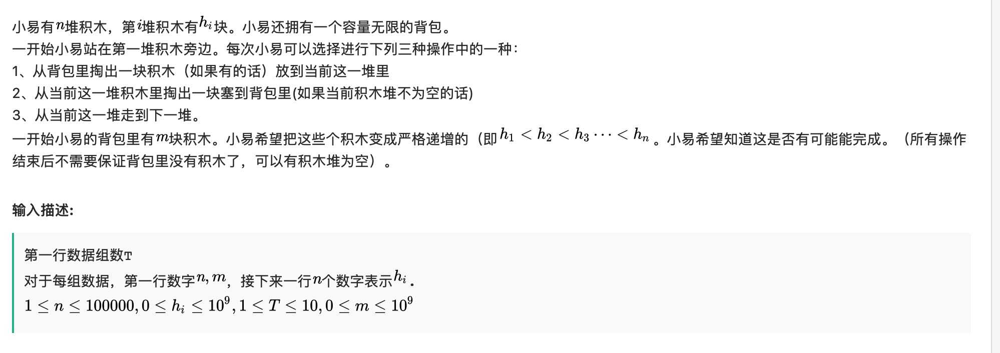

<!--
 * @Description: 
 * @Versions: 
 * @Author: Vernon Cui
 * @Github: https://github.com/vernon97
 * @Date: 2021-01-23 22:53:31
 * @LastEditors: Vernon Cui
 * @LastEditTime: 2021-01-25 01:50:00
 * @FilePath: /.leetcode/Users/vernon/Leetcode-notes/网易2020算法.md
-->
### 01 - [编程题] 吃葡萄

有三种葡萄，每种分别有a,b,c颗。

有三个人，第一个人只吃第1,2种葡萄，第二个人只吃第2,3种葡萄，第三个人只吃第1,3种葡萄。
适当安排三个人使得吃完所有的葡萄,并且且三个人中吃的最多的那个人吃得尽量少。

**输入描述:**
第一行数字TT，表示数据组数。接下来T行，每行三个数a,b,c `1≤a,b,c≤10^18`,`1≤T≤10`

**输出描述:**
对于每组数据，输出一行一个数字表示三个人中吃的最多的那个人吃的数量。

**示例1:**

```
2
1 2 3
1 2 6
```

```
2
3
```

**示例2:**
```
1
12 13 11
```

```
12
```

---

我是真的找不到规律了 好不起来了

**解析：**

将一组三个葡萄数想像成三条线段，如果能构成三角形（符合两短相加大于长），则三个人一人吃掉相邻两条边的一半就可以；如果不能构成三角形（即有一超长边），那么要把超长边平分给两个人吃，相当于折断长边，现在有4条边肯定能构成四边形，那么有两种情况：

两个人吃完长边后不再吃短边，第三人吃完短边也没有超出另两个人；
两人吃完长边后，如果不帮第三人吃两个短边，会使第三人吃的超过2人。
第一种情况的输出就是长边的1/2；第二种情况则与三角形情况相同，需要所有人均分。

真的想不到

```cpp
#include <iostream>
#include <algorithm>
#include <vector>

using namespace std;
using LL = long long;
int main()
{
    int T;
    cin >> T;
    while(T--)
    {
        LL a, b, c, res;
        cin >> a >> b >> c;
        vector<LL> nums = {a, b, c};
        sort(nums.begin(), nums.end());
        a = nums[0], b = nums[1], c = nums[2];
        res = max((a + b + c  + 2)/ 3, (c + 1) / 2);
        cout << res << endl;
    }
    return 0;
}
```

### 02 - [编程题]逆序对距离之和

小易给定一个到的排列，希望你能求出这个序列中**所有逆序对的距离和**。
下标的距离为`|i - j|`，逆序对是指序列中一对下标`i < j`且`a[i] > a[j]`

**输入描述:**

第一行数字表示排列长度 
接下来一行个数字表示这个排列


**输出描述:**

一行一个数字表示答案

**输入例子1:**
```
5  
1 3 4 2 5
```
**输出例子1:**
```
3
```
**例子说明1:**

逆序对:
(3, 2)距离为2
(4, 2)距离为1
总和为3

---

救命啊🆘 没有一个题会做的

逆序对这个题来自于归并排序

原版的求逆序对的个数, 是根据分治的思想 分别求左半边逆序对的个数 右半边逆序对的个数 和 左边 + 右边的逆序对个数；

这样的话排序就不会影响分别在两边的逆序对的求法，此外 排序之后 

只要出现nums[i] >= nums[j], 那么 nums[i + 1] 到 nums[mid] 都和 nums[j]成为逆序对 （因为左右两边都已经排过序） 这样就避免暴力枚举了

**原版求逆序对的数量**
```cpp
#include <iostream>

using namespace std;

typedef long long LL;

const int N = 1e5 + 10;

int a[N], tmp[N];

LL merge_sort(int q[], int l, int r)
{
    if (l >= r) return 0;

    int mid = l + r >> 1;

    LL res = merge_sort(q, l, mid) + merge_sort(q, mid + 1, r);
    int k = 0, i = l, j = mid + 1;
    while (i <= mid && j <= r)
        if (q[i] <= q[j])
        {
            tmp[k ++ ] = q[i ++ ];
        }
        else
        {
            // [mid ... i] 和 j 成为逆序对
            res +=  mid - i + 1;
            tmp[k ++ ] = q[j ++ ];
        }
    while (i <= mid) tmp[k ++ ] = q[i ++ ];
    while (j <= r) tmp[k ++ ] = q[j ++ ];

    for (i = l, j = 0; i <= r; i ++, j ++ ) q[i] = tmp[j];

    return res;
}

int main()
{
    int n;
    scanf("%d", &n);
    for (int i = 0; i < n; i ++ ) scanf("%d", &a[i]);

    cout << merge_sort(a, 0, n - 1) << endl;

    return 0;
}

```

这里有一个前提还是很重要的

**题目是计算坐标之间的距离，例子中的说明也表明了这一点。但是输入的数组是一个 1 到 n 的排列，这会导致逆序对距离之和等于逆序对元素差的和**

就把这个坐标的问题给转换走了（想不到） 然后计算元素的差 就在上面的基础上改一改遇到逆序对时候的计算规则就好了

```cpp
/*
 * @Description: 
 * @Versions: 
 * @Author: Vernon Cui
 * @Github: https://github.com/vernon97
 * @Date: 2021-01-09 19:52:37
 * @LastEditors: Vernon Cui
 * @LastEditTime: 2021-01-24 00:18:17
 * @FilePath: /.leetcode/Users/vernon/cppTest/main.cpp
 */
#include <iostream>

using namespace std;

typedef long long LL;

const int N = 1e5 + 10;

int a[N], tmp[N];

LL merge_sort(int q[], int l, int r)
{
    if (l >= r) return 0;

    int mid = l + r >> 1;

    LL res = merge_sort(q, l, mid) + merge_sort(q, mid + 1, r);
    LL sum = 0;
    for(int i = l; i <= mid; i++)
        sum += q[i];
    int k = 0, i = l, j = mid + 1;
    while (i <= mid && j <= r)
        if (q[i] <= q[j])
        {
            sum -= q[i];
            tmp[k ++ ] = q[i ++ ];
        }
        else
        {
            // [mid ... i] 和 j 成为逆序对
            res +=  sum - q[j] * (mid - i + 1);
            tmp[k ++ ] = q[j ++ ];
        }
    while (i <= mid) tmp[k ++ ] = q[i ++ ];
    while (j <= r) tmp[k ++ ] = q[j ++ ];

    for (i = l, j = 0; i <= r; i ++, j ++ ) q[i] = tmp[j];

    return res;
}

int main()
{
    int n;
    scanf("%d", &n);
    for (int i = 0; i < n; i ++ ) scanf("%d", &a[i]);

    cout << merge_sort(a, 0, n - 1) << endl;

    return 0;
}
```

### 03 - [编程题]跳柱子

小易有根柱子，第根柱子的高度为。一开始小易站在第一根柱子上。小易能从第根柱子跳到第根柱子，当且仅当且。其中为指定的一个数字。
另外小易拥有一次释放超能力的机会。这个超能力能让小易从柱子跳到任意满足的柱子而无视柱子高度的限制。
现在小易想知道，小易是否能到达第根柱子。

**输入描述:**

第一行数据组数
对于每组数据，第一行数字，接下来一行个数字表示.


**输出描述:**

对于每组数据，输出YES或NO

**输入例子1:**

1
5 3
6 2 4 3 8

**输出例子1:**

YES

**输入例子2:**

1
5 2
1 8 2 3 4

输出例子2:

NO

---

肯定是dp了（明天写

```cpp
#include <iostream>
#include <algorithm>
#include <cstring>
#include <cstdio>

using namespace std;

const int N = 1010;
int n, k, T;
int nums[N];
bool f[N], g[N];

int main()
{
    scanf("%d", &T);
    while(T--)
    {
        scanf("%d%d", &n, &k);
        for(int i = 1;i <= n; i++)
            scanf("%d", nums + i);
        memset(f, false, sizeof f);
        memset(g, false, sizeof g);
        f[1] = true;
        for(int i = 2; i <= n; i++)
        {
            for(int j = max(1, i - k); j < i; j++)
            {
                if(nums[j] >= nums[i])
                {
                    f[i] = f[i] || f[j];
                    g[i] = g[i] || g[j];
                }
                else g[i] = g[i] || f[j]; // 否则可以使用超能力一次
            }
        }
        if(f[n] || g[n]) puts("YES");
        else puts("NO");
    }
    return 0;
}
```

### 04 - [编程题]积木


**输出描述:**

对于每组数据输出一行，输出结果YES或NO

**输入例子1:**
```
1
5 3
2 2 3 3 1
```
**输出例子1:**
```
YES
```
**输入例子2:**
```
1
5 2
0 0 1 2 1
```
**输出例子2:**
```
NO
```

---

能不能凑成 `0 1 2 3 4 5 6 ...`

```cpp
#include <iostream>
#include <cstdio>
#include <cstring>

using namespace std;
using LL = long long;
const int N = 100010;
int n, m;
int main()
{
    int T;
    scanf("%d", &T);
    while(T--)
    {
        LL res = 0, minv = 0;
        scanf("%d%d", &n, &m);
        res += m;
        bool flag = true;
        for(int i = 0; i < n; i++)
        {
            LL x;
            scanf("%lld", &x);
            res += x;
            minv += i;
            if(res < minv) flag = false;
        }
        if(flag) puts("YES");
        else puts("NO");
    }
    return 0;
}
```