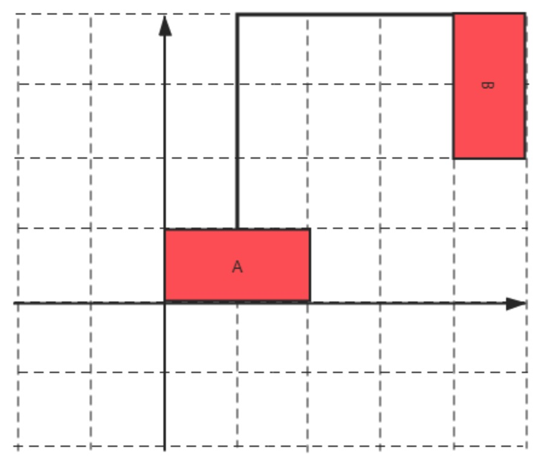

<!--
 * @Description: 
 * @Versions: 
 * @Author: Vernon Cui
 * @Github: https://github.com/vernon97
 * @Date: 2021-01-22 21:28:59
 * @LastEditors: Vernon Cui
 * @LastEditTime: 2021-01-23 00:51:34
 * @FilePath: /.leetcode/Users/vernon/Leetcode-notes/网易2021算法-提前批.md
-->
[测试链接](https://www.nowcoder.com/test/27972441/summary)

### 01 -[编程题]平分物品

现在有n个物品，每一个物品都有一个价值，现在想将这些物品分给两个人，要求这两个人每一个人分到的物品的价值总和相同（个数可以不同，总价值相同即可），剩下的物品就需要扔掉，现在想知道最少需要扔多少价值的物品才能满足要求分给两个人。

**输入描述:**

第一行输入一个整数 T，代表有 T 组测试数据。
对于每一组测试数据，一行输入一个整数 n ，代表物品的个数。
接下来 n 个数，a[i] 代表每一个物品的价值。
```
1<= T <= 10
1 <= n <= 15
1 <= a[i] <= 100000
```

**输出描述:**

对于每一组测试数据，输出一个答案代表最少需要扔的价值。

**输入例子1:**
```
1
5
30 60 5 15 30
```
**输出例子1:**
```
20
```
**例子说明1:**

> 样例解释，扔掉第三个和第四个物品，然后将第一个物品和第五个物品给第一个人，第二个物品给第二个人，每一个人分到的价值为，扔掉的价值为。

---

看起来是签到题 看数据范围就是爆搜就好了

```cpp
#include <iostream>
#include <algorithm>
#include <vector>

using namespace std;

int T, n;
int ans;

void dfs(int u, int val1, int val2, vector<int>& nums)
{
    if(u == n)
    {
        if(val1 == val2)
           ans = max(ans, val1);
         return;
    }
    // 给1， 给2 or 抛弃
    dfs(u + 1, val1 + nums[u], val2, nums);
    dfs(u + 1, val1 , val2 + nums[u], nums);
    dfs(u + 1, val1, val2, nums);
}
int main()
{
    cin >> T;
    while(T--)
    {
        cin >> n;
        vector<int> nums;
        ans = 0;
        int sum = 0;
        for(int i = 0; i < n; i++)
        {
            int x;
            cin >> x;
            nums.push_back(x);
            sum += x;
        }
        dfs(0, 0, 0, nums);
        cout << sum - 2 * ans << endl;
    }
    return 0;
}
```

### 02 - [编程题]买票问题

现在有n个人排队买票，已知是早上8点开始卖票，这n个人买票有两种方式：
第一种是每一个人都可以单独去买自己的票，第 i 个人花费 a[i] 秒。
第二种是每一个人都可以选择和自己后面的人一起买票，第 i 个人和第 i+1 个人一共花费 b[i] 秒。
最后一个人只能和前面的人一起买票或单独买票。
由于卖票的地方想早些关门，所以他想知道他最早几点可以关门，请输出一个时间格式形如：08:00:40 am/pm
时间的数字要保持 2 位，若是上午结束，是 am ，下午结束是 pm

**输入描述:**

第一行输入一个整数 T，接下来有 T 组测试数据。
对于每一组测试数据：输入一个数 n，代表有 n 个人买票。
接下来n个数，代表每一个人单独买票的时间 a[i]。
接下来 n-1 个数，代表每一个人和他前面那个人一起买票需要的时间 b[i]
1<= T <=100
1<= n <=2000
1<= a[i] <=50
1<= b[i] <=50


**输出描述:**

对于每组数据，输出一个时间，代表关门的时间 。

**输入例子1:**

2
2
20 25
40
1
8

**输出例子1:**

08:00:40 am
08:00:08 am

---

一看这个数据范围`o(n)` 跑不掉了 估计就是dp

tmd 烦死了 输出时间？？

```cpp
#include <iostream>
#include <cstdio>
#include <algorithm>
#include <vector>

using namespace std;

const int N = 2020;
int n, T;
int a[N], b[N], f[N], g[N];

int main()
{
    scanf("%d", &T);
    while(T--)
    {
        scanf("%d", &n);
        for(int i = 1; i <= n; i++)
           scanf("%d", a + i);
        for(int i = 1; i < n; i++)
           scanf("%d", b + i);
        f[0] = g[0] = 0, g[1] = 0x3f3f3f3f;
        for(int i = 1; i <= n; i++)
        {
            f[i] = min(f[i - 1], g[i - 1]) + a[i];
            if(i >= 2) g[i] = min(f[i - 2], g[i - 2]) + b[i - 1];
        }
        int total_sec = min(f[n], g[n]);
        //int total_sec = 3600;
        // 时间输出
        int cur_hour = 8, cur_minute = 0, cur_sec = 0;
        bool is_am = true;
        cur_hour += total_sec / 3600;
        total_sec = total_sec % 3600;
        cur_minute += total_sec / 60;
        total_sec = total_sec % 60;
        cur_sec = total_sec;
        while(cur_hour > 12)
        {
            is_am = !is_am;
            cur_hour -= 12;
        }
        if(is_am)
            printf("%02d:%02d:%02d am\n", cur_hour, cur_minute, cur_sec);
        else
            printf("%02d:%02d:%02d pm\n", cur_hour, cur_minute, cur_sec);
    }
    return 0;
}
```

### 03 - [编程题]关键词

小易今天读了一篇英语文章，他现在想从里面找出一个单词作为这篇文章的关键词，一个单词可以作为关键词当且仅当它在这篇文章中出现的频率不低于 1% ，现在他想知道有多少个不同的单词可以作为关键词。

**输入描述:**

第一行一个正整数 n，代表这篇文章的单词总数。
接下来 n 行每行一个字符串，代表一个单词，单词仅由大小写英文字母组成。
1<= n <= 106
保证所有的字符串长度之和不超过 106

**输出描述:**

仅一行一个整数表示答案。

**输入例子1:**
```
5
I
I
am
a
boy
```
**输出例子1:**
```
4
```
**例子说明1:**

> 单词 I  出现的频率为 40% ,其他单词出现的频率均为 20%。所以都可以作为关键词。

啊？ 真的吗 这题纯纯签到了 哈希用得好系列（？

```cpp
#include <iostream>
#include <algorithm>
#include <string>
#include <vector>
#include <unordered_map>
#include <unordered_set>

using namespace std;

int main()
{
    int n, res = 0;
    cin >> n;
    cin.get();
    unordered_map<string, int> ha;
    for(int i = 1; i <= n; i++)
    {
        string line;
        getline(cin, line);
        ha[line]++;
        if(100 * ha[line] >= n)
        {
            res ++;
            ha[line] = -1e6;
        }
    }
    cout << res << endl;
    return 0;
}
```

### 04 - [编程题]牛牛铺路

牛牛生活在网格世界中，在网格世界中人们出行只能通过网格上的边来进行。现在牛牛管理着 n 个城市，每个城市在网格世界中都以一个矩形来表示，牛牛想在这 n 个城市之间铺上水泥路方便人们出行，网格上一条边铺上水泥所需要的花费为 1 。但是为了节约预算，牛牛给你这 n 个城市的左下坐标(x0,y0)和右上坐标(x1,y1)，牛牛想让你告诉他让这 n 个城市联通所需要的最小花费是多少呢。(如图花费为6)

**输入描述:**

第一行为一个 n，表示城市数量。
接下来有 n 行，每行有四个整数x0,y0,x1,y1，表示城市坐标。


**输出描述:**

输出为一行，表示答案。

**输入例子1:**
```
3
0 0 1 1
2 2 3 3
4 4 5 5
```
**输出例子1:**
```
4
```

---
一看就是最小生成树了 -> 很快啊 就是kruskal算法

这题就建图好麻烦 那个曼哈顿距离捯饬了半天才搞好顺序 矩形的曼哈顿距离就是线段的距离推广

还有数据范围会溢出 记得边权用long long 来存就好了 

```cpp
#include <iostream>
#include <algorithm>
#include <cstring>

using namespace std;
using LL = long long;

const int N = 1010, M = N * N;

int n;
int p[N];

struct Node
{
    int x1, y1, x2, y2;
}nodes[N];

struct Edge
{
    int a, b;
    LL c;
    Edge() : a(), b(), c() {}
    Edge(int a, int b, LL c) : a(a), b(b), c(c) {}
    bool operator< (const Edge& w) const{
        return c < w.c;
    }
}e[M];

int find(int x)
{
    if (p[x] != x)
        p[x] = find(p[x]);
    return p[x];
}
LL get(Node& n1, Node& n2)
{
    LL x1 = n1.x1, x2 = n1.x2, y1 = n1.y1, y2 = n1.y2;
    LL x3 = n2.x1, x4 = n2.x2, y3 = n2.y1, y4 = n2.y2;
    LL dist_x = max((LL)0,   max(x1, x3) - min(x2, x4));
    LL dist_y = max((LL)0,   max(y1, y3) - min(y2, y4));
    return dist_x + dist_y;
}
int main()
{
    scanf("%d", &n);
    for(int i = 1; i <= n; i++)
    {
        int x1, y1, x2, y2;
        scanf("%d%d%d%d", &x1, &y1, &x2, &y2);
        nodes[i] = {x1, y1, x2, y2};
    }
    // 并查集初始化
    for(int i = 1; i <= n; i++)
        p[i] = i;
    // 建边
    int cnt = 0;
    for(int i = 1; i <= n; i++)
        for(int j = 1; j < i; j++)
        {
            LL dist = get(nodes[i], nodes[j]);
            e[cnt++] = {i, j, dist};
        }
    // kruskal 求最小生成树
    LL res = 0;
    sort(e, e + cnt);
    for(int i = 0; i < cnt; i++)
    {
        int a = e[i].a, b = e[i].b;
        LL c = e[i].c;
        if(find(a) != find(b))
        {
            p[find(a)] = find(b);
            res += c;
        }
    }
    cout << res << endl;
    return 0;
}
```